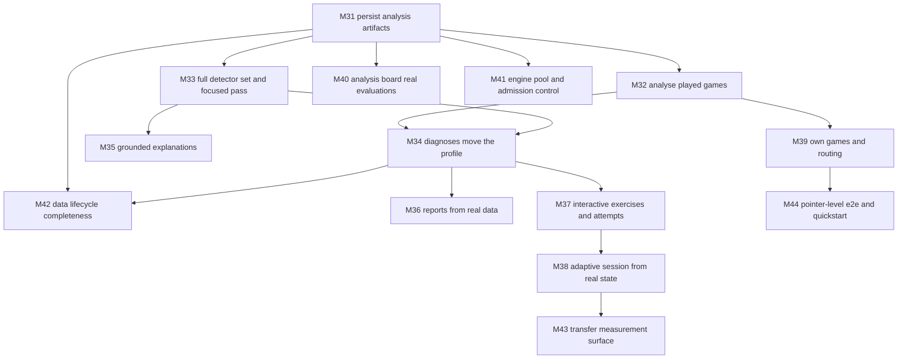

# Development Plan — Scan64 (Learning Loop, M31–M44)

## 1. Context & Source Map

Scan64's first thirty milestones are merged (`main` @ `6da18dd`) and the repository quality gate passes, but the gate measured each milestone in isolation and nothing measured the seam between subsystems. A live audit of the running stack — uvicorn plus the production web bundle, real Stockfish, real browser pointer input — established that the product's central promise (*play, get diagnosed, train your weaknesses*) is not connected end to end. This plan covers only the milestones that close that gap. M1–M30 behavior is established by merged Git history; this file supersedes its historical local planning artifacts as the authoritative plan for active work.

The primary source of truth is `.docs/2026-07-26-learning-loop-enhancement-plan.md`, whose gap inventory (G1–G33) was established by direct observation of a running system and by two read-only source sweeps, with `file:line` evidence against `f616763`. `.docs/scan64-system-design.md` remains the requirements authority for *what the behaviour should be*; the enhancement plan is the authority for *what is currently missing*.

| Plan section | Source document / section |
| --- | --- |
| §6 Section G (Close the diagnostic loop, M31–M36) | Enhancement plan §2.1 (G1–G9), §2.2 (G10–G17); system design §7 (learning pipeline), §8 (taxonomy), §9 (player model), §14 (LLM integration), §17 (data model) |
| §6 Section H (Make the learner able to act, M37–M40) | Enhancement plan §2.3 (G18–G25); system design §10 (exercises), §20 (application screens), §21 (scheduler) |
| §6 Section I (Runtime integrity and operations, M41–M44) | Enhancement plan §2.4 (G26–G33); system design §18.6 (compute budgets), §22 (testing), §24.1 (privacy/export/deletion), §23.4–23.5 (learning metrics) |
| §4 Release Trains | Repository evidence: `pyproject.toml:3` (`version = "0.1.0"`), no `CHANGELOG.md`, zero git tags |
| §7 Cross-Cutting Concerns | Enhancement plan §3 (sequencing principle); `.github/workflows/ci.yml`; branch ruleset on `main` |

## 2. Assumptions & Gaps

> DECISION: The sequencing rule for this plan is that **no milestone may add a read surface whose writer is not landed in the same milestone.** The absence of that rule in M1–M30 is the direct, traceable cause of G2, G3, G10, and G12 — endpoints that read tables no production path writes. Every milestone below is checked against it.

> CORRECTION: The delivered plan's §2 states "Hosted CI is intentionally disabled until a maintainer changes that policy." That is stale. `.github/workflows/ci.yml` defines a `Quality` job that runs `scripts/check.sh` with pinned Stockfish 18 on every pull request and on pushes to `main`, and it gated PR #119. Hosted CI is authoritative for this plan; a milestone is not merge-eligible on local evidence alone.

> DECISION: `main` carries an active branch ruleset (`pull_request`, `non_fast_forward`, `deletion`). Direct pushes are rejected. Every milestone lands through reviewed PRs, and the stack's root PR targets `main`.
> DECISION (H-002): Imported games have one durable owner. M31 adds nullable `Game.owner_player_id`, requires `player_id` for new imports, and backfills an existing game's owner once from its linked `PlaySession.player_id` when that record exists; games without a linked session remain ownerless. The analysis job, report queries, lesson opportunities, and evidence derive ongoing attribution from this field; ownerless legacy games remain read-only historical records, are excluded from player-owned read paths, and are rejected before analysis. `PlaySession` is a one-time migration signal for legacy played games, not an imported-game ownership surrogate.
> DECISION (H-003): M31 bootstraps Alembic and supplies an upgrade path for existing SQLite databases before adding owner and lesson-opportunity columns. A populated legacy SQLite fixture must prove both one-time session-backed owner backfill and null ownership where no session exists before any M31 query runs. System design §17.3 also calls for PostgreSQL migration CI; the current SQLite-only repository has no PostgreSQL service or driver, so M31 records that unimplemented cross-database verification as a visible future-planning gap rather than claiming it.

> ASSUMPTION: The ten seeded taxonomy codes delivered in M2 remain the diagnostic surface for this plan. M33 wires the nine detector classes that already exist but have no production caller; it introduces no new detector classes. Source (§7.4) defers learned detectors to plugin territory, which shipped in M28.

> ASSUMPTION: LLM verbalization stays off by default and behind explicit configuration (M35). Source §14 treats language models as optional and requires deterministic chess reasoning; the default install must not acquire a model dependency.

> ASSUMPTION: Auto-analysis of finished games (M32) is acceptable default behaviour rather than an opt-in. Source §7 describes analysis as the pipeline's entry stage for every played game; a per-player in-flight cap bounds the cost until M41 lands pooling.

> ASSUMPTION: The persisted `ProfileObservation` idempotency key for repeat analysis (M34) is `(player_id, game_id, position_id, skill_id)`. `Evidence` is diagnostic provenance and has no player, game, or skill columns. M34 rejects a missing owner or game before observation; this is the smallest key that makes re-analysis safe without discarding legitimate repeat observations across different games.

> GAP: No semantic-versioning policy, `CHANGELOG.md` convention, tag convention, or publication target exists for the Scan64 repository. `pyproject.toml` carries `version = "0.1.0"` that no process updates, there is no `CHANGELOG.md`, and there are zero tags. This gap was already recorded in the delivered plan and remains unresolved. Release trains below are named and unversioned; required release artifacts are `none` and publication is `not requested` until a maintainer defines the policy.

> GAP: `.github/workflows/ci.yml` declares `on: pull_request:` with no `types:` list. Editing a PR's base — the normal operation when merging a stacked series root-to-leaf — therefore does not retrigger CI, and a retargeted child can display a stale green check. Whether to add `types: [opened, synchronize, reopened, edited]` is a maintainer decision; until then every milestone's merge step must force a fresh run rather than trust the displayed check.

> CORRECTION: System design §17.3 does define a retention target for full-fidelity engine payloads. The repository has no configurable retention or compaction implementation, so M31 retains its bounded candidate/focused-position write scope and does not invent one; the unimplemented source requirement remains visible for future planning.
> GAP (H-016): G13 combines two sources that no current persisted schema can support as a truthful production report: behavioural habit detection needs per-move annotations plus rating-conditioned calibrated population base rates, and context-conditioned profiling needs populated context observations. `Game` stores moves but no elapsed move times; `HabitDetector` has no production rule/base-rate source; no player-context observations are written. M36 therefore closes G10–G12 with owner-scoped recurring-diagnosis patterns and explicitly does not manufacture a habit result. This blocks only the unassigned behavioural-habit and context-conditioned-profile portions of G13; they require a later evidence-instrumentation and calibration plan.
> GAP (H-017): M36 cannot report an active-mastery delta because `SkillState` persists only its current mutable beta parameters and no prior snapshot writer exists; it reports an active-mastery snapshot instead. Imported games have a durable owner but not a durable owner side, so opening result rates use only games whose owner side is derivable and explicitly count excluded results. These limits prevent invented historical values and inverted imported-game outcomes.

None of the above block this plan. The uninstrumented behavioural-habit and context-conditioned-profile portions of G13 remain deferred and unassigned, and the H-017 data limits are designed into M36's acceptance.

## 3. Dependency Graph

## 4. Release Trains

| Target release | Included milestones | Preparation trigger | Required artifacts | Verification | Publication |
| --- | --- | --- | --- | --- | --- |
| `unversioned — learning loop closed` | `M31, M32, M33, M34, M35, M36, M37` | All included milestones are externally merged. | `none` — see §2 `> GAP:` on release policy | `scripts/check.sh` exits 0 on `main` after the final merge, plus the manual loop walkthrough in M37's verification | `not requested` |
| `unversioned — adaptive and operable` | `M38, M39, M40, M41, M42, M43, M44` | All included milestones are externally merged. | `none` — see §2 `> GAP:` on release policy | `scripts/check.sh` exits 0 on `main` after the final merge, plus M44's clean-clone quickstart walkthrough | `not requested` |

Release preparation is assigned once per train and only after every milestone in that train has merged. No milestone below updates a version or changelog artifact.

## 5. Plan Evolution Protocol

- The committed plan and prompt files are authoritative. `.docs/DEVELOPMENT_PLAN_HISTORY.md` is reconstructible local evidence and is ignored by git.
- Before each milestone, inspect its current plan/prompt entry, its source-map rows, the current codebase, merged predecessor diffs, predecessor CI evidence, and the local history when available.
- Record exactly one `DESIGN GO — PLAN REVISION: none`, `DESIGN GO — PLAN REVISION: <entry IDs>`, or `DESIGN NO-GO — REASON: <blocking evidence>`.
- A material mismatch updates the current milestone and every directly or transitively affected future milestone in both authoritative files. Recompute the dependency graph, critical path, and release-train membership when affected.
- `DESIGN NO-GO` blocks code, branches, and implementation PRs. A material plan revision requires a docs-only reconciliation PR that is reviewed, green, and externally merged before implementation.
- This plan's own sequencing rule (§2 DECISION) is part of every design gate: a milestone that would add an unwritten read surface is a material mismatch by definition.

## 6. Sections & Milestones

### Section G — Close the diagnostic loop

#### M31 — Persist analysis artifacts with player attribution

| Field | Value |
| --- | --- |
| Objective | A completed analysis job leaves durable, player-attributed `Position`, `EngineAnalysis`, and `Evidence` rows, so the read endpoints that already ship return real data instead of empty collections. |
| In / Out of scope | In: Alembic bootstrap and an upgrade path for existing SQLite data; a one-time migration backfill from `PlaySession.player_id` only where an existing legacy game has that linked record; `POST /v1/games` requires an existing `player_id` and writes `Game.owner_player_id`; the PGN import client supplies the active player identity; `run_analysis_for_game` derives player attribution from that owner instead of the `"system"` literal; persists `Position` and `EngineAnalysis` for fast-pass candidates and focused-pass positions; persists the `Evidence` it already constructs and discards; `PersistedLessonOpportunity` gains a player column with a migration. Out: reassigning or overriding an owner resolved by migration, assigning an owner to a legacy game without a linked `PlaySession`, new detectors (M33), profile mutation (M34), auto-triggering (M32), retention/compaction implementation (§2 `> CORRECTION:`). |
| Depends on | `none` |
| Target release | `unversioned — learning loop closed` |
| Deliverables | Alembic configuration, baseline, and SQLite legacy-upgrade test covering session-backed owner backfill and the session-less ownerless case; `Game.owner_player_id` column plus migration and owner-required import contract; PGN import client identity handoff and component coverage; rewritten `src/scan64/chess/analysis/jobs.py` writing all three entity types inside the job's session; player column plus migration on `PersistedLessonOpportunity`; owner-based evidence query in `api/reports.py`; `tests/integration/test_analysis_persistence.py`. |
| Acceptance | After a job on an imported game owned by player P: `GET /v1/games/{id}/positions` returns one row per persisted position with its engine analysis attached; `GET /v1/players/P/evidence` returns the evidence backing every persisted lesson; `rg 'player_id="system"' src/` returns no match; no code path constructs an `Evidence` object it does not persist. Migration backfills a legacy game with a linked `PlaySession` once and leaves a session-less legacy game ownerless; the latter is rejected before analysis rather than attributed to a synthetic player. |
| Verification | `uv run pytest tests/integration/test_schema_migrations.py tests/integration/test_analysis_persistence.py` — passes, including both legacy ownership branches; `pnpm --dir apps/scan64-web test` — passes; `scripts/check.sh` — exits 0. Manual: import a PGN as the active player, poll the job to `completed`, assert both endpoints non-empty. |
| Design reevaluation | Inspect `jobs.py`, `api/reports.py:72-113`, `api/games.py:20-63,200-222`, `PgnImportScreen.tsx`, and the SQLModel table definitions for `Game`/`Position`/`EngineAnalysis`/`Evidence`; confirm G1–G3 still hold, imported games have a durable owner, and no interim change already persists these rows. Dependent milestones requiring review if this design changes: M32, M33, M34, M40, M41, M42, and transitively M35, M36, M37, M38, M39, M43, M44. |
| Risks & rollback | Risk: persisting analysis for every ply inflates the SQLite file on bulk import — bounded by persisting only candidate and focused-pass positions. Risk: a required import owner breaks the sole UI caller — land its identity handoff with the API contract and verify it with the frontend suite. Risk: a session-less historical row cannot be safely attributed — leave it immutable, exclude it from player-owned paths, and fail loudly before analysis. Risk: schema changes against existing SQLite files are silent without a real migrator — the two-branch legacy-upgrade fixture is mandatory. Rollback: the stack is the rollback unit; no consumer depends on the rows before M34. |
| Est. PRs | 5 |

#### M32 — Analyse the games you actually play

| Field | Value |
| --- | --- |
| Objective | Reaching a terminal state in a play session produces the same diagnostic output as importing that game as a PGN, attributed to the player who played it. |
| In / Out of scope | In: `Game` rows created by `PlaySessionService` write the session player to M31's `owner_player_id` field, record `white`/`black` from the session's player and opponent config, and maintain a populated PGN as moves are appended; a resign/abandon transition so an unfinished game can be analysed; analysis enqueued on terminal state and on explicit request; `GET /v1/players/{id}/games`. Out: UI surfacing (M39), pooled/admission-controlled execution (M41). |
| Depends on | M31 |
| Target release | `unversioned — learning loop closed` |
| Deliverables | `play_session_service.py` writing `owner_player_id`, `white`/`black` from the session's player and opponent config and keeping `pgn` in sync; `POST /v1/play-sessions/{id}/resign`; terminal-state hook enqueuing an analysis job with a per-player in-flight cap; `GET /v1/players/{id}/games` querying both owned imports and played games without duplicates; `tests/integration/test_play_session_analysis.py`. |
| Acceptance | Playing a session to mate or resignation produces a `completed` `AnalysisJob` for that game with no further client call. `Game.pgn` for a played game is a valid PGN that re-imports cleanly and names the player. `GET /v1/players/{id}/games` lists both played and imported games. A player exceeding the in-flight cap has work queued, never dropped. |
| Verification | `uv run pytest tests/integration/test_play_session_analysis.py` — passes; `scripts/check.sh` — exits 0. Manual: play and resign a session against Stockfish, then read the player's games and evidence. |
| Design reevaluation | Inspect `play_session_service.py:65-149`, `api/play.py`, `api/games.py`'s M31 owner contract, and M31's merged persistence path; confirm G4 and G9 still hold, terminal-state transition has a single call site, and each created game carries exactly one durable owner. Dependent milestones requiring review: M34, M39, and transitively M36, M37, M38, M43, M44. |
| Risks & rollback | Risk: auto-enqueue on every finished game saturates the engine — mitigated by the in-flight cap here and by batch-pool routing in M41. Risk: PGN synchronisation on every move is a hot-path write — build the PGN on terminal transition, not per move, if profiling shows cost. Rollback: the terminal-state hook is one call site. |
| Est. PRs | 5 |

#### M33 — Wire the full detector set and the focused pass

| Field | Value |
| --- | --- |
| Objective | All ten seeded taxonomy codes can be diagnosed on a live request, and flagged positions receive the deep MultiPV evidence the design specifies. |
| In / Out of scope | In: the analysis job resolves detectors through `learning.plugins.registry` rather than constructing one concretely; every seeded detector registers at app startup; `FocusedPassOrchestrator` runs on fast-pass candidates; a production evidence composer derives the existing detector evidence kinds and payloads from the candidate's legal game history, board states, and deep MultiPV output; arbitration when several detectors fire on one position. Out: new detector classes; learned detectors (§2 ASSUMPTION); synthetic fixture evidence in production. |
| Depends on | M31 |
| Target release | `unversioned — learning loop closed` |
| Deliverables | Registry bootstrap bound to the app lifespan; two-pass pipeline in `jobs.py` using M31's game-owner attribution; a production evidence composer that persists provenance-bearing, code-specific payloads with the concrete square, piece, move, or line M35 must render; documented arbitration rule with a deterministic tie-break; a legal production-path fixture corpus carrying games, candidates, and focused MultiPV responses; `tests/integration/test_live_detector_coverage.py` driving that corpus through `run_analysis_for_game`, never through the benchmark harness or its `mock_evidence`. |
| Acceptance | The legal production-path fixture corpus yields at least one diagnosis for each of the ten seeded codes through `run_analysis_for_game`; fixture engine responses contain only legal fast-pass candidates and focused MultiPV lines, and the production evidence composer never consumes benchmark `mock_evidence`. A position where two detectors fire produces exactly one primary diagnosis with the loser retained in `Diagnosis.secondary`. `FocusedPassOrchestrator` is reached from that production call path, and every flagged position retains its deep MultiPV analysis as diagnosis evidence. The coverage report emits per-code TP, FP, FN, and precision across both primary and secondary outputs for the registry result and for that code's detector run alone against the same emitted evidence; no code's registry precision may be lower. |
| Verification | `uv run pytest tests/integration/test_live_detector_coverage.py tests/integration/test_stockfish_pipeline.py` — passes with the per-code production-fixture precision report captured; `scripts/check.sh` — exits 0. |
| Design reevaluation | Inspect `jobs.py:54-92`, `chess/analysis/orchestration.py:101-117`, `learning/plugins/registry.py:38-64`, `benchmarks/diagnosis_report.py:5-54`, the production fixture schema, and M31's game-owner contract; confirm G6 and G7 still hold, the benchmark harness's detector assembly and `mock_evidence` remain test-only, the production evidence composer derives every detector input from game and engine provenance, and diagnosis context uses the durable game owner. Dependent milestones requiring review: M34, M35, and transitively M36, M37, M38, M43. |
| Risks & rollback | Risk: enabling nine more detectors surfaces false positives the single-detector baseline hid — gate each detector on its taxonomy-declared minimum engine evidence and report registry-versus-isolated precision from identical production evidence. The production fixture is a deterministic regression corpus, not coach-annotated promotion evidence; do not claim external precision from it. Risk: the focused pass multiplies analysis cost per game — bound by the existing per-game candidate limit. Rollback: registry lookup is one call site; reverting to the concrete detector restores M31 behaviour. |
| Est. PRs | 5 |

#### M34 — Diagnoses move the profile

| Field | Value |
| --- | --- |
| Objective | A diagnosed weakness changes the player's Bayesian skill state and schedules review, so a repeated mistake becomes visible mastery signal rather than an isolated lesson. |
| In / Out of scope | In: a single profile-update service used by both the M31/M33 analysis path and the content-attempt path; a persisted `ProfileObservation` idempotency record keyed by non-null `(player_id, game_id, position_id, skill_id)`; `SkillState` observation applied from player-attributed analysis findings; rating-band priors applied on first observation of a concept; a `ReviewSchedule` created for each generated lesson with `item_id` set to the canonical `str(PersistedLessonOpportunity.id)` and an explicit `skill_id`; `retired_at` and `retirement_reason` metadata on `SkillState`, `ReviewSchedule`, and `ProfileObservation`; an Alembic revision adding these columns and the observation table with non-retired defaults for existing rows; a live taxonomy-migration hook that remaps or retires `SkillState`, `ReviewSchedule`, and `ProfileObservation` codes. Out: the reports that read this state (M36); adaptive selection (M38); attempting a generated lesson and advancing its schedule, which belongs to M37's generic lesson-attempt endpoint. |
| Depends on | M32, M33 |
| Target release | `unversioned — learning loop closed` |
| Deliverables | Profile-update service replacing the duplicated logic in `content/tracking.py:7-40`; Alembic schema upgrade for `ProfileObservation`, `ReviewSchedule.skill_id`, and retained retirement metadata; prior selection from `PlayerProfile.rating` via `learning/profiling/priors.py`; schedule writer storing the diagnosis `skill_id` against the canonical persisted lesson id; taxonomy-migration hook invoking `learning/diagnosis/taxonomy/migration.py` over live `SkillState.concept_code`, `ReviewSchedule.skill_id`, and `ProfileObservation.skill_id` rows at startup, marking unmappable rows retired with a reason instead of deleting them. A renamed `ProfileObservation` changes to the new key when it has no target; on a target-key collision the existing target remains active and the old observation is retained as retired with reason `Renamed to <new_id>`. When a renamed `SkillState` conflicts with an existing target row, preserve the target prior, add the old row's evidence above its own prior to the target posterior, retain the later `last_updated`, then retire the old row. `tests/integration/test_schema_migrations.py`, `tests/integration/test_profile_updates_from_analysis.py`, `tests/property/test_mastery_monotonicity.py`, and `tests/integration/test_taxonomy_migration_live.py`. |
| Acceptance | Two games containing the same diagnosis lower that concept's expected mastery monotonically and narrow its uncertainty. A player rated 1200 and a player rated 1900 start a new concept at different priors, neither at `(1.0, 1.0)`. Every generated lesson has a `ReviewSchedule` row with a due date, its diagnosed `skill_id`, and the canonical persisted lesson id. Re-analysing the same owned game does not change mastery a second time, including after a taxonomy rename; an ownerless or game-less finding is rejected before an observation is recorded. A `skill_id` rename applied through the migration table remaps live `SkillState.concept_code`, `ReviewSchedule.skill_id`, and active `ProfileObservation.skill_id`; a target-key collision merges Bayesian `SkillState` evidence deterministically and retires the redundant observation with its reason. An unmappable code is retained as retired with a recorded reason, never silently dropped. |
| Verification | `uv run pytest tests/integration/test_schema_migrations.py tests/integration/test_profile_updates_from_analysis.py tests/property/test_mastery_monotonicity.py tests/integration/test_taxonomy_migration_live.py` — passes; `scripts/check.sh` — exits 0. |
| Design reevaluation | Inspect `content/tracking.py:7-40`, `learning/profiling/priors.py:3-20`, `api/learning.py:199-230`, `learning/diagnosis/taxonomy/migration.py:11-51`, the `SkillState`, `ReviewSchedule`, and `ProfileObservation` schemas, the Alembic chain, and M31–M33's merged owner-attributed paths; confirm G5, G14, G15, and G31 still hold, that analysis findings carry a real player and game rather than synthetic or nullable identities, that `ReviewSchedule.item_id` is canonical `str(PersistedLessonOpportunity.id)` M37 will submit, and that a taxonomy rename cannot bypass the active observation idempotency key. Dependent milestones requiring review: M36, M37, M38, M42, and transitively M43. |
| Risks & rollback | Risk: double-counting on re-analysis — addressed by the persisted non-null idempotency key, which must be asserted in tests, not assumed. Risk: unifying two update paths changes famous-game attempt behaviour — cover the existing path with a characterisation test before refactoring. Risk: a migration hook that runs at startup can corrupt live rows on a bad table — require a no-op default, a deterministic target-key collision merge, retained retired rows with their reason, and idempotency of the migration itself. Risk: M34 can write but cannot advance analysis-lesson schedules before M37 exposes its attempt endpoint; keep schedule advancement out of the famous-game endpoint and test it with M37. Rollback: profile updates are additive and the idempotency key makes recomputation safe. |
| Est. PRs | 6 |

#### M35 — Explanations that say something true about the position

| Field | Value |
| --- | --- |
| Objective | Every diagnosis the system can produce has an evidence-grounded explanation; no user-visible lesson falls back to a generic sentence. |
| In / Out of scope | In: a template per seeded taxonomy code parameterised by the code-specific, provenance-bearing M33 evidence payload; required square, piece, move, or line interpolation with a conformance failure when a required field is absent; removal of the catch-all fallback; the optional LLM path routed through `explanations/validator.py` so generated text is checked against evidence before display, off by default. Out: any hosted LLM dependency in the default install; new taxonomy codes; invented explanation details. |
| Depends on | M33 |
| Target release | `unversioned — learning loop closed` |
| Deliverables | Expanded `explanations/templates/provider.py` with per-code templates and interpolation over M33's emitted evidence contract; `tests/conformance/test_explanation_coverage.py` enumerating the taxonomy and every required payload field; LLM path wired behind explicit configuration with grounding validation mandatory when enabled; `tests/unit/test_grounded_explanation.py`. |
| Acceptance | For each of the ten seeded codes, the generated explanation names the specific square, piece, move, or line drawn from its M33 evidence payload. A missing template or required payload field fails the conformance test rather than rendering a fallback or inventing a detail. With the LLM path enabled, an ungrounded generation is rejected and the template output is used instead. The default install acquires no model dependency. |
| Verification | `uv run pytest tests/conformance/test_explanation_coverage.py tests/unit/test_grounded_explanation.py` — passes; `uv run python scripts/check_licenses.py` — passes; `scripts/check.sh` — exits 0. |
| Design reevaluation | Inspect `explanations/templates/provider.py:3-25`, `explanations/validator.py:55-65`, `providers/llm/config.py:79-106`, and M33's merged production evidence composer plus fixture schema; confirm G8 still holds, every live diagnosis code has the required provenance-bearing template inputs, and no template creates facts absent from its evidence. Dependent milestones requiring review: M37. |
| Risks & rollback | Risk: the grounding validator rejects most LLM output and the feature appears broken — rejection is expected behaviour and the template is always the floor; state this in the configuration documentation. Rollback: the template provider remains the default; the LLM path is config-gated. |
| Est. PRs | 4 |

#### M36 — Reports computed from real data

| Field | Value |
| --- | --- |
| Objective | The patterns, openings, and weekly report endpoints compute from persisted evidence and games instead of returning literals, while keeping repeated diagnoses distinct from behavioural habits. |
| In / Out of scope | In: typed recurring-diagnosis patterns computed from `PersistedLessonOpportunity` rows whose `game_id` belongs to the player's `Game.owner_player_id` corpus, including occurrence counts and diagnosis evidence references; an explicit diagnosis-recurrence threshold and sparse-corpus outcome; matching API-client types and profile/coach presentation that name those patterns accurately; the openings report derived from the player's own owner-attributed game corpus with per-family result and error rates, eligible-result counts, and explicit owner-side exclusions; the weekly report as a typed object (games played, active concepts observed, active-mastery snapshots, top recurring diagnosis). Retired profile state remains historical data but does not drive current mastery reporting. Out: coach aggregation logic and authorization changes (the existing embedded `PatternsReport` evolves with its shared contract); behavioural habit detection, population-rate calibration, time-annotation capture, and context-conditioned mastery surfacing. |
| Depends on | M34 |
| Target release | `unversioned — learning loop closed` |
| Deliverables | A `PatternsReport` that returns recurring diagnoses separately from the unavailable behavioural-habit surface, exposes the diagnosis-recurrence threshold, and returns an explicit sparse-corpus outcome; matching web API types and profile/coach renderers; opening-family classification over the player's games with owner-perspective result eligibility; a typed weekly-report model replacing the string with active-mastery snapshots; `tests/integration/test_reports_from_real_data.py` and focused web tests. |
| Acceptance | A player with three games sharing one diagnosis has a recurring-diagnosis pattern in `/patterns` with an occurrence count and evidence references. The endpoint and both profile/coach surfaces name that recurrence as a pattern, never a behavioural habit, and distinguish insufficient diagnosis data from a sufficiently sized corpus with no detected recurrence. The existing coach aggregation and authorization logic remains unchanged while its embedded shared `PatternsReport` reflects the same contract. `/openings` reflects that player's actual opening families and excludes owner-perspective result rates where the owner's side is unknown while reporting the exclusion. `/reports/weekly` returns a typed object with active, non-retired mastery snapshots; it does not claim an unpersisted delta. No handler in `src/scan64/api/reports.py` returns a hardcoded literal collection or string. |
| Verification | `uv run pytest tests/integration/test_reports_from_real_data.py` — passes; `pnpm --dir apps/scan64-web test` — passes; `scripts/check.sh` — exits 0. |
| Design reevaluation | Inspect `api/reports.py:125-129` and the weekly handler, the shared `PatternsReport` coach/client consumers, M31's owner-based evidence query, M34's active/retired profile writes, and the persisted `Game`/`PersistedLessonOpportunity` fields; confirm G10–G12 still hold and that no caller relabels a diagnosis recurrence as a behavioural habit or infers an imported-game owner side. Dependent milestones requiring review: M38. |
| Risks & rollback | Risk: treating repeated diagnoses as habits contradicts §9.5 and exposes a false behavioural claim — return them as a distinct typed pattern across every shared-model consumer. Risk: a sparse diagnosis corpus produces an ambiguous empty result — surface an explicit sparse-corpus state. Risk: opening rates invert an imported game — exclude unresolvable owner sides rather than guessing. Rollback: the endpoints remain read-only; the web change is a contract presentation update. |
| Est. PRs | 4 |

#### M37 — Interactive exercises with recorded attempts

| Field | Value |
| --- | --- |
| Objective | A learner can attempt any generated lesson on a real board, and the attempt is recorded against their profile. |
| In / Out of scope | In: a shared lesson-board component rendering a `LessonSpec` position with legal-move input, hint ladder, and accept/reject feedback, used by Daily Training, Critical Moment Review, and the Opening Explorer's missions; a new player-scoped `LessonAttempt` record separate from `ContentAttempt`, because `ContentAttempt.item_id` is a foreign key to `ContentItem` while M34 schedules use canonical `PersistedLessonOpportunity.id` values; `POST /v1/lesson-attempts` accepting lesson id, session id, submitted move, elapsed time, and hints used; `StudySession` persisted when `/v1/learning/session` is served and returned with the lesson list; resolving an owned persisted-opportunity lesson id before loading and advancing its matching M34 `ReviewSchedule`; server-verifying persisted-opportunity moves against the stored `LessonSpec`; Opening Explorer missions recorded as ungraded, server-side local-seed mission attempts without replacing the client seed families; attempt-driven profile update reusing M34's service and writing only active taxonomy rows. Out: the famous-game `ContentAttempt` route and its `ContentItem` identity; adaptive selection logic that consumes these attempts (M38); replacing the Opening Explorer seed families with a catalog; transfer completion (M43). |
| Depends on | M34 |
| Target release | `unversioned — learning loop closed` |
| Deliverables | `LessonBoard` React component extracted from the working play-board configuration; `DailyTrainingScreen`, `CriticalMomentReview`, and `OpeningExplorerScreen` missions rebuilt on it; `LessonAttempt` and `StudySession` persistence plus a session response carrying the durable study-session id; generic attempt endpoint with explicit `persisted_opportunity` and ungraded `opening_mission` source kinds; M34 schedule advancement after resolving the owned persisted lesson; a Playwright spec driving a real pointer answer. |
| Reconciliation contract | Critical Moment Review and Opening Explorer must receive a durable `StudySession.id` from the surface that serves their lesson. Only Critical Moment Review carrying a canonical owned `PersistedLessonOpportunity.id` may submit a `persisted_opportunity` attempt and advance M34; Opening Explorer local-seed missions submit `opening_mission` attempts and remain ungraded. M38 owns any shared-session composition change. |
| Acceptance | Daily Training presents an interactive board, not a FEN string. A persisted-opportunity attempt is server-verified against its stored lesson: submitting the accepted move is confirmed and recorded; submitting a wrong move consumes an attempt and reveals the next hint. A served training session has a `StudySession` row, returns its id, and every `LessonAttempt` links to it. A persisted-opportunity attempt resolves the owned opportunity before its schedule is loaded, advances the matching M34 `ReviewSchedule`, and changes only the relevant active `SkillState`; for a retired code it is recorded with its profile update explicitly skipped and never recreates the code. An Opening Explorer local-seed mission is recorded server-side as an ungraded `opening_mission` attempt rather than discarded on navigation. |
| Verification | `uv run pytest tests/integration/test_lesson_attempts.py` — passes, covering the separate attempt identity, session linkage, persisted-opportunity ownership and move verification, schedule advancement, active and retired profile outcomes, and ungraded opening-mission recording; `pnpm --dir apps/scan64-web test` and `pnpm --dir apps/scan64-web test:e2e` — pass, including the new pointer-driven attempt spec; `scripts/check.sh` — exits 0. Manual: complete one Daily Training persisted-opportunity lesson and one Opening Explorer mission end to end and observe the mastery and matching schedule change in `/v1/players/{id}/progress`. |
| Design reevaluation | Inspect `DailyTrainingScreen.tsx:75-90`, `CriticalMomentReview.tsx:75-129`, `OpeningExplorerScreen.tsx:13-126`, `api/learning.py:199-230`, `content/models.py:39-68`, the merged M34 profile-update and schedule-identity contracts, and the working play-board configuration in `PlayScreen.tsx`; confirm G15, G17, G18, G19, and G23 still hold, that `ContentAttempt.item_id` cannot represent a persisted-opportunity id and the generic path therefore uses `LessonAttempt`, that the historic `api/content.py` G15 pointer remains closed because content items have no M34 schedule identity, that attempts retain learner work without reactivating a retired taxonomy skill, and that only a `persisted_opportunity` attempt resolves an owned `PersistedLessonOpportunity` before its schedule is loaded. Dependent milestones requiring review: M38, M42, M43. |
| Risks & rollback | Risk: extracting the shared board regresses the play board, which was only recently made usable — extract from the working configuration and cover both boards with pointer-level e2e in the same stack. Risk: treating a persisted opportunity as a `ContentAttempt` violates its foreign-key identity and corrupts history — `LessonAttempt` is a separate, typed record; the famous-game route remains unchanged. Risk: generic attempts advance a schedule in the wrong key space — only the `persisted_opportunity` source kind resolves the owned opportunity before loading its schedule, and the endpoint integration test covers it. Risk: a local Opening Explorer mission implies server-verified chess correctness without a server catalog — record it as explicitly ungraded. Rollback: the screens are independent; the extraction PR is separately revertible. |
| Est. PRs | 6 |

### Section H — Make the learner able to act

#### M38 — Adaptive session driven by actual state

| Field | Value |
| --- | --- |
| Objective | The training session a learner receives is composed from measured active mastery, due non-retired reviews, and recent fatigue rather than fixed constants. |
| In / Out of scope | In: `/v1/learning/session` loads active `SkillState`, due non-retired `ReviewSchedule` rows, and typed M37 `LessonAttempt` history to compute real priority factors; session fatigue uses attempt volume and only server-verified attempt accuracy, excluding ungraded opening missions; a documented exploration floor. Out: uninstrumented behavioural-habit or context-conditioned-profile signals (H-016); new exercise types; transfer selection (M43). |
| Depends on | M37 |
| Target release | `unversioned — adaptive and operable` |
| Deliverables | Priority-factor computation replacing the hardcoded block at `api/learning.py:213-230`; documented weighting naming each factor's source; retired-state filtering at the session boundary; typed attempt-history query that excludes ungraded attempts from accuracy; `tests/integration/test_adaptive_session.py`. |
| Acceptance | A player with a low-mastery active concept receives that concept's lessons ahead of a high-mastery concept's. Overdue non-retired reviews outrank exploration items. After a long high-error session, fatigue measurably shifts composition. No constant priority factor remains in the request path. The exploration floor guarantees at least one non-weakness item per session. |
| Verification | `uv run pytest tests/integration/test_adaptive_session.py` — passes; `scripts/check.sh` — exits 0. |
| Design reevaluation | Inspect `api/learning.py:199-257` and M34/M37's merged active/retired writes, including `LessonAttempt.source_kind` and grading status; confirm G16 still holds and that `SkillState`, `ReviewSchedule`, and verified attempt data now carry the active data this milestone depends on. Dependent milestones requiring review: M43. |
| Risks & rollback | Risk: an over-tuned weighting produces monotonous sessions — the exploration floor is part of acceptance, not a follow-up. Rollback: the previous static composition is a single function. |
| Est. PRs | 4 |

#### M39 — Your games, your history, real navigation

| Field | Value |
| --- | --- |
| Objective | A learner can find their past games, open one, and see its diagnoses, without losing an in-progress game to a stray navigation click. |
| In / Out of scope | In: URL routing replacing the single `currentView` state; a games-list screen backed by M32's owner-based `GET /v1/players/{id}/games` showing result, date, and diagnosis count; deep links to a game's analysis; in-progress play session restored on reload. Out: PGN export UI beyond what the data-lifecycle endpoints already provide. |
| Depends on | M32 |
| Target release | `unversioned — adaptive and operable` |
| Deliverables | Router in `App.tsx` landed before any screen changes; `GamesListScreen`; play-session resumption from a persisted session id; per-game analysis route. |
| Acceptance | Navigating away from an active game and back resumes the same position. The games list shows every game durably owned by the player, whether played or imported after M31; ownerless pre-M31 history is not represented as that player's data. A game's analysis view is reachable by URL and renders its persisted diagnoses. A browser reload during a game resumes rather than restarting. |
| Verification | `pnpm --dir apps/scan64-web test` and `pnpm --dir apps/scan64-web test:e2e` — pass, including a navigate-away-and-resume spec; `scripts/check.sh` — exits 0. |
| Design reevaluation | Inspect `App.tsx:14-77`, every screen's local state, the PGN import identity handoff, and M32's merged owner-based `GET /v1/players/{id}/games`; confirm G20 and G21 still hold. Dependent milestones requiring review: M44. |
| Risks & rollback | Risk: routing touches every screen at once — land the router with existing screens unchanged in the first PR, then add the list and deep links. Rollback: the router PR is independently revertible. |
| Est. PRs | 4 |

#### M40 — Analysis board shows real engine evaluation

| Field | Value |
| --- | --- |
| Objective | The analysis board renders persisted engine evaluations and diagnoses instead of reporting that no analysis is available. |
| In / Out of scope | In: consuming M31's persisted `EngineAnalysis` in `AnalysisScreen`, per-position evaluation display, diagnosis markers on the move list, and distinct states for "not analysed yet", "analysis found nothing", and "ownerless legacy game". Out: on-demand interactive engine analysis of arbitrary user-entered positions or owner reassignment. |
| Depends on | M31 |
| Target release | `unversioned — adaptive and operable` |
| Deliverables | Evaluation rendering and diagnosis markers in `AnalysisScreen.tsx`; an "analyse this game" action for an unanalysed owned game; an honest ownerless-legacy state with no doomed action; component tests. |
| Acceptance | Opening an analysed game shows an evaluation for every persisted position and a marker at each diagnosed position. An unanalysed owned game offers an analyse action rather than a dead message. A game analysed with no findings says so explicitly. An ownerless legacy game explains why it cannot be analysed instead of offering an action that fails. |
| Verification | `pnpm --dir apps/scan64-web test` — passes; `scripts/check.sh` — exits 0. Manual: open a locally analysed game and confirm evaluations and markers render. |
| Design reevaluation | Inspect `AnalysisScreen.tsx:32-183` and M31's merged `/positions` payload and ownership error shape; confirm G22 still holds and that the screen distinguishes analysis state from ownership state. Dependent milestones requiring review: `none`. |
| Risks & rollback | Risk: none beyond display. Rollback: a single screen. |
| Est. PRs | 2 |

### Section I — Runtime integrity and operations

#### M41 — Engine pool and admission control on the production path

| Field | Value |
| --- | --- |
| Objective | Interactive play is never queued behind batch analysis, and no player can monopolise analysis capacity. |
| In / Out of scope | In: `EnginePoolManager` used by the opponent provider (interactive pool) and the analysis job (batch pool), bound to the app lifespan; `AdmissionController` enforcing the per-player daily quota at job submission with fair-share queueing; a documented engine reset on checkout. Out: distributed or multi-host scheduling. |
| Depends on | M31 |
| Target release | `unversioned — adaptive and operable` |
| Deliverables | Pool wiring in `play_session_service.py` and `jobs.py`; admission check in the analysis-job endpoint resolving the durable `Game.owner_player_id` and returning a queued status rather than an error; pool lifecycle bound to `api/app.py`'s lifespan. |
| Acceptance | A move request issued during a running batch analysis completes within the interactive budget. A player exceeding the daily quota has jobs queued fair-share, never rejected or silently dropped. Process count stays bounded under concurrent play plus analysis. A pooled engine carries no state between analyses. |
| Verification | `uv run pytest tests/integration/test_engine_pool_isolation.py tests/integration/test_admission_control.py` — passes; `scripts/check.sh` — exits 0. |
| Design reevaluation | Inspect `providers/stockfish/pool.py:78-151`, `chess/analysis/admission.py:14-86`, `api/games.py:158-168`, `chess/opponents/stockfish_opponent.py:22-28`, and M31's game-owner contract; confirm G26 and G27 still hold and that M32's in-flight cap should now defer to admission control. Dependent milestones requiring review: `none`. |
| Risks & rollback | Risk: pooled engines leak state between analyses and silently corrupt evaluations — the reset on checkout is part of acceptance and must be asserted, not assumed. Risk: M32's in-flight cap and admission control double-throttle — remove the cap in the same stack. Rollback: retain per-call adapter construction behind a configuration flag for one release. |
| Est. PRs | 4 |

#### M42 — Complete the data-lifecycle contract

| Field | Value |
| --- | --- |
| Objective | Export, import, and deletion cover every table holding player-derived data, including M31's `Game.owner_player_id` attribution, its evidence, and M34's `ProfileObservation` rows. |
| In / Out of scope | In: `Evidence`, `Position`, `EngineAnalysis`, `ProfileObservation`, `LessonAttempt`, `TransferPosition`, `TransferMeasurement`, and `StudySession` added to the archive schema, the import path, and the deletion path with audit coverage; an enumeration-based completeness test that fails when a player-scoped table is absent from the lifecycle. Out: hosted-mode retention policy (§2 `> GAP:`). |
| Depends on | M31, M34 |
| Target release | `unversioned — adaptive and operable` |
| Deliverables | Extended archive model and handlers in `api/data_lifecycle.py` preserving `Game.owner_player_id` plus `Evidence`, `Position`, `EngineAnalysis`, `ProfileObservation`, `LessonAttempt`, `TransferPosition`, `TransferMeasurement`, and `StudySession`; `tests/integration/test_data_lifecycle_completeness.py` enumerating SQLModel tables; deletion audit updated to record the added tables. |
| Acceptance | Export, delete, then import round-trips a player with analysed games and profile observations and leaves no orphan rows in any table. After deletion, every player-scoped table has zero residual rows for that player — asserted per table, not inferred from a success status. Adding a new player-scoped table without registering it fails the completeness test. |
| Verification | `uv run pytest tests/integration/test_data_lifecycle_completeness.py` — passes with per-table residual assertions; `scripts/check.sh` — exits 0. Manual: dry-run a deletion and review the audit output before running the destructive path. |
| Design reevaluation | Inspect `api/data_lifecycle.py:23-46,118-130,353-365`, the `DeletionAudit` writer at `:367-378`, M31's merged owner and evidence writes, M34's `ProfileObservation` schema, and M37's player-scoped `LessonAttempt` schema; confirm G28 still holds and that the set of player-scoped tables and owner-bearing fields has not changed. Dependent milestones requiring review: `none`. |
| Risks & rollback | Risk: deletion coverage bugs are silent — acceptance asserts zero residual rows per table rather than a success status. Risk: a destructive path run unattended during development destroys local data — the human review gate below is mandatory. Rollback: additive to the archive schema; deletion changes are the risk and are gated. |
| Est. PRs | 3 |

#### M43 — Transfer measurement becomes reachable

| Field | Value |
| --- | --- |
| Objective | The transfer-measurement lifecycle — the design's evidence that training generalises rather than teaching positions — is usable through the API instead of only through tests. |
| In / Out of scope | In: production seeding of `TransferPosition` from the content catalog; assignment on an active-skill mastery threshold; due-selection inside the training session; completion recording; a per-player transfer report; `verify_lesson` strengthened so an accepted move is engine- or tablebase-confirmed against the objective. Out: the controlled study infrastructure delivered in M30. |
| Depends on | M38 |
| Target release | `unversioned — adaptive and operable` |
| Deliverables | Transfer routes and training-session integration; production seeder for `TransferPosition`; objective-correctness check in `learning/verification/verifier.py`; transfer report endpoint. |
| Acceptance | Reaching the mastery threshold on an active concept assigns a transfer position; it appears in a later session as a due item; completing it records a measurement and moves the transfer report. A lesson whose accepted move is not engine-best fails verification. Previously persisted lessons are re-verified on read and marked, never deleted. |
| Verification | `uv run pytest tests/integration/test_transfer_measurement.py tests/unit/test_lesson_verification.py` — passes; `scripts/check.sh` — exits 0. |
| Design reevaluation | Inspect `learning/evaluation/transfer_measurement.py:41-162`, `learning/exercises/transfer.py:13-141`, `learning/verification/verifier.py:26-40`, and M37/M38's merged typed attempt and active-session paths; confirm G29 and G30 still hold and that transfer completion does not misclassify M37's ungraded opening-mission attempts as measured transfer outcomes. Dependent milestones requiring review: `none`. |
| Risks & rollback | Risk: strengthening `verify_lesson` retroactively invalidates persisted lessons — re-verify on read and mark, never delete. Risk: engine confirmation on every verification is slow — reuse persisted `EngineAnalysis` from M31 before invoking the engine. Rollback: transfer routes are additive; the verifier change is the risk and is independently revertible. |
| Est. PRs | 4 |

#### M44 — Interaction-level e2e and a documented way to run the app

| Field | Value |
| --- | --- |
| Objective | The defect class that shipped a dead chessboard cannot ship again, and a new user can start the application from the README. |
| In / Out of scope | In: Playwright specs driving the board with real pointer input for play, lesson attempts, and analysis; retirement of the `window.__e2e_move` hook as the primary path; `scripts/run.sh` starting API and web together; a README quickstart with prerequisites and the required player-owned PGN import flow; `SCAN64_DATABASE_URL` replacing the bare relative `"database.db"`, defaulting to today's path. Out: hosted deployment; container packaging. |
| Depends on | M39 |
| Target release | `unversioned — adaptive and operable` |
| Deliverables | Rewritten e2e specs using genuine `mouse.down`/`move`/`up` interaction; `scripts/run.sh`; README quickstart naming uv, pnpm, and Stockfish prerequisites; configurable database URL in `persistence/database.py`. |
| Acceptance | An e2e spec fails when the board stops accepting pointer input — demonstrated by reverting the bounds recompute in a scratch worktree and observing the failure, then restoring. A clean clone reaches a playable board following only the README. Setting `SCAN64_DATABASE_URL` relocates the database and the default preserves current behaviour. The `window.__e2e_move` hook remains only where pointer input is not the subject under test. |
| Verification | `pnpm --dir apps/scan64-web test:e2e` — passes; the mutation check described in acceptance, run in a scratch git worktree; `scripts/check.sh` — exits 0. Manual: clean-clone walkthrough following only the README. |
| Design reevaluation | Inspect the four existing specs (`lesson.spec.ts`, `review-interaction.spec.ts:43-70`, `analysis-flow.spec.ts`, `offline-smoke.spec.ts:50-56`), `persistence/database.py:5-6`, `README.md`, M31's import-owner contract, and M39's merged routing; confirm G24, G32, and G33 still hold. Dependent milestones requiring review: `none`. |
| Risks & rollback | Risk: pointer-driven specs are flakier than hook-driven ones — wait on board readiness explicitly rather than sleeping, and keep the hook for offline-queue specs where pointer input is not the subject. Risk: changing the database path silently relocates an existing local database — the default must reproduce today's resolution exactly. Rollback: specs and scripts are additive. |
| Est. PRs | 4 |

## 7. Cross-Cutting Concerns

- **Sequencing invariant (§2 DECISION):** every milestone that adds a read surface lands its writer in the same milestone. This is checked at each design gate and is the plan's primary defence against repeating G2/G3/G10/G12.
- **Hosted CI is authoritative.** `.github/workflows/ci.yml` runs `scripts/check.sh` with pinned Stockfish 18 on every pull request. Local verification is necessary but not sufficient; a milestone is merge-eligible only with a green hosted `Quality` check on each PR.
- **Stale-check hazard on retargeting (§2 `> GAP:`).** The workflow's `pull_request` trigger has no `types:` list, so editing a stacked PR's base does not retrigger CI. When merging a stack root to leaf, force a fresh run on each retargeted child rather than trusting the displayed check.
- **Branch protection.** `main` carries a ruleset requiring pull requests and forbidding non-fast-forward pushes and deletion. No milestone may push to `main` directly.
- **Privacy and deletion (system design §24.1).** M31 begins persisting evidence that is player-attributed; M42 is therefore not optional cleanup but the milestone that keeps the deletion contract honest once that data exists. The two are on the same dependency edge deliberately.
- **Compute budgets (system design §18.6).** M33 adds a second engine pass and M32 adds automatic analysis; M41 is what keeps interactive play responsive once both land. M32's per-player in-flight cap is the interim bound and is removed when M41 supersedes it.
- **Licensing.** No milestone adds a dependency without `scripts/check_licenses.py` passing. M35's optional LLM path must not place a model client in the default install.
- **Release management.** No milestone updates a version or changelog artifact; see the §2 `> GAP:` on release policy and the §4 trains.

## 8. Critical Path

| Step | Milestones | Gate |
| --- | --- | --- |
| 1 | M31 | Persisted positions, engine analyses, and evidence are readable through the endpoints that already ship. |
| 2 | M32, M33 | A played game is automatically diagnosed by the full detector set with focused-pass evidence. |
| 3 | M34 | Diagnoses change mastery and schedule review, idempotently. |
| 4 | M35, M36, M37 | Explanations are specific, reports are computed, and exercises are answerable — the learning loop is closed. |
| 5 | M38, M39, M40 | Sessions adapt to measured state, history is navigable, evaluations are visible. |
| 6 | M41, M42, M43, M44 | Capacity is bounded, player data is portable and deletable, transfer is measurable, interaction is tested and the app is runnable from a clean clone. |

M31 gates everything. Nothing downstream is worth starting while the analysis job discards its own output.
