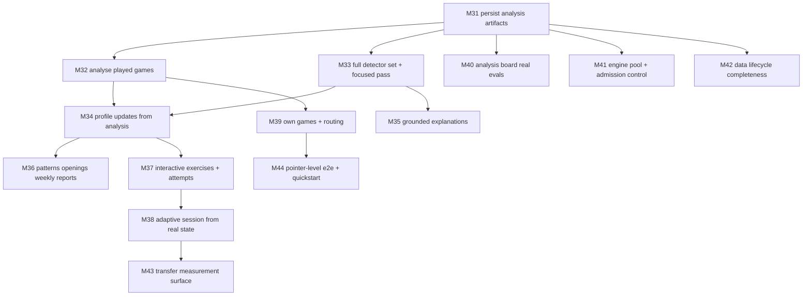

# Scan64 — Learning-Loop Enhancement Plan (M31–M44)

> STATUS: `§2` is the evidence-backed gap inventory and `§3` is the sequencing input for active planning. `§4`–`§5` record the 2026-07-26 proposal and are superseded by `docs/planning/DEVELOPMENT_PLAN.md` and `docs/planning/EXECUTION_PROMPTS.md`.

Date: 2026-07-26
Baseline: `main` @ `f616763` (M1–M30 merged, `scripts/check.sh` green)
Source of truth for requirements: `docs/planning/system-design.md`; this plan closes the delta between that design and the shipped behaviour observed in a live end-to-end audit.

## 1. Why this plan exists

At the baseline, M1–M30 was merged and the local quality gate passed, but the gate measured each milestone in isolation. Nothing measured the seam between subsystems. A live audit of the running stack (uvicorn + the production web bundle, real Stockfish, real browser pointer input) found the product's central promise — *play, get diagnosed, train your weaknesses* — is not connected end to end.

The audit's headline finding: **a game you play in the app is never analysed, and even an analysed game writes nothing to your profile.** Every read endpoint behind the Profile screen queries a table that no production code path writes.

Three user-blocking frontend defects found in the same audit were fixed before this plan was written (Chessground stale-bounds board lockup, 409 lockout for returning players, split player identity between Play and every other screen). They are recorded in §6 and are not milestones here.

## 2. Verified gap inventory

Every row was confirmed against a running system or by direct source inspection. `file:line` references are against `f616763`.

### 2.1 Loop-breaking (the core promise)

| # | Gap | Evidence |
| --- | --- | --- |
| G1 | Analysis is player-agnostic: the job hardcodes `player_id="system"`, so no finding can ever attach to a person. | `src/scan64/chess/analysis/jobs.py:56,87` |
| G2 | The analysis job persists no `Position`, `EngineAnalysis`, or `Evidence` rows. `Evidence` objects are constructed and dropped. | `jobs.py:75-86`; `GET /v1/games/{id}/positions` returned `[]` after a completed job |
| G3 | `GET /v1/players/{id}/evidence` reads `Position`→`Evidence`, which only tests ever write. Structurally always empty. | `src/scan64/api/reports.py:72-113`; `tests/unit/test_evidence_model.py:19-36` |
| G4 | Games played in-app are never analysed. Only the PGN-import screen creates an analysis job. | `apps/scan64-web/src/components/PgnImportScreen.tsx:49` is the sole `createAnalysisJob` caller |
| G5 | Game analysis never updates the Bayesian profile. The only live `SkillState` write is the famous-game attempt route. | `jobs.py:86-136`; `src/scan64/api/content.py:127-136` |
| G6 | Nine of ten seeded detectors have no live request path; the job constructs `HangingPieceDetector` concretely and bypasses the plugin registry. | `jobs.py:59-62`; `src/scan64/benchmarks/diagnosis_report.py:5-22` |
| G7 | The focused/deep MultiPV pass is dead in production; only the fast pass runs. | `src/scan64/chess/analysis/orchestration.py:101-117` vs `jobs.py:54-63` |
| G8 | The live explanation for the only wired diagnosis is a fixed fallback string: *"An error occurred. Always scan for forcing moves before continuing."* The template map holds two `tactics.knight_fork` aliases and nothing for `board_awareness.hanging_piece`. | `src/scan64/explanations/templates/provider.py:3-25` |
| G9 | Played-game `Game` rows store `white="Player"`, `black="Opponent"` and an empty `pgn`. The player's identity lives only on `PlaySession`. | `src/scan64/chess/games/play_session_service.py:78`; verified in `database.db` |

### 2.2 Reports and profiling

| # | Gap | Evidence |
| --- | --- | --- |
| G10 | `/v1/players/{id}/patterns` returns a hardcoded `recurring_habits=[]`. | `src/scan64/api/reports.py:126-129` |
| G11 | `/v1/reports/weekly` returns the literal string `"Weekly summary"`. | `src/scan64/api/reports.py` |
| G12 | `/v1/reports/openings` returns a hardcoded `openings: []` without reading any game data. | `src/scan64/api/reports.py:125-129` |
| G13 | Habit detection and context-conditioned profiling are implemented but have no production caller. | `src/scan64/learning/profiling/habits.py:90-156`, `context.py:35-82` |
| G14 | Rating-band Bayesian priors are never applied; every new concept starts at `(1.0, 1.0)`. | `src/scan64/learning/profiling/priors.py:3-20` vs `src/scan64/content/tracking.py:25-36` |
| G15 | Spaced repetition is read but never written on the normal learning path; ordinary attempts create no `ReviewSchedule`. | `src/scan64/api/learning.py:199-230`; `src/scan64/api/content.py:109-136` |
| G16 | `/v1/learning/session` hardcodes its priority factors (`session_fatigue=0.0`, fixed severity/interest/relevance) and loads no `SkillState`. Adaptive in shape only. | `src/scan64/api/learning.py:213-230` |
| G17 | No `StudySession` is persisted and there is no generic lesson-attempt endpoint — only the famous-game-specific route. | `src/scan64/content/models.py:39-68`; `src/scan64/api/learning.py:250-257` |

### 2.3 Frontend

| # | Gap | Evidence |
| --- | --- | --- |
| G18 | Daily Training renders the position as a raw FEN string with a "Next Lesson" button. No board, no move input, no attempt submission. | `DailyTrainingScreen.tsx:75-90` |
| G19 | `CriticalMomentReview` has no board and no answer input; it is text plus a Finish button. | `CriticalMomentReview.tsx:75-79,129` |
| G20 | No screen lists the player's own past games. Nav has no entry and the client has no list-games call in use. | `App.tsx:22-31`; `client.ts:56-80` |
| G21 | No routing. `App.tsx` uses one `currentView` state; every screen unmounts on nav and loses its state, including an in-progress play session. | `App.tsx:14-31,35-77` |
| G22 | Analysis Board reports "No engine analysis available" because it reads `/positions`, which G2 leaves empty. | `AnalysisScreen.tsx:32` |
| G23 | Opening Explorer is entirely client-side seed data; missions are never submitted. | `OpeningExplorerScreen.tsx:13-56,109-126` |
| G24 | None of the four Playwright specs exercises real pointer input on the board; the move tests call a `window.__e2e_move` hook. This is exactly why the board-lockup defect shipped. | `review-interaction.spec.ts:43-70`; `offline-smoke.spec.ts:50-56` |
| G25 | Form inputs use placeholders instead of labels; the board has no keyboard path. | `PlayScreen.tsx:242-255,276-281` |

### 2.4 Runtime integrity and operations

| # | Gap | Evidence |
| --- | --- | --- |
| G26 | `AdmissionController` (per-player quota, fair-share) is not connected; the endpoint dispatches `BackgroundTasks` directly. | `src/scan64/chess/analysis/admission.py:14-86` vs `src/scan64/api/games.py:158-168` |
| G27 | `EnginePoolManager` and interactive/batch pool separation are test-only; production launches a Stockfish process per call. | `src/scan64/providers/stockfish/pool.py:78-151`; `adapter.py:20-25` |
| G28 | Export/import/deletion omit `Evidence`, `TransferPosition`, and `TransferMeasurement` — a GDPR-style deletion request would leave rows behind once G2 starts writing evidence. | `src/scan64/api/data_lifecycle.py:23-46,118-130,353-365` |
| G29 | The whole transfer-measurement lifecycle (assignment, due selection, completion, reporting) has no API or CLI entrypoint. | `src/scan64/learning/evaluation/transfer_measurement.py:41-162` |
| G30 | `verify_lesson` checks FEN parsing and SAN legality but not that the accepted move satisfies the objective; the code says side-to-move handling is "for now just parsing". | `src/scan64/learning/verification/verifier.py:26-40` |
| G31 | Taxonomy migration has no live caller, so a `skill_id` rename would strand live `SkillState`/`ReviewSchedule` rows. | `src/scan64/learning/diagnosis/taxonomy/migration.py:11-51` |
| G32 | The SQLite path is the bare relative string `"database.db"`, so the database location silently depends on the process working directory. | `src/scan64/persistence/database.py:5-6` |
| G33 | No documented way to start the application. README has no quickstart; there is no run script and no Vite `preview` proxy. | `README.md`; `apps/scan64-web/vite.config.ts` |

## 3. Sequencing principle

Milestones are ordered so that **each one makes something observably true for a user**, not so that subsystems are completed alphabetically. The rule for this plan: *no milestone may add a read surface whose writer is not landed in the same milestone.* That rule is what M1–M30 lacked, and it is the direct cause of G2/G3/G10/G12.

## 4. Milestones

### Section G — Close the diagnostic loop

#### M31 — Persist analysis artifacts with player attribution

| Field | Value |
| --- | --- |
| Objective | A completed analysis job leaves durable, player-attributed `Position`, `EngineAnalysis`, and `Evidence` rows, so every existing read endpoint returns real data. |
| In / Out of scope | In: `run_analysis_for_game` persists positions and engine analyses for every analysed ply, persists the `Evidence` it already constructs, and takes the owning `player_id` from the game's `PlaySession` instead of the `"system"` literal; `PersistedLessonOpportunity` gains a player column. Out: new detectors (M33), profile mutation (M34), auto-triggering (M32). |
| Depends on | none (baseline `f616763`) |
| Deliverables | `jobs.py` rewritten to accept a resolved player identity and to write `Position`/`EngineAnalysis`/`Evidence` inside the job's session; a migration for the new opportunity column; integration test asserting a job produces non-empty `/positions` and `/players/{id}/evidence`. |
| Acceptance | After a job on an imported game owned by player P, `GET /v1/games/{id}/positions` returns one row per analysed ply with its engine analysis, and `GET /v1/players/P/evidence` returns the evidence backing every persisted lesson. No code path constructs an `Evidence` object it does not persist. Grep for `player_id="system"` returns nothing. |
| Verification | `uv run pytest tests/integration/test_analysis_persistence.py`; manual: import a PGN, poll the job, assert both endpoints non-empty. |
| Risks & rollback | Risk: persisting every ply's analysis inflates the SQLite file on bulk import. Mitigate by writing `EngineAnalysis` only for fast-pass candidates and focused-pass positions, not every ply. Rollback: stack is the rollback unit; no consumer depends on the rows before M34. |
| Est. PRs | 4 |

#### M32 — Analyse the games you actually play

| Field | Value |
| --- | --- |
| Objective | Finishing (or abandoning) a play session produces the same diagnostic output as importing that game as a PGN, attributed to the player who played it. |
| In / Out of scope | In: `Game` rows created by `PlaySessionService` record the real player identity and maintain a populated PGN as moves are appended; analysis is enqueued when a session reaches a terminal state and on an explicit "analyse now" request; a resign/abandon transition exists so an unfinished game can be analysed. Out: UI surfacing of the result (M39). |
| Depends on | M31 |
| Deliverables | `play_session_service.py` writes `white`/`black` from the session's player and opponent config and keeps `pgn` in sync; `POST /v1/play-sessions/{id}/resign`; terminal-state hook enqueuing an analysis job; `GET /v1/players/{id}/games`. |
| Acceptance | Play a game to mate or resignation via the API; without any further client call, a completed `AnalysisJob` exists for that game, its `Game.pgn` is a valid importable PGN naming the player, and `GET /v1/players/{id}/games` lists it. |
| Verification | `uv run pytest tests/integration/test_play_session_analysis.py`; manual: play and resign a session against Stockfish, then read the player's games and evidence. |
| Risks & rollback | Risk: auto-enqueue on every finished game saturates the engine on bulk play. Mitigate by routing through the batch pool once M41 lands, and by a per-player in-flight cap in this milestone. Rollback: the terminal-state hook is a single call site. |
| Est. PRs | 4 |

#### M33 — Wire the full detector set and the focused pass

| Field | Value |
| --- | --- |
| Objective | All ten seeded taxonomy codes can be diagnosed on a live request, and flagged positions receive the deep MultiPV evidence the design specifies. |
| In / Out of scope | In: the analysis job resolves detectors through `learning.plugins.registry` rather than constructing one concretely; every seeded detector registers; `FocusedPassOrchestrator` runs on fast-pass candidates and its MultiPV output becomes the evidence for diagnosis; per-detector confidence arbitration when several fire on one position. Out: new detector *classes* beyond the ten already implemented. |
| Depends on | M31 |
| Deliverables | Registry bootstrap at app startup; `jobs.py` two-pass pipeline; arbitration rule with a documented tie-break; a fixture-corpus regression test asserting each of the ten codes is produced for at least one golden position through the live job path (not the benchmark harness). |
| Acceptance | The benchmark corpus routed through the production job path yields at least one diagnosis for each of the ten seeded codes. A position where two detectors fire produces exactly one primary diagnosis with the loser recorded as secondary. `FocusedPassOrchestrator` appears in a production stack trace. |
| Verification | `uv run pytest tests/integration/test_live_detector_coverage.py tests/integration/test_stockfish_pipeline.py`. |
| Risks & rollback | Risk: enabling nine more detectors raises false positives that the single-detector baseline hid. Mitigate by gating each detector on its taxonomy-declared minimum engine evidence and reporting precision on the golden corpus in the milestone's verification output. Rollback: registry lookup is one call site; reverting to the concrete detector restores M31 behaviour. |
| Est. PRs | 5 |

#### M34 — Diagnoses move the profile

| Field | Value |
| --- | --- |
| Objective | A diagnosed weakness changes the player's Bayesian skill state and schedules review, so repeated mistakes become visible mastery signal. |
| In / Out of scope | In: `SkillState.apply_observation` called from the analysis path with the diagnosis as a negative observation; rating-band priors applied on first observation of a concept; `ReviewSchedule` created/updated when a lesson is generated and when it is attempted. Out: the reports that read this state (M36). |
| Depends on | M32, M33 |
| Deliverables | A single profile-update service used by both the analysis path and the content-attempt path (removing the duplicate update logic in `content/tracking.py`); prior selection from `PlayerProfile.rating`; schedule writer. |
| Acceptance | Two games containing the same diagnosis lower that concept's expected mastery monotonically and narrow its uncertainty. A player rated 1200 and a player rated 1900 start a new concept at different priors. Every generated lesson has a `ReviewSchedule` row with a due date. |
| Verification | `uv run pytest tests/integration/test_profile_updates_from_analysis.py tests/property/test_mastery_monotonicity.py`. |
| Risks & rollback | Risk: double-counting a diagnosis when a game is re-analysed. Mitigate with an idempotency key of (player, game, position, skill) on the observation. Rollback: profile updates are additive; a revert leaves stale `SkillState` rows that the idempotency key makes safe to recompute. |
| Est. PRs | 4 |

#### M35 — Explanations that say something true about the position

| Field | Value |
| --- | --- |
| Objective | Every diagnosis the system can produce has an evidence-grounded explanation; no user-visible lesson falls back to a generic sentence. |
| In / Out of scope | In: a template per seeded taxonomy code, parameterised by the diagnosis's evidence payload (hanging square, forking piece, the missed capture's target); removal of the catch-all fallback in favour of a loud failure in tests when a code has no template; optional LLM verbalization routed through `explanations.validator.attach_validated_explanation` so generated text is checked against evidence before it is shown, off by default. Out: any hosted LLM dependency in the default install. |
| Depends on | M33 |
| Deliverables | Expanded `TemplateExplanationProvider` with per-code templates and evidence interpolation; a conformance test enumerating the taxonomy and asserting template coverage; LLM path wired behind explicit configuration with grounding validation mandatory when enabled. |
| Acceptance | For each of the ten codes, the generated explanation names the specific square/piece from its evidence payload. A taxonomy code without a template fails the conformance test rather than silently rendering the fallback. With the LLM path enabled, an unfaithful generation is rejected and the template output is used. |
| Verification | `uv run pytest tests/conformance/test_explanation_coverage.py tests/unit/test_grounded_explanation.py`. |
| Risks & rollback | Risk: the grounding validator rejects most LLM output and the feature looks broken. Mitigate by treating rejection as normal and always having the template as the floor. Rollback: the template provider remains the default; the LLM path is config-gated. |
| Est. PRs | 4 |

#### M36 — Reports computed from real data

| Field | Value |
| --- | --- |
| Objective | The patterns, openings, and weekly report endpoints compute from persisted evidence and games instead of returning literals. |
| In / Out of scope | In: `recurring_habits` from `learning.profiling.habits` over the player's persisted diagnoses; the openings report from the player's own game corpus with per-family result and error rates; the weekly report as a structured object (games played, concepts observed, mastery deltas, top recurring diagnosis). Out: coach-facing aggregation changes. |
| Depends on | M34 |
| Deliverables | Habit computation wired into `/patterns`; opening-family classification over the player's games for `/openings`; a typed weekly-report model replacing the string. |
| Acceptance | A player with three games sharing one diagnosis has that pattern in `/patterns` with an occurrence count and evidence references. `/openings` reflects that player's actual opening families. `/reports/weekly` returns a typed object; no endpoint in `reports.py` returns a hardcoded literal. |
| Verification | `uv run pytest tests/integration/test_reports_from_real_data.py`. |
| Risks & rollback | Risk: habit detection over a sparse corpus produces noise. Mitigate with a minimum-occurrence threshold surfaced in the response. Rollback: endpoints are read-only. |
| Est. PRs | 3 |

### Section H — Make the learner able to act

#### M37 — Interactive exercises with recorded attempts

| Field | Value |
| --- | --- |
| Objective | A learner can attempt any generated lesson on a real board and the attempt is recorded against their profile. |
| In / Out of scope | In: a shared lesson-board component rendering the `LessonSpec` position with legal-move input, hint ladder, and accept/reject feedback, used by Daily Training and Critical Moment Review; a generic `POST /v1/lesson-attempts` accepting a lesson id, session id, submitted move, elapsed time, and hints used; `StudySession` persisted when `/v1/learning/session` is served. Out: the adaptive selection logic that consumes these attempts (M38). |
| Depends on | M34 |
| Deliverables | `LessonBoard` React component; `DailyTrainingScreen` and `CriticalMomentReview` rebuilt on it; generic attempt endpoint and `StudySession` writer; attempt-to-profile update reusing M34's service. |
| Acceptance | Daily Training presents a board, not a FEN string. Submitting the accepted move is confirmed and recorded; submitting a wrong move consumes an attempt and reveals the next hint. A served training session has a `StudySession` row and every attempt links to it. |
| Verification | `pnpm test`, `pnpm test:e2e` (new spec driving a real pointer answer), `uv run pytest tests/integration/test_lesson_attempts.py`. |
| Risks & rollback | Risk: the shared board component regresses the play board. Mitigate by extracting it from the play board's working configuration and covering both with pointer-level e2e. Rollback: screens are independent. |
| Est. PRs | 5 |

#### M38 — Adaptive session driven by actual state

| Field | Value |
| --- | --- |
| Objective | The training session a learner receives is composed from their measured mastery, due reviews, and recent fatigue rather than fixed constants. |
| In / Out of scope | In: `/v1/learning/session` loads `SkillState`, due `ReviewSchedule` rows, recent attempt history, and habit output to compute real priority factors; session fatigue derived from recent attempt volume and accuracy. Out: new exercise types. |
| Depends on | M37 |
| Deliverables | Priority-factor computation replacing the hardcoded block at `api/learning.py:213-230`; documented weighting with each factor's source; a test proving session composition changes as mastery changes. |
| Acceptance | A player with a low-mastery concept receives that concept's lessons ahead of a high-mastery concept's. Overdue reviews outrank exploration. After a long high-error session, fatigue measurably shifts composition. No constant priority factor remains in the request path. |
| Verification | `uv run pytest tests/integration/test_adaptive_session.py`. |
| Risks & rollback | Risk: an over-tuned weighting produces monotonous sessions. Mitigate with an explicit exploration floor in the composer. Rollback: the previous static composition is one function. |
| Est. PRs | 4 |

#### M39 — Your games, your history, real navigation

| Field | Value |
| --- | --- |
| Objective | A learner can find their past games, open one, and see its diagnoses, without losing an in-progress game to a stray nav click. |
| In / Out of scope | In: URL routing replacing the single `currentView` state; a games-list screen backed by `GET /v1/players/{id}/games` showing result, date, and diagnosis count; deep links to a game's analysis; in-progress play session restored on reload. Out: PGN export UI beyond what data lifecycle already offers. |
| Depends on | M32 |
| Deliverables | Router in `App.tsx`; `GamesListScreen`; play-session resumption from persisted session id; per-game analysis route. |
| Acceptance | Navigating away from an active game and back resumes the same position. The games list shows every game the player played or imported. A game's analysis view is reachable by URL and renders its persisted diagnoses. |
| Verification | `pnpm test`, `pnpm test:e2e` (nav-away-and-resume spec). |
| Risks & rollback | Risk: routing touches every screen. Mitigate by landing the router first with existing screens unchanged, then adding the list. Rollback: router PR is independently revertible. |
| Est. PRs | 4 |

#### M40 — Analysis board shows real engine evaluation

| Field | Value |
| --- | --- |
| Objective | The analysis board renders the persisted engine evaluation and the diagnosis for each position instead of "No engine analysis available". |
| In / Out of scope | In: consuming M31's persisted `EngineAnalysis` in `AnalysisScreen`, per-ply evaluation display, and diagnosis markers on the move list. Out: on-demand interactive engine analysis of arbitrary user positions. |
| Depends on | M31 |
| Deliverables | Position/eval rendering; diagnosis markers; empty-state copy that distinguishes "not analysed yet" from "analysis found nothing". |
| Acceptance | Opening an analysed game shows an evaluation for every analysed ply and a marker at each diagnosed position. An unanalysed game offers an "analyse this game" action rather than a dead message. |
| Verification | `pnpm test`; manual walkthrough against a locally analysed game. |
| Risks & rollback | Risk: none beyond display. Rollback: single screen. |
| Est. PRs | 2 |

### Section I — Runtime integrity and operations

#### M41 — Engine pool and admission control on the production path

| Field | Value |
| --- | --- |
| Objective | Interactive play is never queued behind batch analysis, and no player can monopolise analysis capacity. |
| In / Out of scope | In: `EnginePoolManager` used by the opponent provider (interactive pool) and the analysis job (batch pool); `AdmissionController` enforcing the per-player daily quota at job submission with fair-share queueing. Out: distributed/multi-host scheduling. |
| Depends on | M31 |
| Deliverables | Pool wiring in `play_session_service` and `jobs`; admission check in the analysis-job endpoint returning a queued status rather than an error; pool lifecycle bound to the app lifespan. |
| Acceptance | A move request issued during a running batch analysis returns within the interactive budget. A player exceeding the daily quota has jobs queued fair-share, never rejected or dropped. Process count stays bounded under concurrent load. |
| Verification | `uv run pytest tests/integration/test_engine_pool_isolation.py tests/integration/test_admission_control.py`. |
| Risks & rollback | Risk: pooled engines leak state between analyses. Mitigate with a documented `ucinewgame`/reset on checkout. Rollback: per-call adapter construction remains behind a config flag for one release. |
| Est. PRs | 4 |

#### M42 — Complete the data-lifecycle contract

| Field | Value |
| --- | --- |
| Objective | Export, import, and deletion cover every table that holds player-derived data, including the evidence M31 starts writing. |
| In / Out of scope | In: `Evidence`, `Position`, `EngineAnalysis`, `TransferPosition`, `TransferMeasurement`, and `StudySession` added to the archive schema, the import path, and the deletion path with audit coverage; a completeness test that enumerates SQLModel tables and fails when a player-scoped table is absent from the lifecycle. Out: hosted-mode retention policy. |
| Depends on | M31 |
| Deliverables | Extended archive model and handlers; the enumeration-based completeness test; deletion audit updated. |
| Acceptance | Export→delete→import round-trips a player with analysed games and leaves no orphan rows. Adding a new player-scoped table without registering it fails the completeness test. |
| Verification | `uv run pytest tests/integration/test_data_lifecycle_completeness.py`. |
| Risks & rollback | Risk: deletion coverage bugs are silent. Mitigate by asserting zero residual rows per table after deletion, not just a success status. Rollback: additive. |
| Est. PRs | 3 |

#### M43 — Transfer measurement becomes reachable

| Field | Value |
| --- | --- |
| Objective | The transfer-measurement lifecycle — the design's evidence that training generalises — is usable through the API instead of only through tests. |
| In / Out of scope | In: seeding transfer positions from the content catalog, assignment on mastery threshold, due-selection inside the training session, completion recording, and a per-player transfer report; verification strengthened so a transfer exercise's accepted move is engine- or tablebase-confirmed. Out: the controlled study infrastructure already delivered in M30. |
| Depends on | M38 |
| Deliverables | Transfer routes and session integration; production seeding of `TransferPosition`; objective-correctness check added to `verify_lesson`; report endpoint. |
| Acceptance | Reaching the mastery threshold on a concept assigns a transfer position; it appears in a later session as a due item; completing it records a measurement and moves the transfer report. A lesson whose accepted move is not engine-best fails verification. |
| Verification | `uv run pytest tests/integration/test_transfer_measurement.py tests/unit/test_lesson_verification.py`. |
| Risks & rollback | Risk: strengthening `verify_lesson` retroactively invalidates already-persisted lessons. Mitigate by re-verifying on read and marking, not deleting. Rollback: transfer routes are additive. |
| Est. PRs | 4 |

#### M44 — Interaction-level e2e and a documented way to run the app

| Field | Value |
| --- | --- |
| Objective | The defect class that shipped a dead chessboard cannot ship again, and a new user can start the application from the README. |
| In / Out of scope | In: Playwright specs that drive the board with real pointer input for play, lesson attempts, and analysis, replacing `window.__e2e_move` as the primary path; removal of the DEV-only hook once specs no longer need it; a `scripts/run.sh` starting API and web together; README quickstart; configurable database path replacing the bare relative `"database.db"`. Out: hosted deployment. |
| Depends on | M39 |
| Deliverables | Rewritten e2e specs with genuine `mouse.down/move/up` interaction; `scripts/run.sh`; README quickstart with prerequisites (uv, pnpm, Stockfish); `SCAN64_DATABASE_URL` with the current relative path as default. |
| Acceptance | An e2e spec fails if the board stops accepting pointer input, verified by reverting the M-pre fix in a scratch worktree and observing the failure. A new clone reaches a playable board following only the README. Setting `SCAN64_DATABASE_URL` relocates the database. |
| Verification | `pnpm test:e2e`; mutation check per the acceptance clause; manual clean-clone walkthrough. |
| Risks & rollback | Risk: pointer-driven specs are flakier than hook-driven ones. Mitigate with explicit waits on board readiness rather than sleeps, and keep the hook available for offline-queue specs where pointer input is not the subject. Rollback: specs are additive. |
| Est. PRs | 4 |

## 5. Critical path

| Step | Milestones | Gate |
| --- | --- | --- |
| 1 | M31 | Persisted positions and evidence readable through existing endpoints. |
| 2 | M32, M33 | A played game is diagnosed by the full detector set without a client call. |
| 3 | M34 | Diagnoses change mastery; reviews are scheduled. |
| 4 | M35, M36, M37 | Explanations are specific; reports are computed; exercises are answerable. |
| 5 | M38, M39, M40 | Sessions adapt; history is navigable; evaluations are visible. |
| 6 | M41, M42, M43, M44 | Capacity is bounded, data is portable and deletable, transfer is measurable, interaction is tested. |

M31 is the gate for everything. Nothing downstream is worth starting until the analysis job stops discarding its own output.

## 6. Already applied outside this plan

Three defects were found and fixed during the audit that produced this plan. They are in the working tree at the time of writing, not yet committed.

| Defect | Fix | Verification |
| --- | --- | --- |
| Board accepted no pointer input after "Start Game" — Chessground cached its DOM bounds before the setup form unmounted and shifted the board. | `PlayScreen.tsx`: `redrawAll()` on session start. | Dragged e2–e4 in the production bundle and received an engine reply; regression assertion in `PlayScreen.test.tsx`. |
| Returning players were locked out with `Failed to create player: Conflict`. | `client.ts`: treat 409 as identity reuse. | Started a second session under an existing id; test in `client.test.ts`. |
| Profile, Daily Training, and Coach ran under a random UUID, never the played identity. | `client.ts`/`PlayScreen.tsx`: `setActivePlayerId` on game start. | Profile resolved to the played id after a game. |

## 7. Out of scope

- Hosted deployment, authentication hardening beyond the existing player token, and rate limiting — the source design ties these to hosted mode.
- Lichess/Chess.com import.
- Shipping Maia weights. Operator-provisioned checkpoints remain the only supported path.
- Mobile, desktop, voice, and physical-board clients. `LessonSpec` remains the contract for them.
