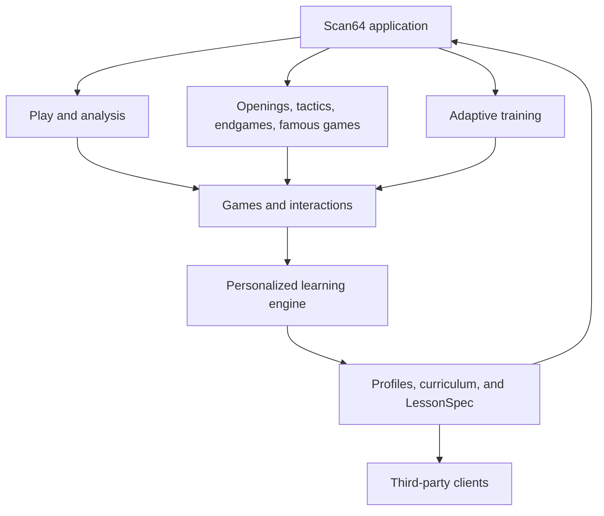
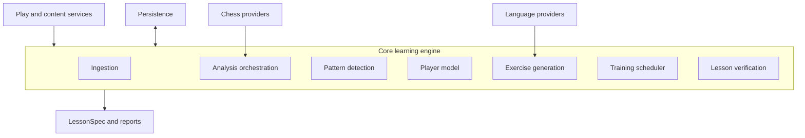
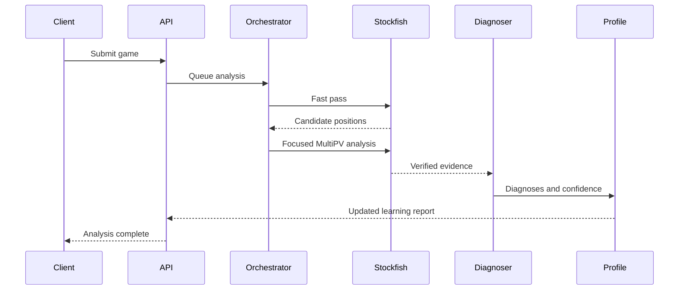

# Scan64
> STATUS: Requirements proposal. `docs/planning/DEVELOPMENT_PLAN.md` and `docs/planning/EXECUTION_PROMPTS.md` govern active milestone sequencing and release evidence; `docs/system-design.md` is the architecture companion. Sections 28 and 33 are superseded for active planning.


## Complete Chess Platform, Personalized Learning Engine, and Open-Source System Design

**Document status:** Requirements proposal.
**Updated:** 29 July 2026
**Tagline:** Play. See. Learn.
**Learning-engine promise:** Train what you fail to see.
**Working description:** A complete, local-first chess playing and learning platform whose personalized learning engine discovers what a player repeatedly fails to see and creates verified, interactive exercises that train those weaknesses.

---

## 1. Executive summary

Most chess software can identify a bad move. Far fewer systems help a player understand why they failed to see the better move, determine whether the failure is recurring, and create targeted practice that changes future behaviour.

This proposal defines **Scan64**, a complete open-source chess application that turns ordinary chess play and structured study into a personalized training loop:

> The system learns what a player repeatedly fails to see, then creates interactive visual exercises that train the player to see it.

Scan64 should be independently useful as a chess application from the first session. Users should be able to play computer opponents, analyse games, study famous openings and games, practise tactics and endgames, explore positions, and follow structured training. These capabilities are table stakes for a credible chess-learning product; they are not the moat.

The moat is the personalized learning engine beneath those experiences. It observes games and study attempts over time, distinguishes an engine error from the human skill that failed, builds a longitudinal model of the player's blind spots and habits, and turns that evidence into an adaptive curriculum. The official application provides a polished complete experience, while the learning engine remains headless and reusable through a typed, renderer-independent `LessonSpec`. Third-party applications can submit games, retrieve player weaknesses, request training sessions, render exercises, and return attempts without adopting the official UI.

The system combines four forms of intelligence:

1. **A chess engine** such as Stockfish provides authoritative move analysis, counterfactual lines, and verification.
2. **A human-like opponent policy** such as Maia provides plausible play at a learner's level. This avoids the unnatural behaviour that can result from simply weakening a superhuman engine.
3. **A deterministic pedagogical layer** classifies mistakes, maintains a skill profile, generates exercises, schedules review, and emits visual instructions.
4. **An optional language model** verbalizes verified evidence, asks Socratic questions, and adapts explanations to the learner. It is never the authority for chess legality or tactical correctness.

The recommended product strategy is therefore:

- Use existing free tools such as Lichess immediately for general play and analysis.
- Build Scan64 as a complete, coherent chess application with computer play, analysis, openings, tactics, endgames, famous games, and ordinary study workflows.
- Treat those familiar capabilities as the acquisition and data-generating surface, while treating personalization, diagnosis, exercise generation, learning transfer, and `LessonSpec` as the differentiated intellectual core.
- Keep the learning architecture headless and public so any compatible UI can build on it.
- Make the official Scan64 application polished and independently useful rather than a technical demonstration.
- Measure success by learning transfer: whether a player recognizes the same concept in a new position and stops repeating the associated mistake in later games.

This revised concept receives a strong **GO** recommendation as an OSS project. It also has legitimate research potential if the diagnostic and transfer-of-learning claims are evaluated rigorously.

---

## 2. Problem definition

### 2.1 The user problem

A player wants to practise chess naturally, learn new tactics and openings, and improve from their own mistakes. Existing products commonly present one or more of the following:

- An evaluation bar.
- A best move.
- A computer-generated variation.
- A generic label such as *mistake* or *blunder*.
- A large library of unrelated puzzles.
- Opening lines that must be memorized.
- A natural-language explanation generated independently for each position.

These features are useful, but they do not necessarily answer the learner's most important questions:

1. What did I fail to notice?
2. Why did I fail to notice it?
3. Have I made this kind of mistake before?
4. What visual or reasoning cue should I learn?
5. Can I recognize the same idea when the board looks different?
6. Has the training changed how I play future games?

### 2.2 The product gap

The gap lies between **engine analysis** and **human learning**.

An engine optimizes move quality. A coach tries to improve the learner's future decision process. These are different objectives.

For example, Stockfish may report that one move changes an evaluation from `+0.3` to `-1.8`. A learning system must go further:

- Determine that the player overlooked an opponent capture.
- Recognize that the overlooked capture was enabled by an overloaded defender.
- Notice that the player has missed comparable defender-overload patterns in five recent games.
- Generate exercises that isolate that relationship.
- Retest the concept after a delay and in visually dissimilar positions.
- Observe whether the mistake frequency later decreases.

The proposed system is designed to bridge this gap.

### 2.3 Product thesis

The core thesis is:

> A player's game history contains a personalized curriculum. Engine-verified analysis can locate the important moments, but a separate learning layer must infer the failed skill, organize recurring evidence, and transform it into targeted practice.

### 2.4 Key hypothesis

The main falsifiable hypothesis is:

> Players who train on exercises generated from their recurring diagnostic patterns will demonstrate better recognition and lower recurrence of those patterns than players who receive only conventional engine review or unrelated puzzles.

As stated, this bundles three mechanisms that must remain separable in evaluation: (1) the diagnosis itself is valid, (2) personalization adds value over motif-matched generic practice, and (3) transfer-exercise design adds value over exact-position replay. A positive result against a single lumped control would not isolate which mechanism worked. The evaluation design in §23.5 therefore uses a graded baseline ladder rather than one control condition, and the roadmap gates in §28 test the weakest unvalidated mechanism first.

---

## 3. Build-versus-use analysis

### 3.1 Existing free solutions

Several capable free and open-source alternatives already cover portions of the experience:

- [Lichess](https://lichess.org/) provides free play, computer opponents, Stockfish analysis, puzzles, studies, opening tools, game imports, and an open database. It is the immediate recommendation for ordinary play and analysis.
- [Lucas Chess](https://lucaschess.pythonanywhere.com/) provides adjustable engines, opening training, tactics, board-vision exercises, endgames, and many specialized training modes.
- [AI Chess Tutor](https://github.com/stefan-kp/chess_tutor) combines Stockfish, real-time coaching, opening practice, tactical exercises, and LLM explanations.
- [Chess King](https://github.com/Iamsdt/chess) demonstrates a browser-based Stockfish-WASM and LLM training application.
- [WhyThisMove](https://whythismove.com/open-source) combines engine analysis, opening data, human move prediction, and LLM coaching in an open-source platform.

Two proprietary products overlap the claimed moat directly and must be part of an honest comparison:

- [Chessable](https://www.chessable.com/) delivers spaced-repetition training with mastery tracking over structured courses — direct overlap with the review scheduling in §21, though driven by authored course content rather than the player's own games.
- [Aimchess](https://aimchess.com/) diagnoses player weaknesses from imported game history and generates targeted drills — the closest existing product to the personalized layer in §4.2, though its diagnoses are aggregate statistics rather than evidence-linked, verified, transfer-tested lessons.

These projects demonstrate three important conclusions:

1. The basic technical concept is feasible.
2. “Stockfish plus an LLM explanation” is no longer sufficient differentiation.
3. Personalized weakness detection (Aimchess) and spaced-repetition mastery training (Chessable) already exist commercially. Scan64's differentiation must rest on the combination they do not offer: evidence-linked diagnosis, verified exercise generation from the player's own games, measured transfer, and an open, headless learning core.

### 3.2 When existing tools are enough

Existing solutions should be used if the primary requirement is:

- Free online games.
- Standard engine review.
- General tactical puzzles.
- Opening-line memorization.
- A one-time explanation of a position.
- An adjustable computer opponent.

Building a new platform solely to reproduce these features is not differentiated. Nevertheless, Scan64 should include them because they remove context switching, create a complete user journey, and give the learning engine direct access to play and study evidence.

### 3.3 When building is justified

Building is justified when the complete application is organized around capabilities that are not consistently delivered as a reusable learning backend:

- Longitudinal modeling of recurring perceptual and reasoning failures.
- Separation of chess error from learning diagnosis.
- Exercise generation from the player's own games.
- Generation of structurally related exercises rather than simple repetition.
- Progressive, renderer-independent visual hints.
- Spaced review and mastery tracking.
- Measurement of transfer into future games.
- A public API and typed lesson format that third-party UIs can consume.

### 3.4 Decision

| Option | Recommendation | Reason |
| --- | --- | --- |
| Use existing tools only | Suitable for immediate learning | Lichess and Lucas Chess already provide substantial free functionality. |
| Build a conventional full chess platform with no learning differentiation | No-go | High scope with little reason for users to switch. |
| Build a generic Stockfish chat interface | No-go | Technically straightforward and already crowded. |
| Build only a personalized backend with a demonstration UI | Technically viable but incomplete as a user product | Reusable, but adoption would depend on imports and third-party experiences. |
| Build Scan64 as a complete app powered by a reusable personalized learning engine | Strong go | Combines a self-contained user experience with clear differentiation and an extensible OSS core. |
| Build an OSS research platform around personalized chess learning | Go with evaluation discipline | Chess offers legal-state verification, strong engines, extensive open data, and measurable player behaviour. |

---

## 4. Vision, boundaries, and design principles

### 4.1 Vision

Scan64 should become both:

1. A complete open-source environment in which a learner can play, study, analyse, train, and improve without needing a subscription or another application.
2. The open personalized-learning layer that other chess applications can embed.

The official application provides games, computer opponents, analysis, structured chess content, and training interactions. The learning engine provides:

- Engine-backed evidence.
- Diagnoses of what the player failed to perceive or calculate.
- A longitudinal player model.
- Targeted, verified training exercises.
- Portable visualization instructions.
- A review schedule.
- Evidence of improvement or persistent weakness.

### 4.2 Three product layers

#### Play and analysis layer

The expected chess foundation includes:

- Legal over-the-board interaction and move history.
- Computer opponents with selectable colour, strength, time control, and behaviour.
- Practice controls such as takeback, restart, save, and resume.
- PGN import and export.
- FEN position setup and analysis.
- Game review, evaluation, candidate lines, and critical moments.
- Clocks, board orientation, coordinates, themes, arrows, and highlights.
- Local-first game history and progress.

#### Structured chess-learning layer

The expected educational foundation includes:

- Famous openings and their strategic ideas.
- Opening repertoires, common deviations, traps, and thematic middlegames.
- Tactical puzzles by motif and difficulty.
- Endgame fundamentals and tablebase-backed positions.
- Checkmate patterns.
- Calculation and board-visualization exercises.
- Famous historical games with guided annotations.
- “Play from this position” and guided continuation modes.
- Daily training plans and conventional topic progress.

#### Personalized learning layer

The moat includes:

- Diagnosing what the individual repeatedly fails to perceive, calculate, or understand.
- Connecting mistakes across games, openings, puzzles, and study attempts.
- Maintaining a multidimensional skill and habit profile beyond Elo.
- Generating exercises from personal mistakes and related positions.
- Scheduling review based on mastery, hints, recency, and transfer.
- Selecting conventional content according to the player's observed needs.
- Measuring whether training reduces recurrence in future play.

### 4.3 Product boundaries

The Scan64 application is responsible for:

- Providing a complete play, analysis, and structured-learning experience.
- Making the first session valuable before sufficient personalization data exists.
- Capturing consistent game and study events for the learning engine.
- Rendering the full range of `LessonSpec` interactions.
- Demonstrating the public backend contracts without hiding learning logic in the client.

The reusable backend is responsible for:

- Ingesting and normalizing games.
- Analysing critical positions.
- Detecting and classifying learning opportunities.
- Updating the player model.
- Selecting and generating exercises.
- Verifying exercise correctness.
- Scheduling training.
- Returning structured lessons and reports.

The initial product is not required to own:

- Matchmaking.
- Social features.
- Payments or subscriptions.
- Tournament infrastructure.
- Live multiplayer networking.
- A proprietary opening database.
- A mandatory hosted LLM.

These may be added later, but they are not required to validate the core learning loop. Basic computer play and conventional chess study are required; social-network and competitive-platform infrastructure are not.

### 4.4 Design principles

#### Complete product, headless core

The official application must feel complete to a learner, while the personalized learning engine must remain usable through a Python library, command line, and API independently of that application.

#### Table stakes feed the moat

Computer play, openings, tactics, endgames, famous games, and analysis are not throwaway features. They provide value, generate evidence, and become more effective when selected and adapted by the learning engine.

#### Engine-grounded

All move-specific claims must trace back to a legal position and verified engine evidence.

#### Pedagogy before centipawns

The system prioritizes teachable patterns and behavioural recurrence over small engine-evaluation differences.

#### Local-first and privacy-conscious

Users should be able to analyse games and maintain their learning profile locally. Hosted services may be offered, but the core must not require them.

#### Renderer-independent

The backend emits semantic visualization commands such as “highlight the undefended bishop” rather than UI-specific pixels or animations.

#### LLM-optional

Every core learning operation must work without a language model. Language generation enhances explanations but does not determine truth.

#### Evidence-preserving

Every diagnosis and lesson should retain its source position, engine configuration, relevant line, classifier version, and confidence.

#### Progressive disclosure

The system should help the user discover a move rather than reveal it immediately.

#### Transfer over memorization

Mastery requires success on related unseen positions and reduced recurrence in future play, not merely replaying the original answer.

---

## 5. Target users and use cases

### 5.1 Primary learner

An amateur player who:

- Plays regularly but lacks structured coaching.
- Wants understandable feedback rather than raw engine output.
- Repeats opening, tactical, or calculation habits.
- Wants a small, relevant daily curriculum.
- Prefers free or local software.

The initial design should target approximately beginner-to-intermediate players. At this level, recurring tactical awareness, board scanning, opening principles, and calculation discipline are often more teachable than subtle engine preferences.

### 5.2 Developers

Developers may build:

- Mobile chess trainers.
- Lichess or Chess.com companion applications.
- Classroom dashboards.
- Accessibility-oriented interfaces.
- Voice-controlled trainers.
- Physical-board integrations.
- Research experiments.
- Alternative schedulers or diagnosis providers.

### 5.3 Coaches and researchers

Coaches may use the engine to identify patterns across student games. Researchers may use its normalized events and evaluation harness to study personalized instruction, error classification, visual attention, and learning transfer.

**Persona priority.** Through Phase 2, the primary learner (§5.1) is the only persona with roadmap authority. Developers, coaches, and researchers are architecture-supported — public contracts, clean module boundaries, and reproducible analysis are designed in from the start — but no roadmap item before Phase 4 should exist solely to serve them. When persona needs conflict, the learner experience wins.

### 5.4 Representative use cases

#### Play against the computer

The user starts a normal game without importing anything. They choose colour, time control, opponent type, approximate strength, and whether assistance is permitted. The completed game flows directly into analysis and the personal learning history.

#### Natural practice

The user plays a normal game. The system records the game and generates a small number of high-value learning moments afterward.

#### Coach mode

During an untimed practice game, the system pauses after a meaningful error, rolls back the position, and provides progressive hints.

#### Independent calculation mode

No assistance appears during the game. Afterward, the user must first annotate critical positions before seeing engine analysis.

#### Mistake replay

The user receives positions from previous games, with pieces or sides transformed where valid, and must identify the overlooked cue.

#### Opening rotation

The system assigns an opening family and a strategic objective, monitors whether the player follows principles, and compares behaviour across structures.

#### Guided opening study

The user selects a famous opening and learns its purpose, characteristic pawn structures, typical plans, common mistakes, traps, and transitions into the middlegame. The system adapts the depth and choice of variations to the player's experience and observed weaknesses.

#### Famous-game study

The user follows a historical game one decision at a time, predicts important moves, receives contextual explanations, and can branch into “play from here” positions. Attempts contribute evidence to the same skill profile used for ordinary play.

#### Tactics, endgames, and visualization

The user can deliberately practise a conventional topic even when it has not appeared recently in personal games. The scheduler combines this broad curriculum with personalized review so the learner is not constrained by the positions they happen to encounter.

#### Daily personalized session

The scheduler chooses a mixture of due reviews, recent mistakes, weak motifs, and one exploratory topic.

---

## 6. System context and high-level architecture



### 6.1 Product and platform relationship

Scan64 is not a backend with a demo attached. It is a complete end-user chess application powered by a reusable platform.

```text
Scan64 application
├── play and analysis
├── structured chess content
└── personalized training
          │
          ▼
Scan64 learning platform
├── evidence and diagnosis
├── player model and scheduler
├── exercise generation and verification
├── LessonSpec
└── public library and API
```

The official application may make product-specific decisions about navigation, presentation, and onboarding. It must not contain private implementations of diagnosis, scheduling, or lesson correctness that third-party clients cannot access through public contracts.

### 6.2 Separate the three decision systems

The architecture must not collapse these responsibilities:

| Responsibility | Preferred system | Objective |
| --- | --- | --- |
| Choose a realistic opponent move | Maia or another human-like policy | Behave plausibly at the target skill level. |
| Determine chess truth | Stockfish or tablebase | Find and verify strong moves and refutations. |
| Determine what to teach | Pedagogical engine | Maximize learner improvement and retention. |

This distinction is fundamental. The best move is not automatically the best lesson, and a superhuman engine weakened to an Elo is not automatically a realistic opponent at that Elo.

### 6.3 Core service components



Chess providers are backed by two separate engine-process pools — interactive (live play, on-demand analysis) and batch (bulk imports, re-analysis) — with independent concurrency limits and scheduling priority (§18.6).

### 6.4 Suggested deployment forms

The same core should support:

1. **Python package:** embedded into another application.
2. **Local daemon:** FastAPI service running beside a desktop or browser client.
3. **CLI:** analyse PGNs and generate training plans.
4. **Hosted API:** optional community or commercial deployment.
5. **Batch research pipeline:** analyse large game collections reproducibly.

The official application is an additional first-class deployment, not merely a test harness:

6. **Scan64 desktop/web application:** the complete play, study, analysis, and training experience built entirely on the public core contracts.

---

## 7. End-to-end learning pipeline

### 7.1 Stage 1: game ingestion

Supported inputs should eventually include:

- PGN files.
- Individual FEN positions.
- Games played directly in Scan64.
- Lichess game exports.
- Chess.com game exports where permitted.
- A direct move-event stream.

Normalization should produce:

- Canonical game identifier.
- Initial position and variant.
- Legal move sequence.
- Player colour.
- Time control.
- Per-move clocks when available.
- Player rating and rating system.
- Opening metadata when known.
- Source and import provenance.

Invalid games must be rejected or marked incomplete. Variant support should be explicit; the MVP should support standard chess only.

### 7.2 Stage 2: analysis triage

Deeply analysing every move is expensive and often pedagogically unnecessary. Use a two-pass process:

#### Fast pass

- Low node or time budget.
- Evaluation before and after moves.
- Detect large swings, forced moves, missed tactics, unusual time use, and phase transitions.
- Identify candidate critical positions.

#### Focused pass

- Higher analysis budget only for selected positions.
- MultiPV candidate lines.
- Search restricted to the player's move when comparing counterfactuals.
- Refutations and forcing continuations.
- Optional Syzygy tablebase verification for supported endgames.

Analysis settings must be recorded because engine depth, nodes, hash, threads, and version affect reproducibility.

#### Default budgets

Budgets are configuration, not code, but the design must commit to defaults so worker pools and local hardware requirements can be sized:

- Fast pass: a fixed node budget per position (order 10⁴–10⁵ nodes, roughly 20–80 ms per position on one modern core), so a full game costs ≈ 5–10 CPU-seconds.
- Focused pass: MultiPV 4–5 at order 10⁶–10⁷ nodes per selected position, 5–10 positions per game, ≈ 30–120 CPU-seconds per game.
- Planning number: **≈ 1–2 CPU-minutes of engine time per fully analysed game.** A 1,000-game historical import is therefore a 15–30 CPU-hour batch job, not an interactive request. §18.6 defines the pool separation and admission control this requires.

### 7.3 Stage 3: learning-opportunity detection

A position becomes a learning opportunity when one or more conditions hold:

- Significant evaluation loss.
- Missed forced win or defence.
- Tactical motif overlooked.
- Hanging or undefended material.
- Repeated positional-plan failure.
- Violation of an active opening objective.
- Excessive time spent without producing adequate candidate moves.
- Very rapid move followed by an avoidable error.
- A correct but difficult move worthy of reinforcement.
- A pattern strongly related to an existing weakness.

The detector should avoid overcoaching. A game with twenty minor inaccuracies should not generate twenty lessons. Ranking should consider:

```text
lesson_value = severity
             × teachability
             × recurrence
             × confidence
             × transfer_value
             × readiness
             - redundancy
             - cognitive_overload
```

All factors and penalty terms are normalized to [0, 1] with documented per-taxonomy-code definitions. Because a single near-zero multiplicative factor would otherwise silently zero the whole score, the implementation computes the score in log-additive form (`Σ log(max(factor_i, ε)) − Σ penalty_j`) with a small floor `ε` on each factor. The exact weighting can begin as a transparent heuristic and later be learned from outcome data.

### 7.4 Stage 4: diagnostic classification

The system must distinguish the observed chess event from the inferred learning failure.

#### Chess event

“The move allowed `...Nxf2`, forking the queen and rook.”

#### Learning diagnosis

“The player did not perform an opponent-threat scan before continuing their own attack.”

Diagnoses should be hierarchical and multi-label:

```text
awareness
└── opponent_threats
    └── forcing_moves
        └── captures
            └── fork
                └── knight_fork
```

The system should retain:

- Primary diagnosis.
- Secondary motifs.
- Supporting evidence.
- Confidence.
- Alternative diagnoses.
- Detector versions.

#### Diagnosis tiers and confidence gating

Engine output alone can establish the chess event; it cannot observe what the player looked at. The taxonomy therefore distinguishes two tiers:

- **Observable (event-tier) codes** — hanging piece, missed capture, knight fork allowed — are derivable from position, move, and engine evidence alone. These may carry high confidence from day one.
- **Inferred (process-tier) codes** — “did not perform a threat scan”, “confirmation bias toward intended move” — are hypotheses about cognition. They may only be asserted when corroborated by behavioural signals: pre-move think time, hint level required before success in review, retry-without-hint outcome, candidate moves captured when available, and recurrence across games.

Confidence is produced by a defined mechanism, not asserted. Each detector computes confidence from observable features only, using the calibration procedure named in its taxonomy entry (§8.10). Diagnoses below a rendering threshold (default 0.6) are presented as “possible pattern — insufficient evidence” and carry no scheduling weight until corroborated.

When two detectors disagree on the same opportunity — for example a deterministic rule and a future learned model — the deterministic detector wins for event-tier codes, and the disagreement is logged as evaluation data. A learned detector may replace a rule only after beating it on the golden fixture set (§22.3) at equal or better calibration.

### 7.5 Stage 5: profile update

The player model aggregates evidence across games and training attempts. It must support uncertainty and decay; one mistake is evidence, not a permanent trait.

For each skill or pattern, track:

- Opportunities observed.
- Failures and successes.
- Recency.
- Severity distribution.
- Mean response time.
- Hint dependence.
- Performance by board phase.
- Performance by colour.
- Performance under time pressure.
- Transfer performance.
- Estimated mastery and uncertainty.

### 7.6 Stage 6: exercise generation

An exercise should be derived from a diagnosis, not merely from the engine's first line.

Possible exercise types include:

- Find the opponent's threat.
- Find all checks, captures, and threats.
- Select candidate moves before choosing one.
- Identify the least-defended piece.
- Find the tactical move.
- Defend against a threat.
- Explain the purpose of an opening move.
- Choose a plan rather than a move.
- Calculate a line without moving pieces.
- Reconstruct the board after a sequence.
- Compare two candidate moves.
- Continue from the original position after correction.

### 7.7 Stage 7: verification

No generated lesson should reach a client until it passes verification:

- FEN is valid.
- Side to move is correct.
- All accepted moves are legal.
- Claimed refutations exist at the configured analysis threshold.
- Alternative moves within the acceptance tolerance are handled.
- Visual overlays reference valid squares and pieces.
- Prompts do not reveal answers prematurely.
- LLM text contains no ungrounded move claims.
- Source and provenance are retained.

Verification has a shelf life. Each verification records the engine version, network, and search budget that produced it. When the configured engine is upgraded, cached lessons and due review items are re-verified before delivery; a lesson whose accepted moves no longer hold at the configured threshold is regenerated or retired rather than served stale.

### 7.8 Stage 8: attempt and mastery update

An attempt records more than pass or fail:

- Selected move or answer.
- Time to first action.
- Candidate moves considered, when collected.
- Hints requested and level reached.
- Board interactions.
- Whether the user changed their answer.
- Explanation quality feedback.
- Result on immediate retry.
- Result on delayed review.

The mastery model updates only after the complete attempt is evaluated.

---

## 8. Diagnostic taxonomy

The taxonomy is a core public asset and should be versioned independently.

### 8.1 Board awareness

- Hanging piece.
- Undefended piece.
- Underdefended piece.
- Loose pieces aligned.
- Unseen long-range attacker.
- Back-rank vulnerability.
- Weak diagonal.
- Weak file or rank.
- Overlooked pawn attack.
- Board-side neglect.

### 8.2 Tactical motifs

- Fork.
- Pin.
- Skewer.
- Discovered attack.
- Double attack.
- Deflection.
- Decoy.
- Clearance.
- Interference.
- Overloading.
- Removing the defender.
- Zwischenzug.
- Trapped piece.
- Mating net.
- Perpetual-check resource.

### 8.3 Threat processing

- Did not inspect checks.
- Did not inspect captures.
- Did not inspect direct threats.
- Continued own plan despite opponent threat.
- Misjudged threat urgency.
- Failed to find defensive resource.

### 8.4 Candidate-move generation

- Considered only one move.
- Ignored forcing candidate.
- Ignored quiet defensive move.
- Chose a move inconsistent with stated plan.
- Failed to compare candidate outcomes.

### 8.5 Calculation

- Stopped one ply too early.
- Missed opponent's best reply.
- Missed intermediate move.
- Incorrect exchange sequence.
- Visualization error after piece movement.
- Evaluation error at line endpoint.

### 8.6 Positional understanding

- Weak-square creation.
- Bad-piece improvement failure.
- Pawn-structure misunderstanding.
- Poor exchange decision.
- Space disadvantage.
- King-safety neglect.
- Unnecessary pawn move.
- Premature attack.
- Failure to create a plan.

### 8.7 Opening behaviour

- Delayed development.
- Repeated piece movement without justification.
- Premature queen development.
- Failure to contest the centre.
- Delayed castling.
- Memorized move without understanding its purpose.
- Poor response to deviation.
- Narrow opening dependence.
- Confusion across transpositions.

### 8.8 Endgame technique

- King inactivity.
- Pawn-race miscalculation.
- Opposition misunderstanding.
- Incorrect rook placement.
- Failure to create passed pawn.
- Wrong-piece exchange.
- Tablebase conversion failure.

### 8.9 Behaviour and metacognition

- Impulsive move.
- Excessive time on low-value decision.
- Insufficient time reserved.
- Repeated attraction to speculative attacks.
- Failure to update plan after opponent move.
- Confirmation bias toward intended move.
- Repertoire comfort dependence.

### 8.10 Taxonomy governance

Every diagnosis code should define:

- Human-readable name.
- Parent code.
- Detection requirements.
- Positive examples.
- Counterexamples.
- Confidence calculation.
- Compatible exercise templates.
- Incompatible or confusable diagnoses.
- Minimum engine evidence.

Taxonomy changes require migration rules so historical profiles remain interpretable. Migration rules must also cover live state: an active `ReviewSchedule` or `TrainingSession` that references a renamed, merged, or deprecated `skill_id` is remapped by an explicit table shipped with the taxonomy version, and items that cannot be remapped are retired with a recorded reason rather than orphaned.

#### Ground-truth acquisition

A taxonomy code may not drive personalization until it has a measured error rate. For each code promoted into scheduling:

- Assemble a blind, coach-annotated position set (target: 100+ labelled instances per event-tier code; process-tier codes additionally require the behavioural corroboration defined in §7.4).
- Report inter-rater agreement. A code whose human raters cannot agree (for example, Cohen's kappa below 0.6) is not a valid target for automated classification; it stays event-tier, is merged upward into its parent, or is removed.
- Publish per-code precision and recall against this set with each taxonomy release (§23.2).

---

## 9. Player learning model

### 9.1 Why Elo is insufficient

Elo estimates competitive performance relative to other players. It does not describe why two players at the same rating lose games.

One 1400-rated player may calculate tactics well but mishandle endgames. Another may understand openings but repeatedly overlook opponent threats. The backend therefore requires a multi-dimensional profile.

### 9.2 Skill state

A minimal skill state may be represented as:

```python
class SkillState(BaseModel):
    skill_id: str
    mastery_mean: float
    mastery_uncertainty: float
    opportunities: int
    successful_demonstrations: int
    failed_demonstrations: int
    hint_dependence: float
    transfer_score: float
    last_observed_at: datetime | None
    next_review_at: datetime | None
```

### 9.3 Initial mastery model

The MVP can use a Bayesian beta model or an exponentially weighted score rather than a complex learned model.

For a beta model:

```text
mastery(skill) ~ Beta(alpha, beta)
```

- Independent correct recognition increments `alpha` strongly.
- Correct recognition after hints increments it weakly.
- Failure increments `beta`.
- Transfer success receives more weight than exact-position repetition.
- Old evidence is discounted by an explicit recency weight, not an unspecified “gradual” rule: each observation contributes `w(Δt) = exp(−Δt / τ)` with a configurable half-life (default τ ≈ 90 days), so the posterior can track a skill that is improving or eroding instead of modelling a stationary success rate.

Cold-start priors are not uninformative. Initialize each skill's `Beta(alpha₀, beta₀)` from population-level difficulty for the player's rating band — an empirical-Bayes estimate over the fixture corpus and, later, aggregate opt-in usage data — so early estimates are biased toward “typical for this level” rather than toward an arbitrary 50%.

The model should expose uncertainty; five successes are not equivalent to fifty.

### 9.4 Context-conditioned skill

Performance should optionally be segmented by:

- Opening or pawn structure.
- Game phase.
- Player colour.
- Time control.
- Clock pressure.
- Tactical versus quiet position.
- Board orientation.
- Source: live game or exercise.

This allows conclusions such as:

> Knight-fork recognition is generally adequate, but degrades sharply when the player is attacking and has less than two minutes remaining.

Naive per-cell estimation cannot support this. Eight segmentation dimensions produce hundreds of cells per skill, while a hobbyist generates single-digit joint observations per cell per year. Context-conditioned estimates therefore use partial pooling — a hierarchical model (or a per-skill logistic model with context features) that shrinks each cell toward the skill's global mastery estimate — and a context-conditioned claim is suppressed in favour of the unconditioned estimate until the cell reaches a minimum-evidence threshold (default: 10 opportunities).

### 9.5 Habit detection

A habit is a repeated behavioural sequence, not merely a repeated move.

Examples:

- Moving the queen early in unrelated openings.
- Initiating a kingside pawn attack before completing development.
- Automatically exchanging when attacked.
- Playing the same opening family regardless of learning objective.
- Spending very little time after the opponent creates a direct threat.

Initial habit detection can use explicit rules over game annotations. Later versions may use sequential pattern mining or embeddings, but all reported habits should retain inspectable supporting examples.

Two controls are mandatory before a habit is surfaced:

1. **Multiple-comparisons discipline.** Testing many candidate habit rules against one player's small game history will produce spurious matches. A habit requires a minimum support count (default: 5 occurrences) and a rate that significantly exceeds the population base rate for players at a similar level (binomial test), not merely a rule match.
2. **Honest scoping of abstraction.** Several examples above require matching behaviour across structurally different positions — a materially harder problem than per-position tactical detection. v1 ships only habit rules whose predicates are directly computable from game annotations (move number, piece type, time used, opening family); habits requiring positional abstraction are deferred until the detector-validation harness (§8.10) exists.

### 9.6 Profile output

The profile API should return:

- Strong skills.
- Active weaknesses.
- Emerging patterns with insufficient evidence.
- Recently improved skills.
- Persistent habits.
- Recommended next training targets.
- Supporting games and positions.
- Confidence and evidence counts.

---

## 10. Exercise-generation system

### 10.1 Exercise sources

Exercises may come from:

1. **Exact replay:** the original critical position.
2. **Counterfactual continuation:** return to the position and play the better move.
3. **Perspective reversal:** ask the player to find the opponent's winning idea.
4. **Minimal position:** remove irrelevant material while preserving the motif, if validity and teaching value are verified.
5. **Database retrieval:** find positions sharing the same motif and difficulty.
6. **Controlled transformation:** mirror or colour-swap a valid position where semantics remain intact.
7. **Generated legal position:** construct a new position and verify it exhaustively. This should be deferred until the verifier is mature.

### 10.2 Exercise templates

Each diagnosis maps to one or more templates.

Example for `opponent_threats.forcing_moves.knight_fork`:

1. Ask the learner to identify all opponent checks and captures.
2. Ask which pieces can be attacked simultaneously.
3. Highlight the knight only if the first attempt fails.
4. Highlight its destination squares on the second hint.
5. Animate the fork and best defensive response only at the final level.
6. Schedule a visually different knight-fork position later.

### 10.3 Progressive hint ladder

Hints should move from general process to specific answer:

| Level | Example |
| --- | --- |
| 0 | “Before choosing your move, inspect your opponent's forcing options.” |
| 1 | “Start with captures.” |
| 2 | Highlight the relevant board region. |
| 3 | Highlight the attacking piece. |
| 4 | Draw candidate attack arrows. |
| 5 | Show the first move of the refutation. |
| 6 | Animate the verified continuation and explain the cue. |

The exact hint used is evidence about the depth of the learner's recognition.

### 10.4 Difficulty model

Exercise difficulty can consider:

- Number of legal moves.
- Number of plausible candidate moves.
- Tactical depth.
- Quiet versus forcing first move.
- Number of relevant pieces.
- Visibility distance across the board.
- Whether the key piece moved recently.
- Evaluation gap between best and second-best move.
- Similarity to a recently seen position.
- Learner's past performance on the motif.

These features are split into two scores. `intrinsic_difficulty` uses position-only features, is stable across players, and is the scale used by golden fixtures (§22.3) and diagnostic benchmarks (§23.2). `personalized_readiness` incorporates learner-history features and is used only by the scheduler. Conflating them would make “difficulty” learner-dependent and the benchmark scale meaningless.

### 10.5 Acceptance policy

An exercise should not assume that only the top Stockfish move is valid. Define:

- Exact accepted moves for forced tactics.
- Evaluation tolerance for equivalent practical moves.
- Goal-based acceptance for plan exercises.
- Partial credit for identifying the threat without finding the optimal defence.
- Engine depth and MultiPV coverage used to determine alternatives.

Goal-based acceptance must be mechanically checkable. Each plan-type exercise defines resulting-position invariants — for example, “develop both minor pieces” is accepted when no minor piece remains on its starting square within the move budget — rather than relying on free-form judgement. A plan type without a checkable invariant is not a valid exercise template.

### 10.6 Transfer exercises

Transfer exercises must vary superficial characteristics while preserving the targeted relationship:

- Different opening.
- Opposite board side.
- Different attacking piece where the higher-level concept permits.
- More or less material.
- Different move number.
- Same motif as attack, defence, and prevention.

The system should distinguish near transfer from far transfer. A mirrored version is near transfer; recognizing an overloaded defender in a different pawn structure is farther transfer.

---

## 11. `LessonSpec`: the portable learning representation

### 11.1 Purpose

`LessonSpec` is the main contract between the backend and every UI. It should describe:

- What the learner is meant to discover.
- What position and evidence support the lesson.
- What interactions are permitted.
- How answers are evaluated.
- What progressive hints can be rendered.
- What explanation may be shown.
- How the lesson contributes to mastery.

The schema is analogous to an intermediate representation: game analysis and player history are compiled into a stable lesson description, while clients choose how to render it.

### 11.2 Example

```json
{
  "schema_version": "0.1.0",
  "lesson_id": "les_01J2EXAMPLE",
  "player_id": "player_local_1",
  "source": {
    "kind": "player_game",
    "game_id": "game_123",
    "ply": 27,
    "fen": "r1bq1rk1/ppp2ppp/2np1n2/8/2BPP3/5Q2/PPR2PPP/2B2RK1 b - - 0 8",
    "provenance": {
      "import_source": "pgn",
      "analysis_id": "ana_456"
    }
  },
  "diagnosis": {
    "primary": "awareness.opponent_threats.forcing_moves",
    "secondary": [
      "tactics.fork.knight_fork",
      "behaviour.own_plan_continuation"
    ],
    "confidence": 0.94,
    "evidence_refs": ["ev_1", "ev_2"]
  },
  "objective": {
    "type": "find_opponent_threat",
    "side_to_move": "black",
    "instruction": "Find Black's strongest forcing move."
  },
  "interaction": {
    "input": "board_move",
    "maximum_attempts": 3,
    "allow_piece_movement": true,
    "accepted_moves": [
      {
        "uci": "c6d4",
        "score": 1.0,
        "reason": "primary_solution"
      }
    ]
  },
  "hints": [
    {
      "level": 1,
      "kind": "prompt",
      "text": "List every check and capture before considering quiet moves."
    },
    {
      "level": 2,
      "kind": "highlight_region",
      "squares": ["c6", "d4", "e2", "f3"]
    },
    {
      "level": 3,
      "kind": "draw_arrows",
      "arrows": [
        {"from": "c6", "to": "d4"}
      ]
    }
  ],
  "explanation": {
    "template_id": "missed_forcing_move_v1",
    "summary": "Black can use the knight to create two threats at once.",
    "process_cue": "After every opponent move, scan checks, captures, and direct threats before resuming your own plan.",
    "claims": [
      {
        "text": "The move ...Nd4 attacks two valuable targets.",
        "evidence_ref": "ev_1"
      }
    ]
  },
  "verification": {
    "status": "verified",
    "engine": "Stockfish 18",
    "engine_binary_digest": "sha256:...",
    "nodes": 1000000,
    "multipv": 5,
    "verified_at": "2026-07-12T00:00:00Z"
  },
  "mastery": {
    "skill_ids": [
      "awareness.opponent_threats",
      "tactics.fork"
    ],
    "success_weight": 1.0,
    "hint_penalties": {
      "1": 0.1,
      "2": 0.25,
      "3": 0.5
    }
  }
}
```

The position above is illustrative. Production examples must be generated and verified by the analysis pipeline rather than copied from documentation.

### 11.3 Visualization DSL

The lesson schema should include a small semantic visualization vocabulary:

- `highlight_square`
- `highlight_region`
- `highlight_piece`
- `dim_irrelevant_pieces`
- `draw_arrow`
- `draw_attack_map`
- `draw_defence_map`
- `show_ghost_piece`
- `animate_line`
- `flip_board`
- `hide_coordinates`
- `temporarily_hide_pieces`
- `compare_positions`

Every visual command carries a required `description` field: a human-readable statement of what the command conveys (for example, `draw_attack_map` enumerates the attacking piece and attacked squares). This is the accessibility contract behind §20.4 — screen readers and text-only clients render the description — and retrofitting it after third-party renderers exist would be a breaking change, so it is required from schema v0.1.0.

Clients may ignore unsupported commands, but they must not reinterpret their semantic meaning.

### 11.4 Schema governance

- Use semantic versioning.
- Publish JSON Schema and Pydantic models.
- Include forward-compatible extension fields.
- Provide conformance fixtures.
- Separate required chess truth from optional presentation hints.
- Preserve old schema readers for a documented compatibility window.

---

## 12. Structured chess content and opening learning

### 12.1 Role of the content layer

Scan64 must provide a broad conventional curriculum even before it has enough personal history to diagnose the learner reliably. This content is also part of the personalization loop: every prediction, solution, hint request, and guided continuation provides evidence about the player.

The initial content domains should include:

| Domain | Expected experiences | Personalized use |
| --- | --- | --- |
| Openings | Explorer, guided lines, plans, traps, deviations, repertoire practice. | Select structures and variations related to observed weaknesses. |
| Tactics | Motif sets, mixed puzzles, timed and untimed modes, progressive hints. | Prioritize missed motifs and generate transfer tests. |
| Endgames | Fundamental positions, conversion practice, tablebase-backed verification. | Target endgame errors observed in games and attempts. |
| Checkmates | Pattern recognition and calculation sequences. | Adjust pattern, depth, and hinting to mastery. |
| Visualization | Coordinate, attack-map, blindfold, reconstruction, and line-calculation tasks. | Train the specific board regions and calculation depths that degrade for the player. |
| Famous games | Guided move prediction, annotations, branching, and play-from-position. | Choose games illustrating plans or motifs the learner needs. |
| General principles | Development, king safety, pawn structures, exchanges, planning. | Convert repeated behavioural diagnoses into structured lessons. |

Content should be stored as versioned learning objects with provenance, licence, skill mappings, estimated difficulty, prerequisites, and compatible `LessonSpec` templates. The curriculum engine chooses content; the content catalog does not contain player-specific scheduling logic.

### 12.2 Famous-game learning

Famous games should be interactive rather than passive PGN viewers. A lesson can:

1. Provide historical and strategic context.
2. Pause at a meaningful decision.
3. Ask the learner to identify candidate moves or the opponent's threat.
4. Offer progressive hints.
5. Compare the learner's choice with the played move and verified alternatives.
6. Allow the learner to continue against a computer from that position.
7. Record the attempt against the same skill model used elsewhere.

Licensing and provenance must be tracked separately for game scores, annotations, translations, images, and generated explanations.

### 12.3 Opening-diversity problem

A player may repeatedly begin with the Queen's Gambit or King's Gambit. Both choices can be valid, but habitual selection can prevent exposure to different pawn structures, plans, and calculation demands.

Random openings are not the best solution. They create breadth without a coherent curriculum.

### 12.4 Opening-family curriculum

The system should organize openings by instructional purpose:

| Family | Example | Primary learning objective |
| --- | --- | --- |
| Open centre | Italian Game or Scotch Game | Rapid development, central tension, king safety. |
| Tactical gambit | King's Gambit | Initiative, forcing play, material-versus-time judgment. |
| Positional queen-pawn | Queen's Gambit | Pawn tension, space, minority structures, development. |
| Closed or flank | English Opening | Plans, pawn structures, transpositions, patient improvement. |
| Black against `1.e4` | `...e5`, French, or Caro–Kann family | Central response styles and defensive planning. |
| Black against `1.d4` | Queen's Gambit structures or Indian systems | Pawn breaks, space, and piece placement. |

### 12.5 Opening missions

Instead of asking the user to memorize a line, assign a mission:

- Develop both minor pieces before starting an attack.
- Explain the intended pawn break.
- Castle by a reasonable move unless the position justifies otherwise.
- Identify the worst-placed piece after the opening.
- Respond to an opponent deviation without relying on memorized notation.
- Reach a target pawn structure and identify both sides' plans.

### 12.6 Opening diagnostics

The backend should distinguish:

- Theoretical deviation.
- Inaccurate move.
- Principled alternative.
- Memorization failure.
- Conceptual misunderstanding.
- Successful handling of an unfamiliar response.

Leaving theory is not inherently a mistake. The lesson should focus on consequences and plans, not rote compliance.

### 12.7 Repertoire policy

A scheduler can balance:

- Familiar opening consolidation.
- Deliberate exposure to a contrasting structure.
- Black and White practice.
- Responses to common opponent moves at the player's rating.
- Review of positions where the player previously became uncomfortable.

---

## 13. Opponent modeling

### 13.1 Why limited Stockfish is insufficient

Stockfish supports reduced strength, but lowering search or selecting weaker alternatives can produce behaviour that is not representative of a human learner. A realistic opponent should make plausible human moves, display rating-conditioned preferences, and commit human-like mistakes.

### 13.2 Maia integration

[Maia Chess](https://github.com/CSSLab/maia-chess) provides human-like policies trained on human games for rating bands approximately spanning 1100–1900. [Maia-2](https://github.com/CSSLab/maia2) provides a unified skill-aware model intended to capture play across skill levels.

The recommended provider strategy is:

- `MaiaOpponentProvider` for human-like play.
- `StockfishOpponentProvider` for configurable conventional engine play.
- `OpeningBookOpponentPolicy` for curriculum-controlled opening selection.
- A future `CompositeOpponentPolicy` that combines an opening objective, human policy, time model, and personality constraints.

Two integration realities must be stated plainly:

- **Model choice.** Maia-1 ships as discrete checkpoints at roughly 100-Elo increments (~1100–1900); it cannot hit arbitrary strength targets without a defined interpolation mechanism (for example, sampling between adjacent checkpoints' move distributions). Maia-2 conditions on skill continuously and is the preferred target for adaptive difficulty; if v1 ships with Maia-1, coarse 100-Elo granularity is an accepted, documented limitation.
- **Coverage.** The Maia bands exclude part of the stated primary audience (§5.1): players below ~1100 have no faithful human-like model. For that range, use the lowest Maia band with the mismatch disclosed, rather than pretending a weakened Stockfish is human-like. Per-move neural inference latency and packaging cost (Lc0 or ONNX runtime plus weights, per platform) are capacity-planning inputs alongside the Stockfish budgets in §18.6.

### 13.3 Adaptive difficulty

Difficulty should not automatically chase a 50% win rate. Training objectives may require:

- Slightly weaker opponent for practising conversion.
- Slightly stronger opponent for defence.
- Same-level opponent for realistic play.
- Controlled tactical opportunities.
- Opening-specific deviations at the learner's likely opponent rating.

### 13.4 Opponent versus coach

The opponent should not know the lesson answer unless the selected scenario explicitly requires cooperation. The coach observes and teaches; the opponent tries to play according to its policy. Keeping these agents separate avoids scripted, artificial games.

---

## 14. LLM integration and safety

### 14.1 Appropriate LLM responsibilities

An LLM may:

- Adapt wording to the player's estimated knowledge.
- Convert structured evidence into natural language.
- Ask Socratic questions.
- Compare recurring examples.
- Generate a weekly narrative summary.
- Explain notation or concepts on demand.
- Produce multiple explanation styles.
- Translate explanations.

### 14.2 Inappropriate LLM responsibilities

An LLM must not independently:

- Determine legal moves.
- Calculate the authoritative best line.
- Validate check, checkmate, or stalemate.
- Decide whether an answer is accepted.
- Invent a tactical motif without supporting evidence.
- Modify the user's mastery state directly.

### 14.3 Grounded explanation contract

The explanation provider receives a structured package:

- FEN.
- Move history.
- Player move.
- Best candidate moves.
- MultiPV lines.
- Evaluation deltas.
- Detected motifs.
- Attack and defence relationships.
- Target diagnosis.
- Desired reading level.
- Permitted claims with evidence identifiers.

The provider must return schema-constrained output (structured or function-calling mode), not free prose: every chess-factual claim is emitted as a discrete object carrying its `evidence_ref`, matching the `claims` structure in §11.2. The validator's job is then schema and reference-integrity checking — it never attempts to extract move claims from free natural-language text, which is error-prone in both directions. The validator checks:

- Every named move is legal in the appropriate position.
- Every claimed line matches a verified variation or permitted derived fact.
- No unsupported certainty is introduced.
- The answer does not reveal more than the requested hint level.

### 14.4 No-LLM operation

Templates must cover core diagnoses. For example:

```text
Your move allowed {opponent_move}, which {consequence}.
Before continuing your own plan, inspect {scan_sequence}.
In this position, the important cue was {visual_cue}.
```

This makes the core free, deterministic, testable, and suitable for offline use.

### 14.5 Provider model

Support optional adapters for:

- Local Ollama-compatible models.
- OpenAI-compatible APIs.
- Other hosted providers.
- Template-only mode.

Provider configuration belongs to the deployment, not the core domain model.

---

## 15. Public API design

### 15.1 API principles

- Resource-oriented endpoints.
- Idempotency for ingestion and long-running analysis requests.
- Asynchronous jobs for deep analysis.
- Stable public schemas.
- Explicit versions.
- Pagination for histories.
- Exportability of all user data.
- Server-sent events or WebSockets only where streaming materially helps.

### 15.2 Proposed endpoints

#### Games

```text
POST   /v1/games
GET    /v1/games/{game_id}
GET    /v1/games/{game_id}/positions
POST   /v1/games/{game_id}/analysis-jobs
GET    /v1/analysis-jobs/{job_id}
GET    /v1/games/{game_id}/learning-opportunities
```

#### Players and profiles

```text
POST   /v1/players
GET    /v1/players/{player_id}
GET    /v1/players/{player_id}/profile
GET    /v1/players/{player_id}/patterns
GET    /v1/players/{player_id}/progress
GET    /v1/players/{player_id}/evidence
```

#### Training

```text
POST   /v1/training-sessions
GET    /v1/training-sessions/{session_id}
GET    /v1/training-sessions/{session_id}/next
POST   /v1/lessons/{lesson_id}/attempts
POST   /v1/attempts/{attempt_id}/events
POST   /v1/training-sessions/{session_id}/complete
```

#### Play

```text
POST   /v1/play-sessions
POST   /v1/play-sessions/{session_id}/moves
GET    /v1/play-sessions/{session_id}
POST   /v1/play-sessions/{session_id}/resign
```

#### Structured content

```text
GET    /v1/content/openings
GET    /v1/content/openings/{opening_id}
POST   /v1/opening-sessions
GET    /v1/content/tactics
GET    /v1/content/endgames
GET    /v1/content/famous-games
POST   /v1/study-sessions
GET    /v1/study-sessions/{session_id}/next
POST   /v1/study-attempts
```

#### Reports and export

```text
GET    /v1/reports/weekly
GET    /v1/reports/openings
POST   /v1/exports
POST   /v1/imports
DELETE /v1/players/{player_id}/data
```

The stated principles bind the endpoints, not just the preamble:

- Every mutating endpoint requires an `Idempotency-Key` header (or an equivalent client-supplied key such as `client_move_id` on `POST /v1/play-sessions/{session_id}/moves`), so a request retried after a network timeout cannot duplicate a move or an ingestion.
- Every collection endpoint accepts `cursor` and `limit` parameters and returns `next_cursor`.
- Long-running analysis jobs expose completion via `GET /v1/analysis-jobs/{job_id}` polling plus an optional server-sent-events stream; clients must not need to poll aggressively.
- `POST /v1/imports` accepts a previously exported archive, completing the export/delete pair so a local profile can move to a hosted deployment and back.

### 15.3 Training-session request

```json
{
  "player_id": "player_local_1",
  "duration_minutes": 15,
  "mode": "adaptive",
  "constraints": {
    "maximum_new_lessons": 3,
    "include_due_reviews": true,
    "include_openings": true,
    "exclude_skill_ids": []
  }
}
```

### 15.4 Attempt request

```json
{
  "attempt_id": "att_123",
  "lesson_id": "les_456",
  "started_at": "2026-07-12T10:00:00Z",
  "submitted_at": "2026-07-12T10:00:18Z",
  "answer": {
    "type": "move",
    "uci": "c6d4"
  },
  "hints_used": [1],
  "candidate_moves": ["c6d4", "f6e4"]
}
```

### 15.5 Python API

The package should offer the same capabilities without HTTP:

```python
engine = LearningEngine(config)
game = await engine.ingest_pgn(pgn)
report = await engine.analyse_game(game.id, player_id=player.id)
session = await engine.create_training_session(
    player_id=player.id,
    duration_minutes=15,
)
lesson = await session.next_lesson()
```

---

## 16. Internal events and workflows

### 16.1 Domain events

Useful domain events include:

```text
GameIngested
GameValidated
PlaySessionStarted
MovePlayed
GameCompleted
StudySessionStarted
ContentAttempted
OpeningDeviationObserved
AnalysisRequested
PositionAnalysed
LearningOpportunityDetected
DiagnosisProduced
PlayerProfileUpdated
ExerciseGenerated
LessonVerified
TrainingSessionCreated
HintRequested
AttemptSubmitted
AttemptEvaluated
MasteryUpdated
TransferObserved
PatternRecurrenceObserved
```

Every event shares a standard envelope: `event_id`, `occurred_at`, `schema_version`, `correlation_id` (stable across one game's ingestion-to-mastery chain), and `causation_id` (the event that directly triggered this one). Delivery semantics are at-least-once with idempotent consumers. The envelope is what turns the §26.1 trace into a query over the event store rather than a hand-assembled artifact, and it maps directly onto OpenTelemetry spans.

Events make workflows auditable and enable alternative consumers without coupling them to synchronous request handling.

### 16.2 Analysis workflow



### 16.3 Exercise workflow

1. Scheduler identifies a due or high-priority skill.
2. Exercise generator selects an eligible source position and template.
3. Lesson builder creates the `LessonSpec`.
4. Engine verifier checks accepted moves and variations.
5. Explanation validator checks grounded language.
6. Schema validator checks renderer compatibility.
7. Lesson is cached and delivered.
8. Attempt evidence updates the player model.

---

## 17. Data model

### 17.1 Primary entities

| Entity | Purpose |
| --- | --- |
| `Player` | Identity, preferences, rating context, privacy settings. |
| `Game` | Normalized game metadata and move sequence. |
| `PlaySession` | Built-in computer game, clock, opponent configuration, and practice settings. |
| `Position` | Position at a specific ply with FEN and derived state. |
| `EngineAnalysis` | Versioned engine results and configuration. |
| `Evidence` | Atomic fact supporting a diagnosis or explanation. |
| `Diagnosis` | Inferred learning failure with confidence. |
| `SkillDefinition` | Versioned taxonomy entry. |
| `SkillState` | Player-specific mastery estimate. |
| `Habit` | Repeated behavioural pattern and supporting examples. |
| `Exercise` | Abstract training task before rendering. |
| `LessonSpec` | Verified client-facing lesson. |
| `TrainingSession` | Ordered curriculum instance. |
| `Attempt` | Learner response and interaction summary. |
| `AttemptEvent` | Fine-grained interaction such as hint request. |
| `ReviewSchedule` | Spaced-repetition state. |
| `ContentItem` | Versioned opening, tactic, endgame, famous game, or general lesson with provenance. |
| `StudySession` | A conventional or adaptive sequence over content items. |
| `ContentAttempt` | Learner response to an opening, puzzle, endgame, or famous-game decision. |

### 17.2 Evidence as a first-class entity

Evidence should be atomic and machine-verifiable where possible:

```json
{
  "evidence_id": "ev_1",
  "kind": "engine_line",
  "position_id": "pos_27",
  "claim": "Move c6d4 creates a double attack",
  "payload": {
    "move": "c6d4",
    "targets": ["e2", "f3"],
    "principal_variation": ["c6d4", "f3d4"]
  },
  "producer": {
    "name": "stockfish_adapter",
    "version": "0.1.0"
  }
}
```

Diagnoses and explanations refer to evidence IDs instead of duplicating untraceable claims.

### 17.3 Storage strategy

#### MVP

- SQLite.
- SQLAlchemy or SQLModel.
- JSON columns for provider-specific evidence.
- Local filesystem or content-addressed blobs for large analysis artifacts.

#### Hosted scale

- PostgreSQL for transactional state.
- Object storage for large PGN and engine-analysis artifacts.
- Queue such as Redis-backed workers or a database-native job system.
- Optional analytical warehouse only after real usage justifies it.

Two policies apply at every tier:

- **Retention.** Evidence and engine-analysis payloads grow without bound if kept at full fidelity. Full MultiPV payloads are retained for a configurable window (default: 12 months or the player's last 200 analysed games, whichever is larger), then compacted to summary statistics; the `Evidence` row and its claim survive compaction so diagnoses remain inspectable. Budget roughly 50–200 KB per fully analysed game before compaction.
- **Portability.** Alembic migrations run against both SQLite and PostgreSQL in CI from the first migration, and evidence JSON avoids engine-specific JSON functions, so the MVP-to-hosted transition is a tested path rather than an asserted one.

Do not begin with multiple microservices or a large data platform. Module boundaries should be clean, but deployment should remain a modular monolith for the MVP.

---

## 18. Recommended technology stack

### 18.1 Core backend

- Python 3.12 or newer.
- `python-chess` for chess rules, PGN, FEN, and UCI interaction.
- Pydantic v2 for public schemas and `LessonSpec`.
- FastAPI for the optional service surface.
- SQLAlchemy 2 or SQLModel for persistence.
- `uv` for dependency and environment management.
- `pytest`, Hypothesis, and snapshot fixtures for testing.
- Alembic for database migrations.

### 18.2 Chess providers

- [Stockfish](https://github.com/official-stockfish/Stockfish) as the authoritative analysis provider.
- Maia or Maia-2 as an optional human-like opponent.
- Syzygy tablebases for exact supported endgames.
- Opening data from appropriately licensed public sources or user-provided repertoires.

### 18.3 Scan64 web application

- React and TypeScript.
- Vite.
- Chessground or another capable board renderer with complete third-party licence notices.
- IndexedDB for local client state and offline queueing.
- PWA packaging initially.

### 18.4 Why not start with Streamlit or Gradio?

They are suitable for an experiment but less suitable for rich board interaction, animation, progressive hints, and a polished complete chess application. They may still be used for internal diagnostic dashboards.

### 18.5 Why a modular monolith?

The system has many conceptual modules but limited initial operational scale. A modular monolith provides:

- Fast iteration.
- Simple local installation.
- Easier debugging.
- Atomic transactions.
- Lower contributor burden.

Provider processes such as Stockfish can remain isolated without turning every domain module into a network service.

### 18.6 Compute budget and engine pools

Engine time is the system's dominant resource and is budgeted explicitly (defaults in §7.2: ≈ 1–2 CPU-minutes per fully analysed game).

- **Two pools.** Interactive work (live opponent moves, single-position analysis, on-demand review) and batch work (bulk imports, re-analysis, benchmark runs) use separate engine-process pools with independent concurrency limits. Interactive requests are never queued behind batch jobs; a bulk import must not stall a live game.
- **Admission control.** Bulk imports are quota-ed — a default number of games of focused analysis per player per day, with the remainder queued fair-share across players in hosted mode — so a single 1,000-game history sync cannot monopolize workers.
- **Local hardware floor.** Local-first is a hardware claim, not only a principle. The reference local configuration is 4 cores / 8 GB RAM, on which the default budgets analyse a game in a few minutes of background time. On weaker hardware the system degrades explicitly — fewer focused positions per game and reduced node budgets — rather than silently backlogging. A local LLM is outside the default budget; template explanations are the local default (§14.4).

---

## 19. Repository design

```text
scan64/
├── pyproject.toml
├── package.json
├── README.md
├── LICENSE
├── THIRD_PARTY_NOTICES.md
├── CONTRIBUTING.md
├── SECURITY.md
├── docs/
│   ├── architecture/
│   ├── taxonomy/
│   ├── lessonspec/
│   ├── providers/
│   └── research/
├── schemas/
│   ├── lesson-spec.schema.json
│   └── events.schema.json
├── src/
│   └── scan64/
│       ├── chess/
│       │   ├── games/
│       │   ├── positions/
│       │   ├── analysis/
│       │   └── opponents/
│       ├── content/
│       │   ├── openings/
│       │   ├── tactics/
│       │   ├── endgames/
│       │   ├── famous_games/
│       │   └── curricula/
│       ├── learning/
│       │   ├── evidence/
│       │   ├── diagnosis/
│       │   ├── profiling/
│       │   ├── exercises/
│       │   ├── scheduling/
│       │   └── verification/
│       ├── lessonspec/
│       ├── explanations/
│       ├── persistence/
│       ├── api/
│       └── cli/
├── providers/
│   ├── stockfish/
│   ├── maia/
│   ├── templates/
│   └── llm/
├── apps/
│   └── scan64-web/
├── benchmarks/
│   ├── fixtures/
│   ├── diagnosis/
│   ├── explanations/
│   └── learning-transfer/
├── examples/
├── tests/
│   ├── unit/
│   ├── integration/
│   ├── conformance/
│   └── regression/
└── scripts/
```

### 19.1 Public packages

Over time, the repository may expose separately versioned artifacts:

- `chess-learning-core`
- `chess-learning-api`
- `chess-lesson-spec`
- `chess-diagnosis-taxonomy`
- Provider packages

Do not split them prematurely. Stable boundaries should be demonstrated before packaging them independently.

---

## 20. Scan64 application

### 20.1 Purpose

The official application exists to:

- Provide a complete chess playing, analysis, study, and training experience.
- Give users immediate value before a personalized profile has matured.
- Capture consistent evidence from games and learning activities.
- Demonstrate the full range of visual learning interactions.
- Prove that the public backend contracts are sufficient.
- Serve as a conformance reference for third-party clients without feeling like a demo.

It is the primary user-facing Scan64 product, but not the exclusive surface for the learning platform.

### 20.2 Essential screens

#### Play

- Board.
- Human-like or conventional computer opponent.
- Target difficulty, colour, opening constraint, and opponent settings.
- Classical, rapid, blitz, custom, or untimed practice clocks.
- Takeback, restart, save, resume, resign, and rematch where appropriate.
- PGN import/export and FEN position setup.
- Game history and completed-game analysis.
- Optional coach mode.
- No distracting engine evaluation during independent play.

#### Explore and analyse

- Analysis board.
- MultiPV candidate lines.
- Opening identification and explorer.
- Evaluation history and critical moments.
- “Play from here” against a selected opponent.
- Position, line, PGN, and FEN sharing/export.

#### Learn

- Famous openings and guided repertoires.
- Tactical puzzles and motif collections.
- Endgame fundamentals.
- Checkmate patterns.
- Board visualization and calculation exercises.
- Famous games with move prediction and guided commentary.
- Topic search and conventional learning paths.

#### Critical-moment review

- Original position.
- “What were you thinking?” optional capture.
- Progressive hint ladder.
- Retry and counterfactual continuation.
- Verified explanation.

#### Daily training

- One lesson at a time.
- Minimal progress display.
- Mix of due reviews, current weakness, and exploration.

#### Player model

- Strengths and weaknesses.
- Confidence and evidence count.
- Recurring habits.
- Improvement over time.
- Supporting game positions.

#### Opening rotation

- Current opening family.
- Learning mission.
- Concept mastery rather than memorized depth alone.

#### Famous-game study

- Historical context and annotations.
- Predict-the-move interactions.
- Progressive visual hints.
- Branching analysis and alternative lines.
- Continue against the computer from any critical position.

### 20.3 Interaction principle

The UI should not immediately display engine arrows after every error. The default sequence should be:

1. Restore the critical position.
2. Ask the learner to inspect it.
3. Request opponent threats or candidate moves.
4. Provide a general reasoning cue.
5. Add visual assistance progressively.
6. Show the answer and continuation only when needed.
7. Let the learner replay the corrected line.

Interruption policy is decided per mode rather than left open: coach mode interrupts during play by explicit opt-in (§5.4); ordinary play, independent calculation mode, and analysis are post-game only.

### 20.4 Accessibility

The visualization DSL should allow alternative rendering:

- Colour-independent patterns.
- Screen-reader descriptions.
- Keyboard-only board movement.
- Coordinate narration.
- Adjustable animation speed.
- Reduced-motion mode.
- High-contrast themes.

---

## 21. Training scheduler

### 21.1 Session composition

A default 15-minute session might contain:

- 40% due reviews.
- 30% recent high-value mistakes.
- 20% transfer exercises for current weaknesses.
- 10% exploratory topic or opening mission.

The percentages should be configurable and eventually adaptive.

### 21.2 Priority factors

```text
priority = review_due
         + weakness_severity
         + recurrence_probability
         + curriculum_relevance
         + transfer_need
         + user_interest
         - recent_overexposure
         - session_fatigue
```

All terms are bounded to [0, 1] with documented definitions. `session_fatigue` is computed, not asserted: a function of consecutive lessons completed this session and rolling response-time degradation relative to the player's session baseline.

### 21.3 Avoiding pathological personalization

If the system trains only the user's existing mistakes, it may create a narrow curriculum. The scheduler must reserve capacity for:

- Core chess fundamentals.
- New tactical motifs.
- Opening diversity.
- Endgames.
- Strength reinforcement.
- Skills not yet observed because the player's games rarely create those opportunities.

Personalization should guide the curriculum, not imprison it.

---

## 22. Testing and verification strategy

### 22.1 Unit tests

- PGN and FEN validation.
- Move legality.
- Evaluation normalization by side to move.
- Taxonomy mappings.
- Mastery updates.
- Scheduling rules.
- `LessonSpec` validation.
- Visualization-command validation.

### 22.2 Property-based tests

Use generated legal positions and move sequences to verify:

- Ingestion never produces illegal internal state.
- Mirroring transformations preserve legal relationships when claimed.
- Accepted moves remain legal.
- Evaluation orientation remains consistent.
- Serialization round trips.
- Schema migrations preserve required meaning.

### 22.3 Golden tactical fixtures

Maintain curated positions with reviewed labels for:

- Major tactical motifs.
- Common confusions.
- Positions with multiple acceptable moves.
- False-positive traps for heuristic detectors.
- Quiet moves that engines prefer but should not become beginner lessons.

### 22.4 Engine regression tests

Engine upgrades can change evaluations and principal variations. Pin:

- Engine version.
- Network file.
- Search budget.
- Threads and hash where relevant.
- Expected tolerance rather than brittle exact scores.

An engine upgrade also triggers re-verification of distributed artifacts — cached lessons and due review items (§7.7) — not only fixture regression.

### 22.5 Explanation tests

Every generated explanation should be checked for:

- Legal move references.
- Evidence coverage.
- No unsupported tactical claim.
- Correct side and perspective.
- Appropriate hint disclosure.
- Reading-level constraints.
- Consistency between text and visual overlays.

### 22.6 Client conformance

Publish a corpus of `LessonSpec` fixtures covering every visualization command and interaction type. A third-party renderer can run these fixtures to claim conformance.

---

## 23. Evaluation and benchmarks

### 23.1 System-quality metrics

- Analysis throughput per game.
- Median and tail latency.
- Cache hit rate.
- Exercise-verification failure rate.
- API error rate.
- Storage per analysed game.
- Determinism under fixed configuration.

### 23.2 Diagnostic metrics

Given expert-labelled positions:

- Precision and recall by diagnosis.
- Hierarchical F1.
- Confidence calibration.
- Inter-rater agreement among human coaches.
- Rate of “correct event, wrong learning diagnosis.”

### 23.3 Explanation metrics

- Grounded-claim precision.
- Illegal-move rate, with a target of zero after validation.
- Human-rated clarity.
- Human-rated usefulness.
- Hint leakage rate.
- Agreement with coach explanations.

### 23.4 Learning metrics

The most important metrics are behavioural:

- Immediate correction success.
- Delayed recall.
- Near-transfer success.
- Far-transfer success.
- Reduction in motif recurrence per opportunity.
- Reduction in severe evaluation loss associated with the target diagnosis.
- Improved threat-scan behaviour.
- Improved candidate-move diversity.
- Retention and voluntary practice, treated as secondary to learning.

### 23.5 Baselines

Compare against:

1. Stockfish analysis only.
2. Stockfish plus generic explanation.
3. Random puzzles matched by rating.
4. Motif-matched puzzles without personal history.
5. Exact replay of personal mistakes.
6. Full personalized diagnosis plus transfer exercises.

Learning-gain comparisons require random assignment after recruitment, not self-selected condition choice; self-selection confounds motivation with treatment. Lightweight pre/post transfer measurement begins in Phase 3 on the system's own users; the controlled multi-arm study is a Phase 4 deliverable (§30.2).

### 23.6 Avoiding misleading metrics

- Puzzle accuracy can rise through memorization.
- Centipawn loss is noisy and sensitive to game distribution.
- Elo changes require many games and can be confounded by time control.
- Engagement does not prove learning.
- LLM explanation preference does not prove diagnostic correctness.

The evaluation suite should report multiple measures and publish its procedure.

---

## 24. Privacy, security, and responsible design

### 24.1 User data

Game histories can reveal usernames, schedules, social graphs, and behavioural patterns. The system should support:

- Anonymous local profiles.
- Configurable removal of external usernames.
- Complete export.
- Complete deletion.
- Clear separation between local and hosted processing.
- No telemetry in the core by default.

#### Opponent data

Every imported game carries a second person's moves, identifier, and rating. Opponents are data subjects too: opponent identifiers are pseudonymized at ingestion by default; opponent-identifying fields are excluded from exports, reproducibility bundles, and any public benchmark; and the documentation states the basis for processing third-party game data (publicly available game records, processed locally by default, never enriched into opponent profiles).

#### Fingerprinting risk

Stripping usernames is not anonymization. Opening repertoires, move-timing patterns, and move sequences can re-identify players — the same signals platforms already use for ban-evasion detection. Any shared or published dataset therefore aggregates or perturbs time-usage data and is documented as pseudonymous, not anonymous.

#### Minors

Chess has a large under-18 population. The local-first default is the primary mitigation: local profiles involve no data transfer. Hosted deployments require age attestation; accounts below the applicable digital-consent age run local-only features (no telemetry, no hosted LLM, no public-benchmark contribution) unless verifiable parental consent exists. This is a launch requirement for any hosted mode, not a post-launch patch.

#### Hosted-mode cost assumption

Hosted deployment is a community-run reference deployment, not a funded service, until Phase 4 demonstrates adoption. Capacity planning, quotas (§18.6), and support expectations are set accordingly, and no roadmap item may assume hosted-scale revenue or infrastructure.

### 24.2 LLM privacy

Before sending a position to a hosted language provider:

- Remove usernames and unrelated metadata.
- Send only the necessary position and evidence.
- Make remote processing explicit.
- Allow template-only or local-model operation.

### 24.3 API security

Hosted deployments require:

- Authentication and per-player authorization.
- Rate limiting.
- PGN and payload-size limits.
- Worker resource limits.
- Stockfish process isolation and timeouts.
- Protection against arbitrary engine paths or command injection.
- Audit records for destructive data operations.

### 24.4 Cheating risk

The application should not position itself as a real-time assistant for competitive online games. Coach mode should be intended for games against the built-in opponent or explicitly uncompetitive study. Documentation and UI should discourage use during live rated play on third-party platforms.

Documentation alone is not a control, given a public, documented API (§15). Hosted deployments add technical friction: per-position analysis endpoints are rate-limited below real-time-assistance utility, and coach-mode interactions are designed around post-move reflection rather than pre-move consultation. A local user can always modify an AGPL system; the goal is that the official product and hosted service are never the convenient cheating tool.

---

## 25. Open-source and licensing strategy

### 25.1 Project licence decision

**Decision: license Scan64's original application, backend, and core learning engine under the GNU Affero General Public License v3.0 or later (`AGPL-3.0-or-later`).**

This is the best fit for the intended architecture because:

- Scan64 is designed to run both locally and as a network-accessible service.
- The project depends on or is expected to combine with important GPLv3 chess components.
- Strong copyleft protects the open learning engine when modified versions are distributed.
- The Affero network provision additionally requires an operator of a modified network version to offer corresponding source to users interacting with it remotely.
- The licence still permits commercial use, paid hosting, modification, and redistribution, provided its obligations are followed.

GPL dependencies do not mechanically require AGPL rather than GPL. AGPL is an intentional product decision: ordinary GPL primarily addresses distribution, whereas Scan64 also wants modifications used to provide a hosted learning service to remain available to the users of that service.

The root repository should contain the complete AGPLv3 text in `LICENSE`, use the SPDX identifier `AGPL-3.0-or-later`, and include a short licence section in the README. Source files may use a concise SPDX header where the project adopts file-level headers.

This document provides an engineering recommendation, not legal advice. Before the first public binary, container, model bundle, or hosted production release, conduct a dependency and distribution review.

### 25.2 GPL component obligations

[Stockfish is distributed under GPLv3](https://github.com/official-stockfish/Stockfish). When distributing Stockfish or a compiled derivative such as a WASM binary, the distributor must comply with its licence and make the corresponding source available as required.

Other planned components also have their own licences:

- `python-chess` is GPLv3 or later.
- Maia's training code is GPLv3; the model weights are a separate licensing question, since weight files are not unambiguously “source code” and FOSS-ML weight licensing remains unsettled. Verify and document the weight-distribution terms independently before bundling weights in any release, with a model card per §25.6.
- Chessground is GPLv3 or later and explicitly documents the GPL consequence for a combined web work.

Scan64's AGPL licence does not replace or erase these licences. Each component retains its copyright, licence, notices, source-availability requirements, and modification history. The distribution must satisfy all applicable obligations.

### 25.3 Compatibility and distribution policy

The GPLv3 expressly permits combining GPLv3-covered work with AGPLv3-covered work under its section concerning use with the GNU Affero General Public License. The GPL terms continue to apply to the GPL-covered portions, while the AGPL network-interaction requirement applies to the combined work as specified by the licences.

Every official Scan64 release should therefore:

- Include `LICENSE` for Scan64.
- Include `THIRD_PARTY_NOTICES.md` with component names, versions, copyright holders, licences, and source locations.
- Preserve notices shipped with dependencies.
- Provide corresponding source or a compliant written/source offer for every bundled GPL component as required.
- Publish build scripts and configuration needed to reproduce distributed engine or WASM binaries.
- Record modifications to third-party components.
- Include model-card and model-licence information for every distributed neural model.
- Generate a software bill of materials for release artifacts.
- Block release when a dependency has an unknown, incompatible, non-commercial, or otherwise unacceptable licence.

Do not assume that invoking a GPL executable through UCI, placing components in separate processes, or downloading them after installation automatically resolves every licensing question. Process boundaries are valuable architecture, but distribution and derivative-work analysis still require care.

### 25.4 Ecosystem adoption

AGPL may discourage some proprietary vendors from embedding Scan64 directly. That is consistent with the goal of protecting improvements to the central learning platform, but the project should still make independent client development easy through:

- A documented HTTP API.
- A stable `LessonSpec` JSON Schema.
- Protocol conformance fixtures.
- Clear guidance that merely implementing an independent compatible protocol is different from copying or linking Scan64 code.
- Potential separately maintained client SDKs or specifications under a permissive licence if ecosystem friction becomes material. Any mixed-licence design must use explicit directory-level notices and contributor agreements or developer certificates appropriate to the chosen governance model.

The initial release should avoid mixed licensing unless there is a concrete adopter need. A single `AGPL-3.0-or-later` default is easier for contributors and release compliance.

### 25.5 Data licensing

- Track provenance for opening books and puzzle datasets.
- Respect attribution and share-alike requirements.
- Avoid republishing third-party data without compatible terms.
- Let users import private repertoires without incorporating them into public datasets.
- Third-party game sources have terms of service independent of copyright. The Lichess open database is CC0 and safe for benchmarks; per-user API exports (Lichess, Chess.com) are processed for that user only. Only CC0 data and games with explicit contributor consent are eligible for any public benchmark or redistributed dataset. “Where permitted” (§7.1) means verified against the source's current terms and recorded in provenance.

### 25.6 OSS governance

Recommended assets:

- Public roadmap.
- Architecture decision records.
- Versioned diagnosis taxonomy.
- `LessonSpec` enhancement proposals.
- Contributor guide.
- Code of conduct.
- Security policy.
- Reproducible benchmark harness.
- Transparent model and dataset cards where ML components are introduced.

Adopt a Developer Certificate of Origin (DCO) or contributor licence agreement before the first external contribution is merged. §25.4 already notes that any future licence adjustment — for example, a permissive `LessonSpec` SDK — depends on one; once outside contributors hold copyright without it, relicensing becomes practically impossible. This is cheap now and unrecoverable later.

The most valuable community contribution may be improved diagnosis detectors, exercise templates, and conformance fixtures rather than UI themes.

---

## 26. Observability and reproducibility

### 26.1 Structured tracing

Each lesson should be traceable through:

```text
game → position → engine analysis → evidence
     → diagnosis → profile decision → exercise
     → verification → LessonSpec → attempt → mastery update
```

### 26.2 Reproducibility bundle

For debugging, export a bundle containing:

- Sanitized source PGN.
- Position FEN.
- Engine version and configuration.
- Analysis response.
- Detector versions.
- Diagnosis result.
- Player-profile snapshot used for scheduling.
- Generated lesson.
- Verification report.

### 26.3 Operational metrics

- Worker queue depth.
- Engine process health.
- Analysis time and nodes.
- Diagnosis distribution.
- Lesson rejection reasons.
- LLM validation failures.
- Schema-version usage.
- Scheduler coverage across skills.

Operational dashboards must avoid exposing private game content unnecessarily.

---

## 27. Risks and mitigations

| Risk | Impact | Mitigation |
| --- | --- | --- |
| Table-stakes chess features consume the roadmap | Slower delivery of the learning moat | Build a complete but bounded v1: computer play, analysis, openings, tactics, endgames, famous games, and training; defer social, tournaments, and live multiplayer. |
| Treating centipawn loss as diagnosis | Poor teaching quality | Maintain a separate evidence-based pedagogical layer. |
| LLM hallucinated chess claims | Loss of trust | Constrained inputs, evidence references, move validation, template fallback. |
| Weak Stockfish feels unnatural | Poor practice realism | Use a human-like opponent policy such as Maia. |
| Too many corrections | Cognitive overload | Rank learning opportunities and cap lessons per game. |
| Overfitting to past mistakes | Narrow curriculum | Reserve training capacity for fundamentals and exploration. |
| Replaying exact positions creates memorization | False mastery | Use near- and far-transfer exercises. |
| Misclassifying why a move was played | Incorrect personalization | Capture optional user intent, use confidence, show supporting evidence, allow correction. |
| Engine upgrades change results | Reproducibility problems | Pin versions, record settings, use tolerance-based fixtures. |
| Complex microservice architecture | Contributor and deployment burden | Start with a modular monolith. |
| Licensing mistakes | Distribution risk | Document provenance and obtain licence review before releases. |
| Expensive deep analysis | Poor local performance | Two-pass triage, caching, node budgets, background jobs. |
| Sparse early user history | Unreliable profile | Use priors, broad curriculum, uncertainty, and gradual personalization. |
| Incorrect mastery inference | Misleading reports | Expose uncertainty and require transfer evidence. |
| Maintainer bus factor | Project stalls or dies during an absence | Cap concurrent scope so any phase survives a three-month single-maintainer absence; document decisions continuously; automate releases. |
| Taxonomy lacks construct validity | Personalization is confidently wrong and unfalsifiable | Treat inter-rater agreement (§8.10) as a hard per-code go/no-go gate in Phase 0/1a; demote or delete codes coaches cannot agree on. |
| No user-acquisition path | Product is complete but unused | Name and test an initial channel (own play history, one chess community, one coach cohort) during Phase 1; treat zero external users at Phase 2 exit as a stop signal. |

---

## 28. Delivery roadmap

### Phase 0: design validation

**Goal:** Validate the diagnosis-to-exercise loop before building a full application.

- Finalize a small v0 taxonomy.
- Curate 50–100 representative positions.
- Implement Stockfish analysis and evidence extraction.
- Manually review generated diagnoses.
- Define `LessonSpec` v0.1.
- Prototype three visualization interactions.
- Interview or observe a small number of learners.

**Exit criterion:** Reviewers agree that the system explains a failed skill rather than merely restating the engine line.

### Phase 1a: diagnosis validity (no application)

**Goal:** Prove the diagnosis-to-exercise loop on real games before any application code. §29.3 names diagnosis as the genuinely hard problem; this gate exists so the application is not built on an unvalidated core.

- Python package and CLI only.
- PGN/FEN ingestion.
- Stockfish two-pass analysis with recorded budgets (§7.2).
- Initial event-tier detectors (observable codes only, §7.4).
- SQLite player profile.
- Exact-replay exercises with template explanations.
- `LessonSpec` schema and verifier.
- Reproducible benchmark fixtures.

**Exit criterion:** On the creator's own game history plus at least one other player's, the pipeline produces ranked, verified exercises linked to recurring weaknesses, and blind review confirms the diagnoses at the §8.10 agreement threshold.

### Phase 1b: vertical-slice application

**Goal:** Prove that normal computer play can flow directly into a personalized lesson.

- Basic legal game service and persistent play session.
- Computer play against a configurable Stockfish provider.
- Minimal but production-shaped board application rendering the hint ladder exclusively from `LessonSpec`.
- Progressive hints.
- Basic FastAPI endpoints.

**Exit criterion:** A user can play or import multiple games and receive a ranked set of verified exercises linked to recurring weaknesses, entirely through public contracts.

### Phase 2: complete Scan64 v1 application

**Goal:** Deliver a self-contained chess playing and learning application around the validated feedback loop.

- Polished web board and ordinary computer-game controls.
- Configurable local computer play.
- PGN/FEN import, export, position setup, and analysis board.
- Post-game critical-moment review.
- Opening explorer and initial guided opening curriculum.
- Tactical puzzle and endgame modules.
- Initial famous-game study mode.
- Daily adaptive training.
- Profile and evidence view.
- Spaced repetition.
- Opening missions.
- Offline-capable PWA.

Content authoring is tracked as its own workstream with its own estimate: curriculum writing, puzzle tagging, and famous-game annotation are research-and-writing bottlenecks that do not compress under engineering effort. v1 content is deliberately small — three opening families from §12.4, a five-game famous-game seed set without branching, and a curated tactics/endgame set — rather than the full catalog.

**Exit criterion:** A learner can play, analyse, study openings, solve tactics, practise endgames, explore famous games, and receive personalized training without leaving Scan64. The application consumes public learning contracts and contains no hidden pedagogical logic.

### Phase 3: human-like play and transfer

**Goal:** Improve realism and establish meaningful mastery.

- Maia provider.
- Transfer-position retrieval.
- Controlled position transformations.
- Context-conditioned skill states.
- Habit detection.
- Opening-family rotation.
- Local and hosted LLM adapters.
- Claim-level explanation validation.
- Lightweight pre/post transfer measurement — a scoped-down §30.2: pre-test, immediate post-test, and delayed test on the system's own users.

**Exit criterion:** Using the lightweight measurement above, the system can demonstrate that a learned motif is recognized in novel positions by real users. The controlled multi-arm study remains a Phase 4 deliverable.

### Phase 4: ecosystem and research

**Goal:** Establish the backend as an OSS platform.

- Third-party client SDKs.
- Renderer conformance suite.
- Plugin interfaces for detectors and schedulers.
- Coach dashboard.
- Public anonymized benchmark, subject to consent and licensing.
- Controlled learning study.
- Research paper and dataset documentation.

**Exit criterion:** At least one independent client or research integration uses the backend without depending on the official Scan64 application.

---

## 29. MVP scope and effort assessment

### 29.1 Technically easy

- Playing legal games.
- Running Stockfish through UCI.
- Receiving MultiPV lines and evaluations.
- Importing and exporting PGN.
- Rendering board arrows and highlights.
- Basic mistake classification by evaluation loss.
- Template explanations.

### 29.2 Moderately difficult

- Reliable tactical motif extraction.
- Selecting only pedagogically useful positions.
- Designing a stable `LessonSpec`.
- Progressive hint design.
- Maintaining reproducible engine analysis.
- Human-like opponent packaging.
- Good local installation across platforms.

### 29.3 Genuinely difficult

- Inferring why a specific player failed.
- Separating a one-off error from a recurring weakness.
- Generating valid, useful transfer exercises.
- Measuring mastery rather than memorization.
- Demonstrating that training reduces future recurrence.
- Producing reliable strategic explanations for quiet positions.

### 29.4 Realistic delivery expectation

For an experienced engineer:

- A narrow proof of concept is plausible within several focused weekends.
- A credible vertical slice covering computer play through personalized review is likely a multi-week project.
- A polished complete v1 with play, study content, analysis, and basic personalization is a multi-month effort.
- A mature cross-platform system with strong diagnosis, transfer learning, and a broad content catalog is a longer-term product.

The schedule depends more on pedagogical validation and dataset construction than on basic engine integration.

---

## 30. Research potential

### 30.1 Research questions

1. Can a model infer a player's failed cognitive or perceptual skill from game state, move choice, time usage, and history?
2. Does personal-error-derived practice outperform rating-matched generic puzzles?
3. Does explaining a visual cue improve transfer more than explaining the engine line?
4. How much user history is required to build a useful weakness profile?
5. Can human-like opponents create better learning opportunities than weakened optimal engines?
6. Which types of transformation preserve the pedagogical identity of a chess position?
7. Can a structured non-LLM pipeline match or exceed LLM-only explanations in correctness and learning value?

### 30.2 Potential experimental design

Randomize participants into:

- Conventional engine review.
- Generic LLM explanation.
- Exact personal-mistake replay.
- Personalized diagnosis plus transfer training.

Measure:

- Pre-test motif recognition.
- Immediate post-test.
- Delayed test.
- Transfer to unseen positions.
- Recurrence per opportunity in subsequent games.
- Player confidence calibration.

### 30.3 Paper-worthy contribution

A paper should not claim novelty for combining Stockfish and an LLM. Stronger contributions would be:

- A validated taxonomy of player-specific learning failures.
- A reproducible method for mapping game evidence to diagnoses.
- A portable lesson representation.
- An exercise-generation and verification framework.
- Evidence that personalized transfer exercises change later play.

Without evaluation of diagnosis quality or learning transfer, the work is better presented as an engineering system or technical report than an academic learning contribution.

---

## 31. Key architecture decisions

### ADR-001: Complete product, headless learning core

**Decision:** Scan64 ships as a complete user-facing chess application, while its learning engine and lesson protocol remain public and independently reusable.
**Reason:** Users need play and structured study without context switching, while differentiation still lies in diagnosis, personalization, and exercise generation.

### ADR-002: Separate opponent, analyst, and teacher

**Decision:** Use independent interfaces for opponent policy, engine analysis, and pedagogical selection.
**Reason:** Human realism, chess optimality, and teaching value are different objectives.

### ADR-003: LLM is optional and non-authoritative

**Decision:** Core functionality uses deterministic templates and verified evidence.
**Reason:** Preserves correctness, offline operation, cost control, and provider independence.

### ADR-004: Portable `LessonSpec`

**Decision:** All clients receive a versioned renderer-independent lesson representation.
**Reason:** Enables third-party clients and prevents pedagogical logic from leaking into one UI.

### ADR-005: Modular monolith first

**Decision:** Maintain strong module boundaries in one deployable backend.
**Reason:** Reduces operational and contributor complexity during discovery.

### ADR-006: Mastery requires transfer

**Decision:** Exact-position success alone cannot establish mastery.
**Reason:** It may reflect memorization rather than improved recognition.

### ADR-007: Evidence and provenance are first-class

**Decision:** Diagnoses and explanations reference versioned evidence.
**Reason:** Enables validation, debugging, reproducibility, and user trust.

### ADR-008: AGPL-3.0-or-later

**Decision:** License Scan64's original application, backend, and learning engine under `AGPL-3.0-or-later`.
**Reason:** The project combines with GPLv3 chess components and wants modifications offered as a network service to remain available to remote users.

---

## 32. Open questions

The following decisions should be resolved through prototypes and user testing:

1. What is the smallest diagnosis taxonomy that produces useful lessons?
2. What interruption frequency should coach mode default to? (Interruption policy itself is decided per mode: coach mode interrupts by opt-in; all other modes are post-game only, §20.3.)
3. How much self-explanation should be requested from users?
4. What engine search budget is sufficient for reliable beginner/intermediate lessons on ordinary hardware?
5. Which tactical detectors should be deterministic versus learned?
6. How should strategic diagnoses be validated when multiple plans are reasonable?
7. What minimum evidence should be required before the system calls something a habit?
8. Which three of the six §12.4 opening families ship in v1? (The family taxonomy itself is decided; v1 breadth is the open choice.)
9. How should the project package Maia or other model dependencies across platforms?
10. Should `LessonSpec` documentation or future client SDKs eventually receive an additional permissive licence to encourage independent integrations?
11. What user controls are necessary to correct an inaccurate diagnosis?
12. How can third-party renderers declare partial visualization support?

---

## 33. Recommended immediate next steps

1. Establish the Scan64 repository under `AGPL-3.0-or-later`, adopt a DCO or CLA before the first external contribution (§25.6), add third-party notice policy, and automate dependency licence checks.
2. Define the bounded v1 product journey: play a computer, review the game, receive a personalized lesson, and schedule a transfer exercise.
3. Define `LessonSpec` v0.1 and the visualization DSL.
4. Select ten high-value diagnosis codes:
   - Hanging piece.
   - Missed check.
   - Missed capture.
   - Missed direct threat.
   - Knight fork.
   - Pin.
   - Overloaded defender.
   - Stopped calculation too early.
   - Delayed development.
   - King-safety neglect.
5. Curate a small expert-reviewed fixture set.
6. Implement legal game sessions, PGN ingestion, and deterministic Stockfish analysis.
7. Produce lessons using templates only.
8. Build the Scan64 play-and-review UI so it renders the hint ladder exclusively from `LessonSpec`.
9. Add a deliberately small seed catalog covering openings, tactics, endgames, and famous games.
10. Test the loop on the creator's own game history.
11. Record false diagnoses and evolve the taxonomy before adding an LLM.
12. Publish the schemas, benchmark method, licence inventory, and architectural boundaries with the first OSS release.

The critical prototype is not “Can the system show the best move?” It is:

> Can it take several real games, identify a recurring failure with inspectable evidence, generate a visual lesson, and later demonstrate recognition of that concept in a different position?

If that loop works, the project has validated its core reason to exist.

---

## 34. Final recommendation

Scan64 is feasible and viable as an open-source product when it combines a complete but bounded chess experience with a sharply differentiated learning engine.

It should provide the capabilities users reasonably expect—computer play, game analysis, openings, tactics, endgames, famous games, visualization, and structured training—without attempting initially to reproduce social networks, tournaments, live multiplayer, or every specialist mode found in mature platforms.

The strongest product position is:

> A complete open-source chess playing and learning platform powered by a reusable personalization and lesson-generation engine.

Its defensible value comes from the full closed loop:

```text
ordinary play
→ verified critical moments
→ learning diagnosis
→ recurring weakness model
→ targeted visual exercises
→ spaced and transfer practice
→ observed improvement in future play
```

Stockfish supplies chess truth. Human-like policies supply realistic opposition. The optional LLM supplies language. The project's own contribution is the layer that turns evidence into an individualized curriculum.

The application makes that contribution accessible in a coherent daily product; the headless architecture makes it extensible by other developers. Licensing the project under `AGPL-3.0-or-later` protects both distributed and network-deployed improvements while remaining compatible with the intended GPLv3 ecosystem. The result is sufficiently differentiated for a meaningful OSS system, valuable for the creator's own chess learning, and potentially suitable for research if its learning claims are evaluated rather than assumed.

---

## 35. Selected references

1. Lichess. “Free Online Chess.” [https://lichess.org/](https://lichess.org/)
2. Lichess. “Open Database.” [https://database.lichess.org/](https://database.lichess.org/)
3. Lucas Chess. “An easy way to play and train chess on your PC.” [https://lucaschess.pythonanywhere.com/](https://lucaschess.pythonanywhere.com/)
4. Stockfish developers. “Stockfish: A free and strong UCI chess engine.” [https://github.com/official-stockfish/Stockfish](https://github.com/official-stockfish/Stockfish)
5. `python-chess` documentation. “UCI/XBoard engine communication.” [https://python-chess.readthedocs.io/en/latest/engine.html](https://python-chess.readthedocs.io/en/latest/engine.html)
6. McIlroy-Young, R., Sen, S., Kleinberg, J., and Anderson, A. “Aligning Superhuman AI with Human Behavior: Chess as a Model System.” [https://arxiv.org/abs/2006.01855](https://arxiv.org/abs/2006.01855)
7. CSSLab. “Maia Chess.” [https://github.com/CSSLab/maia-chess](https://github.com/CSSLab/maia-chess)
8. Tang, Z., Jiao, D., McIlroy-Young, R., Kleinberg, J., Sen, S., and Anderson, A. “Maia-2: A Unified Model for Human-AI Alignment in Chess.” [https://arxiv.org/abs/2409.20553](https://arxiv.org/abs/2409.20553)
9. CSSLab. “Maia-2 implementation.” [https://github.com/CSSLab/maia2](https://github.com/CSSLab/maia2)
10. Stefan-kp. “AI Chess Tutor.” [https://github.com/stefan-kp/chess_tutor](https://github.com/stefan-kp/chess_tutor)
11. Iamsdt. “Chess King.” [https://github.com/Iamsdt/chess](https://github.com/Iamsdt/chess)
12. WhyThisMove. “Open Source Chess Training Platform.” [https://whythismove.com/open-source](https://whythismove.com/open-source)
13. GNU Project. “GNU Affero General Public License, version 3.” [https://www.gnu.org/licenses/agpl-3.0.html](https://www.gnu.org/licenses/agpl-3.0.html)
14. Apache Software Foundation. “Apache License v2.0 and GPL Compatibility.” [https://www.apache.org/licenses/GPL-compatibility.html](https://www.apache.org/licenses/GPL-compatibility.html)
15. Lichess. “Chessground.” [https://github.com/lichess-org/chessground](https://github.com/lichess-org/chessground)

---

## Appendix A: Glossary

**Centipawn:** One hundredth of a pawn, commonly used to represent engine evaluation. It is not a direct probability and should not be treated as a learning diagnosis.

**Critical position:** A position selected for deeper analysis because it may contain a meaningful decision, error, or learning opportunity.

**Diagnosis:** An inference about the skill or reasoning process that failed, supported by chess evidence and player history.

**Evidence:** A versioned, inspectable fact supporting a diagnosis or explanation.

**FEN:** Forsyth–Edwards Notation, a standard textual representation of a chess position.

**Human-like policy:** A model optimized to select moves resembling those made by humans at a specified level, rather than always selecting the objectively best move.

**LessonSpec:** The renderer-independent representation of a verified interactive lesson.

**Mastery:** Estimated ability to recognize and apply a concept, including on positions different from the original training example.

**MultiPV:** Engine analysis that returns multiple principal variations from a position.

**Near transfer:** Application of learning to a position that looks similar to the training example.

**Far transfer:** Application of the same concept in a position with substantially different surface characteristics.

**PGN:** Portable Game Notation, a standard format for recording chess games.

**Principal variation:** The engine's predicted best continuation from a position.

**UCI:** Universal Chess Interface, a protocol for communication between chess engines and user interfaces.

---

## Appendix B: Example weekly report

```text
Primary improvement
You detected direct captures more consistently this week. In new positions,
your success increased from 55% to 72%, although the evidence is still limited.

Recurring weakness
When you begin a kingside attack, you often resume your own plan without
checking the opponent's forcing replies. This occurred in 4 of 11 relevant
positions and caused two material losses.

Opening behaviour
You played the Queen's Gambit in 6 of 8 games as White. Your development was
generally sound, but you were less comfortable when Black changed the pawn
structure early. The next opening mission will focus on identifying the correct
pawn break rather than recalling a move sequence.

Recommended session
- 3 due opponent-threat exercises
- 2 transfer positions involving overloaded defenders
- 1 Queen's Gambit pawn-structure exercise
- 1 Italian Game exploration game
```

---

## Appendix C: Example plugin interfaces

```python
from typing import Protocol


class AnalysisProvider(Protocol):
    async def analyse(
        self,
        position: "Position",
        request: "AnalysisRequest",
    ) -> "AnalysisResult": ...


class OpponentPolicy(Protocol):
    async def choose_move(
        self,
        position: "Position",
        context: "OpponentContext",
    ) -> "MoveDecision": ...


class PatternDetector(Protocol):
    async def detect(
        self,
        opportunity: "LearningOpportunity",
        evidence: list["Evidence"],
        player_context: "PlayerContext",
    ) -> list["DiagnosisCandidate"]: ...


class ExerciseGenerator(Protocol):
    async def generate(
        self,
        diagnosis: "Diagnosis",
        player_state: "PlayerState",
    ) -> list["ExerciseCandidate"]: ...


class LessonVerifier(Protocol):
    async def verify(
        self,
        candidate: "LessonSpec",
    ) -> "VerificationResult": ...


class ExplanationProvider(Protocol):
    async def explain(
        self,
        evidence: "ExplanationEvidence",
        policy: "ExplanationPolicy",
    ) -> "GroundedExplanation": ...
```

These interfaces are illustrative. The first implementation should keep provider contracts small and evolve them from real use rather than attempting to predict every future extension.
