# Scan64 — System Design

**Companion documents:** [`system-overview.md`](./system-overview.md) (what/why/market/risks/moat), [`pitch.md`](./pitch.md) (shareable one-pager)
**Scope of this document:** architecture, component responsibilities, data model, public contracts, and end-to-end workflows (user-facing and internal), with Mermaid diagrams for each major flow.

---

## 1. Architectural principles that drive every diagram below

- **Complete product, headless core.** The Scan64 application is a first-class deployment of a reusable learning platform, not a demo shell around a private backend. Every capability the official app uses is reachable through the same public contracts a third-party client would use.
- **Three decision systems stay separate.** Opponent realism (Maia), chess truth (Stockfish/tablebase), and pedagogical selection (deterministic engine) are independent interfaces. Collapsing them loses either realism, correctness, or teaching value.
- **`LessonSpec` is the only thing a client ever consumes.** Game analysis and player history are compiled into a stable, versioned, renderer-independent lesson description. Clients decide how to render it; they never receive raw pedagogical logic.
- **Evidence and provenance are first-class, not incidental.** Every diagnosis and explanation carries a pointer to the engine evidence that produced it, so any claim is traceable and re-verifiable.
- **LLM-optional.** Every core learning operation — diagnosis, exercise generation, hinting, scheduling — must function with zero LLM calls via deterministic templates.
- **Modular monolith first.** Many conceptual modules, one deployable backend for the MVP. Provider processes (Stockfish, Maia) are isolated by process boundary, not by turning every module into a network service.

---

## 2. System context

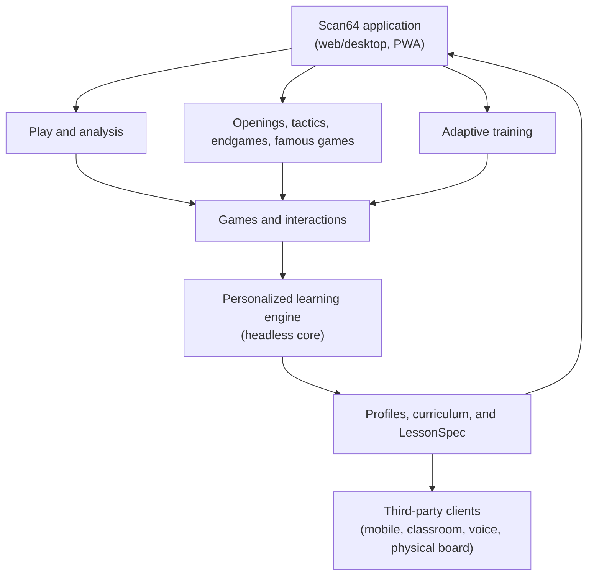

The official Scan64 application and any third-party client are peers with respect to the learning engine: both consume the same public API and the same `LessonSpec` contract. The application earns its place in the architecture by being a *complete* consumer and by generating the evidence the engine needs — not by having privileged internal access.

```text
Scan64 application
├── play and analysis
├── structured chess content
└── personalized training
          │
          ▼
Scan64 learning platform
├── evidence and diagnosis
├── player model and scheduler
├── exercise generation and verification
├── LessonSpec
└── public library and API
```

---

## 3. Component architecture

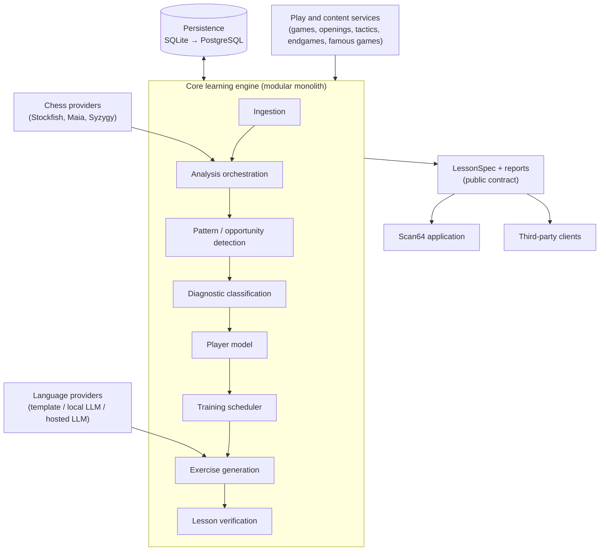

Chess providers run behind **two separate engine-process pools** — interactive (live play, on-demand review) and batch (bulk imports, re-analysis) — with independent concurrency limits, so a bulk PGN import can never stall a live game (§9.4).

### 3.1 Deployment forms

The same core supports five deployment shapes without code forking:

1. **Python package** — embedded in another application.
2. **Local daemon** — FastAPI service beside a desktop/browser client.
3. **CLI** — analyse PGNs, generate training plans, no server required.
4. **Hosted API** — optional community/commercial deployment.
5. **Batch research pipeline** — reproducible analysis over large game collections.
6. **Scan64 desktop/web application** — the complete first-class product, built entirely on the same public contracts as 1–5.

### 3.2 Repository layout

```text
scan64/
├── src/scan64/
│   ├── chess/          # games, positions, analysis, opponents
│   ├── content/         # openings, tactics, endgames, famous_games, curricula
│   ├── learning/        # evidence, diagnosis, profiling, exercises, scheduling, verification
│   ├── lessonspec/       # the portable lesson contract
│   ├── explanations/     # grounded LLM/template explanation providers
│   ├── persistence/
│   ├── api/               # FastAPI surface
│   └── cli/
├── providers/
│   ├── stockfish/  ├── maia/  ├── templates/  └── llm/
├── apps/scan64-web/
├── benchmarks/     # fixtures, diagnosis, explanations, learning-transfer
├── schemas/         # lesson-spec.schema.json, events.schema.json
└── tests/            # unit, integration, conformance, regression
```

Module boundaries are enforced now; packages (`chess-learning-core`, `chess-lesson-spec`, `chess-diagnosis-taxonomy`, provider packages) are only split into independently versioned artifacts once the boundaries have proven stable in practice.

---

## 4. Data model

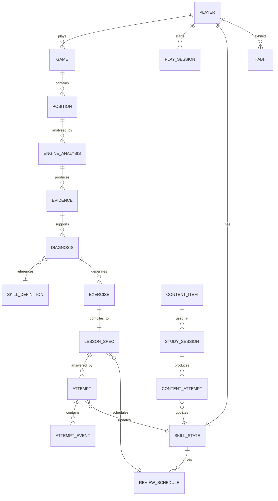

### 4.1 Primary entities

| Entity | Purpose |
| --- | --- |
| `Player` | Identity, preferences, rating context, privacy settings |
| `Game` | Normalized game metadata and move sequence |
| `PlaySession` | Built-in computer game, clock, opponent configuration |
| `Position` | Position at a specific ply, FEN and derived state |
| `EngineAnalysis` | Versioned engine results and configuration |
| `Evidence` | Atomic, machine-verifiable fact supporting a diagnosis or explanation |
| `Diagnosis` | Inferred learning failure with confidence and evidence refs |
| `SkillDefinition` | Versioned taxonomy entry |
| `SkillState` | Player-specific mastery estimate (mean, uncertainty, decay) |
| `Habit` | Repeated behavioural pattern with supporting examples |
| `Exercise` | Abstract training task, pre-rendering |
| `LessonSpec` | Verified, renderer-independent client-facing lesson |
| `TrainingSession` | Ordered curriculum instance |
| `Attempt` / `AttemptEvent` | Learner response and fine-grained interaction (hint requests, etc.) |
| `ReviewSchedule` | Spaced-repetition state |
| `ContentItem` / `StudySession` / `ContentAttempt` | Versioned openings/tactics/endgames/famous games and attempts against them |

### 4.2 Evidence as a first-class, atomic entity

```json
{
  "evidence_id": "ev_1",
  "kind": "engine_line",
  "position_id": "pos_27",
  "claim": "Move c6d4 creates a double attack",
  "payload": { "move": "c6d4", "targets": ["e2", "f3"], "principal_variation": ["c6d4", "f3d4"] },
  "producer": { "name": "stockfish_adapter", "version": "0.1.0" }
}
```

Diagnoses and explanations reference evidence IDs; they never restate an untraceable claim inline. This is what makes the system auditable: any lesson can be walked backward to the exact engine output that justified it.

### 4.3 Storage strategy

- **MVP:** SQLite, SQLAlchemy/SQLModel, JSON columns for provider-specific evidence, filesystem/content-addressed blobs for large artifacts.
- **Hosted scale:** PostgreSQL for transactional state, object storage for large PGN/analysis artifacts, a queue for workers, an analytical warehouse only once real usage justifies it.
- **Retention:** full MultiPV payloads kept for a configurable window (default 12 months or last 200 analysed games), then compacted to summary statistics — the `Evidence` row and claim survive compaction so diagnoses stay inspectable. Budget ≈ 50–200 KB per fully analysed game before compaction.
- **Portability:** Alembic migrations run against both SQLite and PostgreSQL in CI from the first migration, so MVP-to-hosted is a tested path, not an asserted one.

---

## 5. `LessonSpec`: the portable contract

`LessonSpec` is the schema boundary between "what the backend knows" and "what any renderer shows." It is versioned (semantic versioning), published as both JSON Schema and Pydantic models, and every visualization command carries a required human-readable `description` field so screen readers and text-only clients can render meaning, not just pixels.

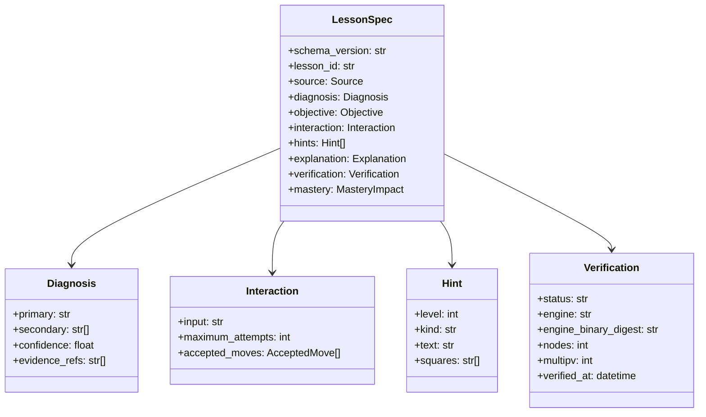

**Visualization DSL** (semantic, not pixel-level — clients may ignore an unsupported command but must not reinterpret it): `highlight_square`, `highlight_region`, `highlight_piece`, `dim_irrelevant_pieces`, `draw_arrow`, `draw_attack_map`, `draw_defence_map`, `show_ghost_piece`, `animate_line`, `flip_board`, `hide_coordinates`, `temporarily_hide_pieces`, `compare_positions`.

**Verification has a shelf life.** Each verification records the engine version, network, and search budget that produced it. When the configured engine is upgraded, cached lessons and due review items are re-verified before delivery — a lesson whose accepted moves no longer hold is regenerated or retired, never served stale.

---

## 6. End-to-end system workflow: game → lesson

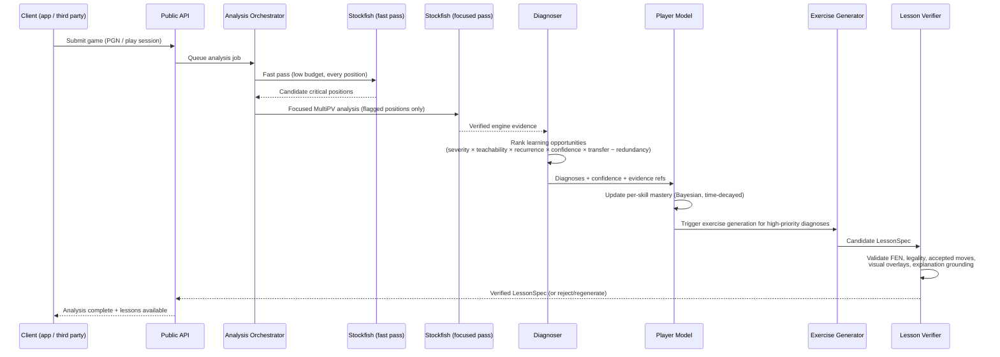

### 6.1 Two-pass analysis budgets (why this is cheap enough to run locally)

| Pass | Budget | Purpose |
| --- | --- | --- |
| Fast pass | ~10⁴–10⁵ nodes/position, ≈20–80 ms/position on one core | Flag candidate critical positions across the whole game (≈5–10 CPU-seconds/game) |
| Focused pass | MultiPV 4–5, ~10⁶–10⁷ nodes, 5–10 positions/game | Verified refutations and alternatives only where it matters (≈30–120 CPU-seconds/game) |

**Planning number:** ≈1–2 CPU-minutes of engine time per fully analysed game. A 1,000-game historical import is a background batch job (≈15–30 CPU-hours), never an interactive request — this is why interactive and batch engine pools are kept separate with independent concurrency limits and admission control (a per-player daily quota on bulk-import focused analysis).

---

## 7. Exercise-generation workflow

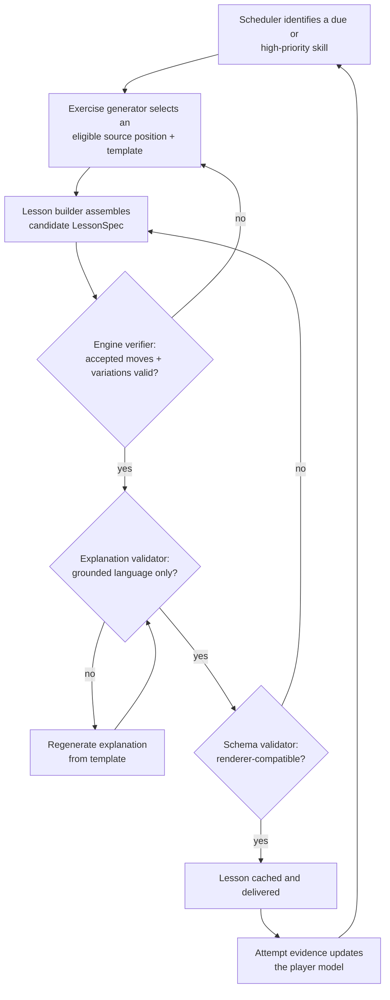

Exercise sources, in increasing order of construction risk: exact replay of the original position, counterfactual continuation (return and play the better move), perspective reversal (find the opponent's winning idea), minimal position (strip irrelevant material, verified), database retrieval (same motif/difficulty), controlled transformation (mirror/colour-swap where semantics survive), and fully generated positions (deferred until the verifier is mature — the riskiest source and explicitly not in early scope).

---

## 8. User workflow: a single game with post-game review

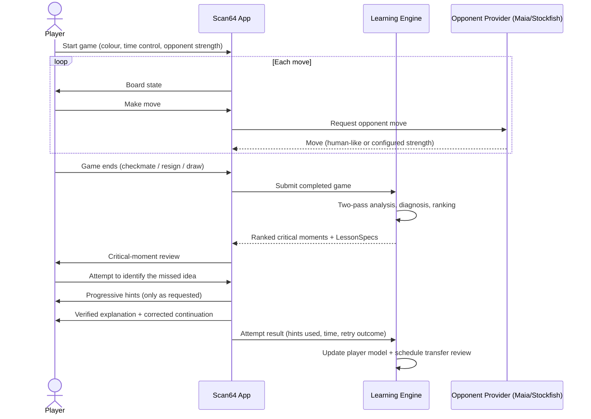

The default interaction sequence inside "critical-moment review" is deliberately not "show the arrow immediately":

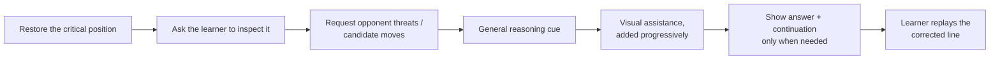

Interruption policy is decided per mode, not left ambiguous: **coach mode** interrupts *during* play, and only by explicit opt-in; ordinary play, independent-calculation mode, and analysis are **post-game only**.

---

## 9. User workflow: daily adaptive training session

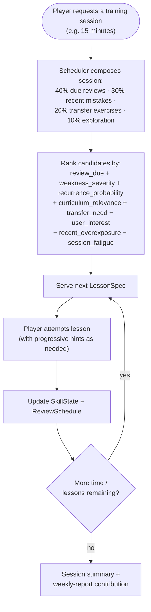

The scheduler explicitly reserves capacity for fundamentals, new motifs, opening diversity, and endgames, independent of the player's own mistake history — a system that trains only existing mistakes produces a narrower and narrower curriculum over time; this reservation is a hard constraint, not a tunable that can be optimized away.

---

## 10. User workflow: famous-game study (representative content-layer flow)

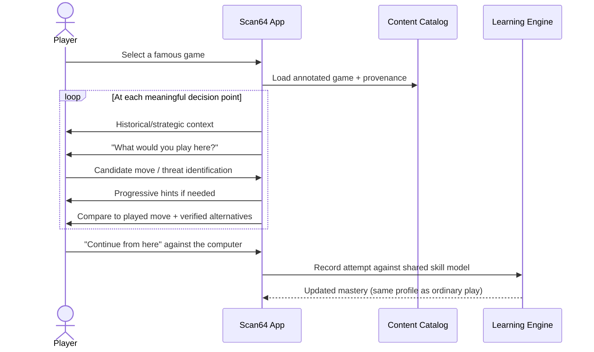

Famous-game attempts feed the *same* skill model as ordinary play and puzzle attempts — the content layer is not a separate silo; it is another evidence source into one player profile.

---

## 11. Domain events and observability

Every internal transition emits a domain event with a standard envelope (`event_id`, `occurred_at`, `schema_version`, `correlation_id` stable across one game's full ingestion-to-mastery chain, `causation_id`). Delivery is at-least-once with idempotent consumers.

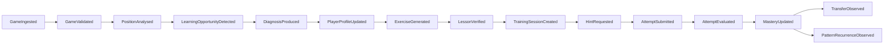

This event chain is also the reproducibility trace: `game → position → engine analysis → evidence → diagnosis → profile decision → exercise → verification → LessonSpec → attempt → mastery update`. A debugging bundle for any lesson can be assembled by walking this chain and exporting sanitized PGN, FEN, engine version/config, analysis response, detector versions, diagnosis result, the profile snapshot used for scheduling, the generated lesson, and its verification report.

---

## 12. Public API surface (summary)

Resource-oriented, versioned (`/v1`), idempotent on every mutating call (`Idempotency-Key` or an equivalent client-supplied key such as `client_move_id`), cursor-paginated on every collection, async jobs for deep analysis (poll + optional SSE stream).

```text
Games            POST /v1/games · GET /v1/games/{id} · POST /v1/games/{id}/analysis-jobs
                 GET /v1/games/{id}/learning-opportunities
Players          POST /v1/players · GET /v1/players/{id}/profile · /patterns · /progress · /evidence
Training         POST /v1/training-sessions · GET .../next · POST /v1/lessons/{id}/attempts
Play             POST /v1/play-sessions · POST /v1/play-sessions/{id}/moves
Content          GET /v1/content/{openings,tactics,endgames,famous-games}
                 POST /v1/opening-sessions · POST /v1/study-sessions · POST /v1/study-attempts
Reports/export   GET /v1/reports/weekly · POST /v1/exports · POST /v1/imports
                 DELETE /v1/players/{id}/data
```

The same capability set is available without HTTP as a Python API:

```python
engine = LearningEngine(config)
game = await engine.ingest_pgn(pgn)
report = await engine.analyse_game(game.id, player_id=player.id)
session = await engine.create_training_session(player_id=player.id, duration_minutes=15)
lesson = await session.next_lesson()
```

---

## 13. Opponent modeling architecture

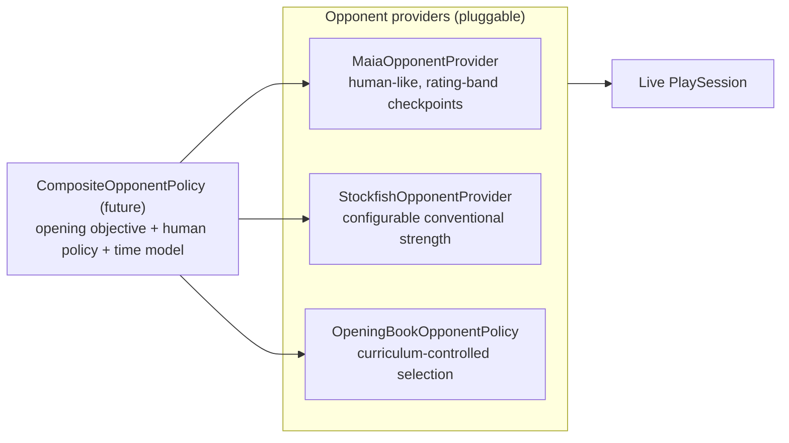

Stockfish reduced-strength play is not treated as a substitute for a human-like policy: it can find implausible defensive resources or make implausible blunders relative to a real player at that rating, which corrupts both realism and the diagnosis pipeline downstream (a "mistake" the player made against an unrealistic opponent is weaker training signal). Known limitation, stated plainly: Maia-1 ships at ~100-Elo checkpoint granularity spanning roughly 1100–1900, and below ~1100 there is currently no faithful human-like model — the lowest available band is used with the mismatch disclosed, not papered over.

---

## 14. Testing and verification architecture

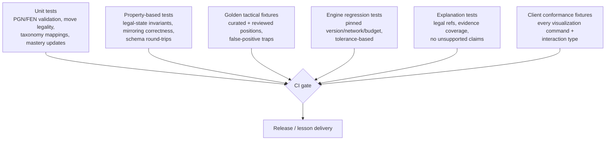

Golden fixtures exist specifically to catch two failure classes that unit tests miss: heuristic detectors that fire on positions coaches would not call a lesson (false-positive traps), and quiet moves engines prefer but that make poor beginner lessons.

---

## 15. Deployment topology (reference)

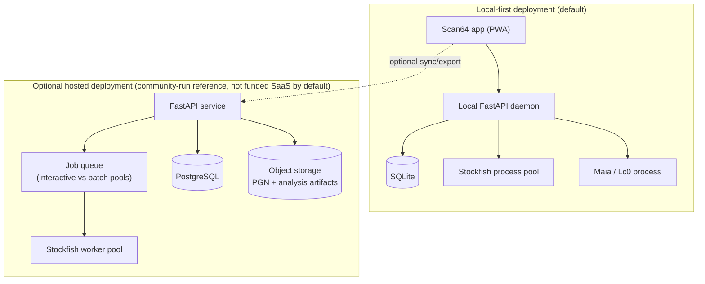

Local-first is a hardware claim, not only a principle: the reference configuration (4 cores / 8 GB RAM) analyses a game in a few minutes of background time under the default budgets; weaker hardware degrades explicitly (fewer focused positions, reduced node budgets) rather than silently backlogging work.

---

## 16. Key architecture decisions (ADR summary)

| ADR | Decision | Reason |
| --- | --- | --- |
| 001 | Complete product, headless learning core | Users need play + study without context switching; differentiation is diagnosis/personalization/generation, not the UI |
| 002 | Separate opponent, analyst, and teacher interfaces | Human realism, chess optimality, and teaching value are different objectives |
| 003 | LLM optional and non-authoritative | Preserves correctness, offline operation, cost control, provider independence |
| 004 | Portable `LessonSpec` | Enables third-party clients; prevents pedagogical logic from leaking into one UI |
| 005 | Modular monolith first | Reduces operational and contributor complexity during discovery |
| 006 | Mastery requires transfer | Exact-position success alone may reflect memorization, not improved recognition |
| 007 | Evidence and provenance are first-class | Enables validation, debugging, reproducibility, and user trust |
| 008 | AGPL-3.0-or-later | Combines with GPLv3 chess components; keeps hosted-service improvements available to their users |

Full rationale for each decision is in the source design proposal (`.docs/scan64-system-design.md`, §31).
