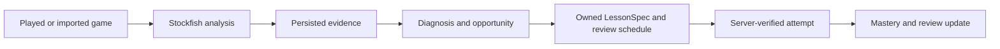

# Scan64 — System Design

This document describes the implementation delivered in Scan64 `0.2.0`, not a future architecture proposal. Product behavior and operating instructions are in the [user guide](user-guide.md).

## Runtime

`scripts/run.sh` starts two local processes:

```text
FastAPI API:  http://127.0.0.1:8001
React client: http://127.0.0.1:5173
```

The FastAPI lifespan creates the local schema, initializes learning plugins, idempotently seeds the transfer catalog, and creates Stockfish engine pools when pooling is enabled. Shutdown closes the pools and clears the plugin registry.

The API exposes `GET /health`, generated interactive documentation at `/docs`, and its machine-readable contract at `/openapi.json`.

## Components

| Component | Implemented responsibility |
| --- | --- |
| `apps/scan64-web` | React client for play, PGN import, game history, analysis, Daily Training, profile, opening explorer, famous-game study, and coach dashboard. |
| `src/scan64/api` | FastAPI routers, bearer-token ownership boundaries, idempotency middleware, lifecycle endpoints, reports, and application orchestration. |
| `src/scan64/chess` | Game/play-session state, Stockfish opponents, analysis jobs, diagnosis candidates, and admission control. |
| `src/scan64/learning` | Evidence, diagnostics, profile updates, spaced review, lesson attempts, transfer measurement, verification, and plugins. |
| `packages/chess-lesson-spec` | Versioned, renderer-independent Pydantic models for `LessonSpec`. |
| SQLite | Default local persistence for players, games, analysis artifacts, evidence, lessons, schedules, study sessions, attempts, transfer measurements, and lifecycle records. |

## Owned learning loop


```mermaid
flowchart LR
  Game[Played or imported game] --> Analysis[Stockfish analysis]
  Analysis --> Evidence[Persisted evidence]
  Evidence --> Diagnosis[Diagnosis and opportunity]
  Diagnosis --> Lesson[Owned LessonSpec and review schedule]
  Lesson --> Attempt[Server-verified attempt]
  Attempt --> Profile[Mastery and review update]
```

### Analysis and persistence

A completed or resigned play session can enqueue analysis automatically. Imported games can be analysed through the owned game path. Analysis persists positions, engine analyses, evidence, and learning opportunities for the game owner; the read paths do not depend on synthetic ownership.

The analysis board renders persisted evaluation and diagnosis data. It distinguishes an unanalysed game, a completed analysis with no diagnosis, and a completed analysis with persisted findings.

### Lessons, review, and transfer

The service creates a durable opportunity, review schedule, and study session before serving an owned persisted lesson. Lesson moves are checked on the server; a verified attempt updates only the matching active skill and review schedule.

Daily Training derives ordering from active mastery, due review, verified attempt history, fatigue, and an exploration floor. Opening Explorer missions remain a separate, ungraded path.

Transfer positions are seeded at application startup. When the existing mastery threshold is reached, the service can assign a separate transfer measurement; later training sessions serve it as a required exercise and its result is reported separately.

### Coach-mode interruption

Coach mode is explicitly enabled on a play session. During eligible practice moves, the server can run a capacity-bounded diagnosis path. It returns a `CriticalInterruptionRead` only after persisting the owned opportunity, review schedule, and study session. Normal play, independent calculation, and ordinary post-game analysis do not claim this interruption behavior.

## Authorization and privacy

Player identities receive bearer tokens. Player-reachable game, play-session, position, analysis-job, and lesson-attempt routes resolve the authenticated player before returning or changing owned data. Missing, malformed, ownerless, and non-owned resources intentionally share an undisclosing not-found response.

Player-derived records participate in export, import, and deletion. Deletion is destructive; use a disposable local player and database while testing the lifecycle.

## Engine capacity

Stockfish work uses separate interactive and batch pools by default. Interactive opponent work is isolated from background analysis. Admission control applies a per-player daily quota to immediately admitted analysis games; work beyond the quota remains queued fairly rather than rejected.

Runtime controls:

| Variable | Default | Effect |
| --- | --- | --- |
| `SCAN64_DATABASE_URL` | `sqlite:///database.db` | SQLite database URL. |
| `SCAN64_ANALYSIS_DAILY_QUOTA` | `50` | Immediately admitted analysis games per player per day; `0` queues every job. |
| `SCAN64_ENGINE_POOL_INTERACTIVE_CONCURRENCY` | `2` | Interactive Stockfish pool size. |
| `SCAN64_ENGINE_POOL_BATCH_CONCURRENCY` | `2` | Batch Stockfish pool size. |
| `SCAN64_ENGINE_POOL_ENABLED` | enabled | Set `0`, `false`, `no`, or `off` to construct engines per call. |
| `SCAN64_MAIA_CONFIG` | unset | Operator-owned Maia configuration file. |
| `SCAN64_LLM_CONFIG` | unset | Optional explanation-provider configuration file. |

## Optional providers

Stockfish is required for the local application. Maia is optional and requires operator-provided assets; follow [Maia operator provisioning](maia.md). Optional LLM explanations never replace the deterministic chess-analysis path: generated claims are validated against evidence before use.

## Deliberate limits

- SQLite is the implemented local storage target; PostgreSQL production verification is not delivered.
- No hosted deployment is documented or supported here.
- Behavioural-habit and context-conditioned profiling are not implemented as calibrated production capabilities.
- Keyboard board interaction and complete accessibility coverage are outstanding.
- Persisted engine payload retention and compaction are not configurable.
