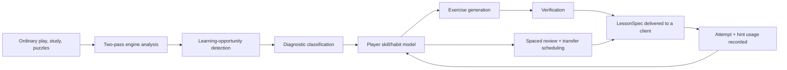

# Scan64 — System Overview

**Tagline:** Play. See. Learn.
**Learning-engine promise:** Train what you fail to see.
**Status:** Concept / design-validation stage
**Companion documents:** [`system-design.md`](./system-design.md) (architecture and workflows), [`pitch.md`](./pitch.md) (shareable one-pager)

---

## 1. What Scan64 is

Scan64 is an open-source, local-first chess platform with two layers:

1. **A complete chess application.** Play against computer opponents, analyse games, study openings and famous games, drill tactics and endgames, and follow structured training — the same table-stakes experience users expect from Lichess or Lucas Chess, in one coherent product.
2. **A personalized learning engine underneath it.** The engine watches what a player does across games, puzzles, and study attempts, infers *why* they keep missing the same kinds of ideas — not just *that* they blundered — and turns that inference into verified, interactive exercises targeted at the specific failure. It schedules review, tracks whether the player has actually internalized the concept (not just memorized the position), and reports progress in plain language.

The engine is headless and public: it exposes a typed, versioned lesson format (`LessonSpec`) and an HTTP/Python API, so any third-party client — a mobile app, a Lichess companion, a classroom dashboard — can submit games, pull a player's weaknesses, request a training session, and render the result without adopting Scan64's own UI.

**One-sentence summary:** Scan64 plays chess with you, notices what you keep failing to see, and builds you exercises that fix it — and it publishes the machinery that does that, not just the app.

---

## 2. Why it needs to exist

### 2.1 The user problem

A player who plays regularly and wants to improve is not short on chess software. They are short on software that answers:

1. What did I fail to notice?
2. Why did I fail to notice it?
3. Have I made this kind of mistake before?
4. What cue should I learn to look for?
5. Can I recognize the same idea in a position that doesn't look like the one I failed on?
6. Has any of this training actually changed how I play?

Existing tools answer adjacent questions well — an evaluation bar, a best move, a generic "blunder" label, a puzzle library sorted by rating — but none of them close the loop from *a specific recurring failure in this player's own games* to *a verified exercise that targets exactly that failure* to *evidence that the failure recurs less often afterward*.

### 2.2 The gap between engine analysis and human learning

An engine optimizes move quality. A coach optimizes the learner's future decision process. Stockfish reporting that a move drops the evaluation from +0.3 to −1.8 is a fact about the position. It is not a diagnosis. Turning it into one requires:

- Determining *what* the player overlooked (an opponent capture, a fork, a plan-consistency failure).
- Recognizing *why* it was overlooked (no threat scan before continuing an own plan; stopped calculating one ply early; confirmation bias toward an intended move).
- Connecting it to the same failure in five other recent games.
- Generating an exercise that isolates the relationship, not just the position.
- Retesting the concept later, in a visually different position.
- Observing whether the mistake rate actually drops.

No mainstream free tool does all six steps end to end, with verified, inspectable evidence at every step. That is the gap Scan64 is designed to close.

### 2.3 Product thesis and falsifiable hypothesis

> A player's game history contains a personalized curriculum. Engine-verified analysis can locate the important moments, but a separate learning layer must infer the failed skill, organize recurring evidence, and transform it into targeted practice.

> **Hypothesis:** players who train on exercises generated from their own recurring diagnostic patterns will show better recognition and lower recurrence of those patterns than players who receive only conventional engine review or unrelated puzzles.

This bundles three separately testable claims — the diagnosis is valid, personalization beats motif-matched generic practice, and transfer-exercise design beats exact-position replay — and the evaluation plan (§7 below) is built to isolate them rather than declare victory against one lumped control.

---

## 3. How it works

### 3.1 Four kinds of intelligence, kept separate

Scan64 deliberately does not collapse four different jobs into one model or one prompt:

| Job | System | Objective |
| --- | --- | --- |
| Determine chess truth | Stockfish / tablebase | Find and verify strong moves and refutations |
| Play a realistic opponent | Maia (human-like policy) | Plausible play at a target skill level, including human-like mistakes |
| Decide what to teach | Deterministic pedagogical engine | Maximize learner improvement and retention, not move quality |
| Explain it in words | Optional LLM | Verbalize verified evidence; ask Socratic questions; adapt reading level |

The best move is not automatically the best lesson, and a Stockfish weakened to an Elo target does not automatically play like a human at that Elo — so opponent behavior, chess correctness, and teaching decisions get separate interfaces rather than one "AI" doing all three.

### 3.2 The learning loop, end to end



1. **Ingestion.** Games arrive from Scan64 play, PGN import, or (later) Lichess/Chess.com export.
2. **Two-pass analysis.** A cheap fast pass over every move flags candidate critical positions (large evaluation swings, missed tactics, forced sequences). A more expensive focused pass with MultiPV runs only on the flagged positions — this keeps the average analysed game to roughly 1–2 CPU-minutes instead of minutes-per-move.
3. **Learning-opportunity detection.** Not every inaccuracy becomes a lesson. Positions are ranked by severity × teachability × recurrence × confidence × transfer value × readiness, minus redundancy and cognitive-overload penalties, so a 20-inaccuracy game does not produce 20 lessons.
4. **Diagnosis.** The system separates the *chess event* ("the move allowed …Nxf2, forking queen and rook") from the *learning failure* ("no opponent-threat scan was performed before continuing an own plan"). Event-tier diagnoses come from engine evidence alone; process-tier diagnoses (about cognition) require corroborating behavioral signal — think time, hint level needed, retry outcome — and are gated by confidence before they affect scheduling.
5. **Player model.** A per-skill mastery estimate (Bayesian, with explicit uncertainty and time-decay) replaces a single Elo number with a multidimensional profile: which motifs, which board phases, which time pressure, which colour.
6. **Exercise generation.** An exercise is derived from the diagnosis, not the engine's top line — "find the opponent's threat," "identify the least-defended piece," "compare two candidates" — with near- and far-transfer variants that change surface features while preserving the underlying relationship.
7. **Verification.** No lesson reaches a client until its FEN is valid, its accepted moves are legal and confirmed at the configured search depth, its visual overlays reference real squares, and any LLM-generated text is checked against grounded evidence and contains no unsupported claim.
8. **Delivery via `LessonSpec`.** A versioned, renderer-independent JSON contract — position, diagnosis, interaction rules, progressive hint ladder, grounded explanation, verification record — is the only thing a client (official app or third party) ever consumes.
9. **Attempt and mastery update.** Every attempt records more than pass/fail: time to first action, hints used, whether the answer changed, and result on later delayed review — feeding back into the same skill model that drove scheduling.

### 3.3 What makes a lesson trustworthy

Every diagnosis and every explanation carries a pointer back to the engine evidence that produced it (`evidence_ref`). An LLM, when used, never asserts chess facts directly — it receives a structured package of verified evidence and returns schema-constrained claims, each tagged with the evidence it is grounded in; a separate validator checks legality and evidence coverage before anything is shown to the learner. Every core learning operation — diagnosis, exercise generation, hinting, scheduling — works with zero LLM calls, using deterministic templates; language models only make the explanation more natural, never more true.

---

## 4. Market research

### 4.1 The audience is large and growing

- **Chess.com**: ~44M members before *The Queen's Gambit* (Oct 2020); 61M five months later; 100M by Dec 2022; over 200M by April 2025; 268.6M by July 2026. Roughly 38M monthly active players and ~8.7–10M daily active users as of late 2025/2026, with 2.5B games played in Q4 2025 alone.
- **Lichess** (free, open-source, the closest philosophical sibling to Scan64): weekly active players in the low single-digit millions (≈750K blitz, ≈441K rapid as of Feb 2026); ~65–80M site visits/month; the rated-game database crossed 6 billion games in 2025.
- **The "Queen's Gambit effect"** is the clearest evidence the audience responds to narrative/product hooks, not just raw utility: app downloads rose 63%, chess-set sales rose >1000% at some retailers, and Chess.com's growth rate more than sextupled for months after the show aired. Female new-registrations share rose from 22% to 27%. The market has already shown it will re-engage dormant players and pull in new ones given the right trigger.

### 4.2 The learning/training sub-market has real commercial precedent

- **Chessable** (spaced-repetition course platform) grew revenue from $3.8M (2020) to $9.7M (2021) while independent, then was rolled into Play Magnus Group and eventually Chess.com. Chess.com has explicitly stated Chessable is "vital" to its strategy — evidence that personalized/spaced training is monetizable, not just a nice-to-have.
- **Aimchess** (weakness-detection app, acquired by Play Magnus Group in 2021, then by Chess.com in Dec 2022) sells a Pro tier at ~$7–10/month for deeper weakness analytics and training. It validates the exact positioning Scan64's personalized layer targets — "tell me what I keep getting wrong" — as something players already pay for.
- **Chess.com itself** reached a >$1B valuation (2023) and took a new investment round from CVC Capital Partners in 2026, alongside existing investor General Atlantic. The category has institutional capital behind it.
- **Market-size estimates** vary by methodology but agree on direction: the global online chess platform market is variously sized at $1.8–2.8B in 2025, forecast to $5.3–7.6B by 2034 (11–12% CAGR); a narrower "chess software" market estimate puts 2024 at ~$1.8B growing to ~$4.6B by 2033 (9.6% CAGR). Directionally: a multi-billion-dollar, double-digit-CAGR market, growing on AI-assisted analysis and educational adoption as stated drivers.

### 4.3 What the incumbents do not offer

| Capability | Lichess | Lucas Chess | Chessable | Aimchess | Scan64 |
| --- | --- | --- | --- | --- | --- |
| Free play, analysis, puzzles | Yes | Yes | No | No | Yes |
| Spaced-repetition mastery tracking | Partial | Partial | Yes | Partial | Yes |
| Weakness detection from own games | No | No | No | Yes (aggregate stats) | Yes (evidence-linked, verified) |
| Diagnosis distinguishes engine error from *human skill that failed* | No | No | No | No | Yes |
| Verified transfer exercises generated from the player's own mistakes | No | No | No | No | Yes |
| Open, headless, renderer-independent learning backend | No | No | No | No | Yes |
| Human-like (not just weakened) computer opponent | No | Partial | No | No | Yes (Maia) |
| Measures whether training changed later play, not just puzzle accuracy | No | No | No | No | Yes (planned) |

Two conclusions follow directly from this table and are load-bearing for the product strategy:

1. **"Stockfish plus an LLM explanation" is not a moat.** Multiple open-source projects (AI Chess Tutor, Chess King, WhyThisMove) already combine those two ingredients. That combination is table stakes, not differentiation.
2. **Personalized weakness detection (Aimchess) and spaced mastery tracking (Chessable) already exist and are already monetized separately**, inside a company now worth >$1B. Scan64's defensible position is the *combination they do not offer*: evidence-linked diagnosis (not aggregate stats), verified exercise generation from the player's own games (not authored courses), measured transfer (not puzzle-accuracy vanity metrics), and an open, headless core a third party can build on without re-licensing a SaaS API.

### 4.4 Why now

- The user base is bigger and more receptive than at any prior point (§4.1), and the category has proven it monetizes training specifically, not just play (§4.2).
- The two hardest technical dependencies are now free and mature: Stockfish is state-of-the-art and open source; Maia/Maia-2 provide human-like (not just weakened) opponent policies trained on real human games across skill bands — this did not exist as an accessible open component a few years ago.
- LLMs make natural-language, level-adapted explanation cheap, but Scan64's design keeps them optional and non-authoritative — avoiding the reliability and cost risk of building the product's core value proposition on a hosted model API.
- No incumbent has open-sourced the *learning core* itself. Chess.com/Chessable/Aimchess are closed SaaS. Lichess is open but has no personalized diagnosis layer. That gap is currently unclaimed.

---

## 5. Risks

| Risk | Impact | Mitigation |
| --- | --- | --- |
| Table-stakes chess features consume the whole roadmap | Learning moat never ships | Bound v1 explicitly: play, analysis, openings, tactics, endgames, famous games, training. No social features, tournaments, or live multiplayer in v1. |
| Centipawn loss is treated as if it were a diagnosis | Teaching quality collapses to "you blundered" | Keep diagnosis as a separate, evidence-based pedagogical layer; centipawn loss is one signal among many, never the label shown to the learner. |
| LLM hallucinates a chess claim | Loses the user's trust immediately, possibly permanently | Constrained/schema-only LLM output, every claim tied to an `evidence_ref`, legality validated before display, deterministic templates as the default with zero LLM dependency. |
| A "weakened" engine opponent feels robotic, not human | Practice doesn't transfer to games against real humans | Use Maia/Maia-2 (human-like policy trained on real games), not just reduced-depth Stockfish. |
| Too many corrections per game | Cognitive overload, learner disengages | Rank and cap lessons per game via the severity × teachability × recurrence formula; never show 20 corrections for 20 inaccuracies. |
| Overfitting the curriculum to past mistakes | Narrow, repetitive training the player comes to resent | Reserve explicit scheduler capacity for fundamentals, new motifs, and exploration, independent of the player's own error history. |
| Replaying the exact position that was missed | Learner memorizes the answer, not the concept — false mastery | Require near- and far-transfer success (different opening, side, material, move number) before crediting mastery, not exact-position recall. |
| Diagnosis misjudges *why* a move was played | Personalization actively teaches the wrong lesson | Confidence-gate process-tier (cognitive) diagnoses behind behavioral corroboration; allow user correction; always show the supporting evidence. |
| Engine version upgrades silently change past verdicts | Cached lessons go stale or wrong without anyone noticing | Pin engine version/config per analysis; re-verify cached lessons and due reviews on every engine upgrade rather than trusting stale verification. |
| Deep analysis is computationally expensive | Unusable on ordinary laptops, or requires a paid backend | Two-pass triage (cheap fast pass, expensive pass only on flagged positions), explicit node/CPU budgets, a documented local-hardware floor (4 cores / 8 GB RAM), graceful degradation rather than silent backlog. |
| Early users have almost no game history | Profile and diagnoses are unreliable in week one | Empirical-Bayes priors from population data by rating band, explicit uncertainty in every mastery estimate, broad conventional curriculum fills the gap while personal data accumulates. |
| Legal/licensing missteps (AGPL + bundled GPL components + model weights) | Distribution blocked, contributor/legal risk | Documented license review before any binary/container/model release; `THIRD_PARTY_NOTICES.md`; explicit weight-licensing verification for Maia; SBOM per release. |
| Documented public API becomes a real-time cheating aid on third-party platforms | Reputational and possibly platform-ban risk for users | Product positioning and UI discourage use during live rated play elsewhere; hosted-mode endpoints rate-limited below real-time-assistance utility; coach mode built around post-move reflection, not pre-move consultation. |
| Single-maintainer bus factor | Project stalls or dies during any absence | Cap concurrent scope so any phase can survive a multi-month single-maintainer gap; document decisions continuously (ADRs); automate releases. |
| The diagnostic taxonomy lacks construct validity | Personalization is confidently wrong — worse than no personalization | Hard per-code go/no-go gate: any diagnosis code human coaches can't agree on (Cohen's kappa below threshold) is demoted or deleted before it drives scheduling. |
| No identified acquisition channel | A technically complete product nobody uses | Name and test one channel early (creator's own play history → one chess community → one coach cohort); treat zero external users at the Phase-2 exit gate as a stop signal, not a delay. |
| Privacy exposure of opponents and minors | Legal/ethical exposure, platform trust damage | Local-first by default (no transfer at all); opponent identifiers pseudonymized at ingestion and excluded from exports/benchmarks; hosted mode requires age attestation and restricts minors to local-only features absent verified parental consent. |

---

## 6. Possible moat

None of Scan64's individual ingredients is defensible alone — Stockfish is free, Maia is open, spaced repetition is a known technique, and LLM explanation is commoditizing fast. The moat has to be structural, not ingredient-level:

1. **Evidence-linked, verified diagnosis — not aggregate stats.** Aimchess tells you your accuracy dropped in the middlegame. Scan64 tells you *this specific move, this specific overlooked capture, this specific recurring cue*, with the supporting engine evidence attached and inspectable. That is a materially harder problem (§29.3 of the design doc calls it "genuinely difficult") and is not what any current competitor ships.
2. **Exercise generation and verification, not course authoring.** Chessable's moat is authored content and spaced repetition over it. Scan64's exercises are *generated from the player's own games and mechanically verified* — no author has to anticipate the player's specific weakness in advance. This scales personalization in a way a content marketplace structurally cannot.
3. **Measured transfer as the success metric, not puzzle accuracy or engagement.** Puzzle accuracy rises with memorization; engagement doesn't prove learning. Committing to near/far-transfer success and reduced real-game recurrence as the metric is a harder standard than any competitor currently publishes against — and if it holds up, it's a credible, defensible claim none of them can easily match without rebuilding their diagnosis layer from scratch.
4. **Open, headless core with a portable `LessonSpec`.** The closed competitors (Chess.com/Chessable/Aimchess) cannot be embedded by a third-party developer without a commercial API relationship, if one exists at all. A public, versioned, renderer-independent lesson format lets any client — mobile trainer, classroom tool, physical board, voice interface — build on Scan64's diagnosis engine without adopting its UI. That creates an ecosystem incumbents structurally can't open up without giving away the product they sell.
5. **AGPL-3.0 as an intentional moat mechanic, not just an ethical stance.** Because Scan64 is designed to run as a network service as well as locally, AGPL's network-use clause means anyone who takes the engine, improves it, and offers it as a hosted service must release those improvements. A closed competitor cannot fork Scan64's diagnosis engine into a proprietary hosted product without triggering that obligation — improvements to the shared core stay shared.
6. **First-mover on a validated diagnostic taxonomy.** A taxonomy of player-specific learning failures with measured inter-rater agreement and published precision/recall per code is itself a research and community asset. Once it exists and is adopted by third-party clients, switching cost accrues to whoever built the taxonomy others' tools speak in terms of — a network effect around a shared vocabulary, not just a shared codebase.

The honest caveat: every one of these is a *claim to validate*, not a guarantee. Diagnosis quality, transfer measurement, and taxonomy validity are explicitly named as the hardest open problems in the design (§29.3 of the design doc), and the roadmap gates each phase on demonstrating them rather than assuming them.

---

## 7. Examples

### 7.1 A single learning moment, concretely

A player, playing Black, is attacking on the kingside and misses that their own knight on c6 can be met with a fork. Stockfish reports the evaluation dropped from +0.3 to −1.8 after their move. Scan64's pipeline:

1. **Event:** "The move allowed …Nxf2 (or the mirrored equivalent), forking the queen and a rook."
2. **Diagnosis:** "Did not perform an opponent-threat scan before continuing an own attacking plan" (process-tier, corroborated by fast move time and full-hint-ladder usage on retry) plus the event-tier tag `tactics.fork.knight_fork`.
3. **Exercise:** The player is shown the position *before* the mistake and asked, "List every check and capture available to your opponent before considering your own plan." Hints escalate from a general reasoning prompt → highlighted board region → highlighted piece → drawn arrows → the answer, only as needed.
4. **Explanation (template or LLM-verbalized, always evidence-grounded):** "Your move allowed …Nd4, which attacks two valuable targets at once. Before continuing your own plan, scan checks, captures, and direct threats — especially once you commit to an attack yourself."
5. **Scheduling:** A visually different knight-fork position — different opening, opposite side of the board, different material count — is scheduled for review days later to test recognition rather than memorized recall.
6. **Report:** A weekly summary aggregates this with similar events: "When you begin a kingside attack, you often resume your own plan without checking the opponent's forcing replies. This occurred in 4 of 11 relevant positions this week and caused two material losses."

### 7.2 Representative user journeys the product is built around

- **Natural practice:** Play a normal game against a Maia-backed human-like opponent at a chosen strength. The system records it and surfaces a small number (not twenty) of high-value learning moments afterward.
- **Coach mode:** During an untimed practice game, the system pauses after a meaningful error, rolls back the position, and walks the progressive hint ladder — opt-in only, never during ordinary or rated-feeling play.
- **Opening rotation:** Instead of memorizing lines, the player is assigned a strategic mission ("develop both minor pieces before attacking," "identify the correct pawn break") within a chosen opening family, and the system tracks concept mastery rather than move-sequence recall.
- **Famous-game study:** Follow a historical game one decision at a time, predict the next move, get contextual explanation on a miss, and branch into "play from here" against the computer — with the attempt feeding the same skill model as ordinary play.
- **Daily 15-minute session:** A scheduler mix of ~40% due spaced reviews, ~30% recent high-value personal mistakes, ~20% transfer exercises on current weaknesses, and ~10% deliberate exploration outside the player's habitual openings — configurable, and never allowed to shrink to "only your mistakes."

### 7.3 A worked example of the `LessonSpec` contract (abbreviated)

```json
{
  "lesson_id": "les_01J2EXAMPLE",
  "source": { "kind": "player_game", "fen": "r1bq1rk1/ppp2ppp/2np1n2/8/2BPP3/5Q2/PPR2PPP/2B2RK1 b - - 0 8" },
  "diagnosis": {
    "primary": "awareness.opponent_threats.forcing_moves",
    "secondary": ["tactics.fork.knight_fork", "behaviour.own_plan_continuation"],
    "confidence": 0.94
  },
  "objective": { "type": "find_opponent_threat", "instruction": "Find Black's strongest forcing move." },
  "hints": [
    { "level": 1, "kind": "prompt", "text": "List every check and capture before considering quiet moves." },
    { "level": 2, "kind": "highlight_region", "squares": ["c6", "d4", "e2", "f3"] }
  ],
  "verification": { "status": "verified", "engine": "Stockfish 18", "multipv": 5 }
}
```

Every field in a real `LessonSpec` traces to verified engine evidence and a specific player-history diagnosis — this is illustrative, not a literal production sample. The full schema, versioning policy, and visualization DSL are defined in [`system-design.md`](./system-design.md).

---

## 8. Bottom line

Scan64 is feasible as an open-source product because it does not need to invent the hard parts from nothing: Stockfish supplies chess truth for free, Maia supplies realistic human-like opposition for free, and LLMs are optional rather than load-bearing. What it needs to build — and what nobody has shipped in one open package — is the layer between "the engine says this was a mistake" and "here is proof this specific player has stopped making it." That layer, kept headless and public behind a versioned `LessonSpec`, is both the product's differentiator and its main technical risk, and the roadmap is explicitly structured to validate it (Phase 0/1a) before investing in the full application around it.
